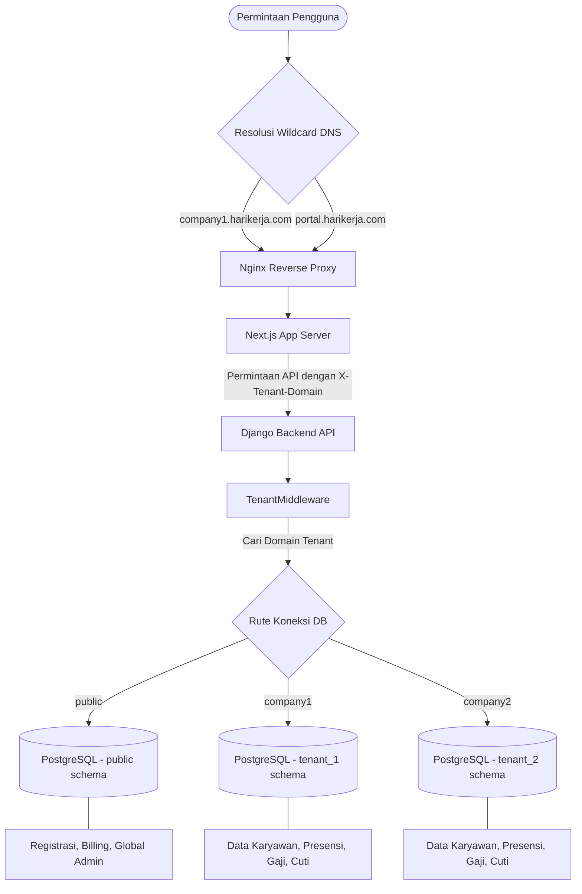

# HariKerja HRMS SaaS

Sistem Manajemen Sumber Daya Manusia (HRMS) multi-tenant generasi terbaru yang dibangun untuk skala perusahaan besar. Platform ini menyediakan rangkaian lengkap untuk manajemen SDM, pelacakan kehadiran dengan verifikasi biometrik AI, kepatuhan penggajian Indonesia (TER 2024), dan Analitik Eksekutif.

## ✨ Sorotan Platform

### Dasbor Admin Profesional


_Pusat komando modern berbasis glassmorphism untuk profesional SDM._

### Presensi Mobile Aman

<p align="center">
  
  
</p>

_Verifikasi wajah biometrik dan ESS (Employee Self-Service) waktu nyata untuk tenaga kerja modern._

### 🛠️ Admin & Operasional


_Proses pendaftaran tenant dan penyediaan organisasional yang efisien._

### 📅 Penjadwalan Canggih


_Perencanaan shift interaktif dan orkestrasi tenaga kerja berbasis kalender._

### 💸 Alur Kerja Keuangan


_Siklus persetujuan multi-tahap untuk klaim pengeluaran dan penggantian biaya (reimbursement)._

### 💳 Kesiapan Komersial

<p align="center">
  
  
</p>

_Penyediaan SaaS bertingkat dan pembatasan langganan cerdas (Essential, Professional, Premium, Enterprise)._

### 📊 Rencana Komersial

| Fitur              | **FREE** | **ESSENTIAL** | **PROFESSIONAL** | **PREMIUM**      | **ENTERPRISE**   |
| :----------------- | :------- | :------------ | :--------------- | :--------------- | :--------------- |
| **Batas Karyawan** | 10       | 25            | 100              | 500              | 2.000+           |
| **HR Inti**        | ✅ Dasar | ✅ Dasar      | ✅ Lanjutan      | ✅ Lanjutan      | ✅ Lanjutan      |
| **Kehadiran**      | ✅ Dasar | ✅ Geofencing | ✅ Geo + Foto    | ✅ Koreksi       | ✅ Shift/Roster  |
| **Penggajian**     | ❌       | ❌            | ✅ PPh 21/BPJS   | ✅ Lanjutan      | ✅ Analitik      |
| **Kinerja**        | ❌       | ❌            | ❌               | ✅ KPI/Appraisal | ✅ Team Coaching |
| **Analitik**       | ❌       | ❌            | ❌               | ❌               | ✅ Audit/Insight |

## 📦 Memulai

Platform ini diatur menggunakan lapisan manajemen Node.js yang terpadu.

### 🚀 Menjalankan Platform

Jalankan perintah berikut untuk memulai semua layanan (Backend, Frontend, DB, Redis) dalam mode pengembangan:

```bash
# Jalankan seluruh platform
node up.mjs dev --build

# Lihat log
node up.mjs dev logs

# Hentikan platform
node up.mjs dev down
```

### 🧪 Menjalankan Unit Tes Terpadu

Platform ini menyertakan orkestrator tes utama yang menjalankan semua tes di seluruh stack (Backend, Frontend, dan Mobile) dan menghasilkan laporan utama:

```bash
# Jalankan semua tes untuk semua modul
node scripts/run_all_tests.mjs
```

**Tes Stack Individual:**
Untuk kontrol yang lebih spesifik, Anda dapat menjalankan tes di dalam setiap direktori modul:

- [**Tes Backend**](./backend/README-id.md#🧪-standar-pengujian)
- [**Tes Frontend**](./frontend/README-id.md#🧪-standar-pengujian)
- [**Tes Mobile**](./mobile/README-id.md#🧪-standar-pengujian)

**Titik Akses (Pengembangan Lokal):**

- **Dasbor Publik**: [http://localhost:3000](http://localhost:3000)
- **Dasbor Tenant**: [http://company1.localhost:3000](http://company1.localhost:3000)
- **Dokumentasi API Backend**: [http://localhost:8000/api/schema/swagger-ui/](http://localhost:8000/api/schema/swagger-ui/)
  

## 📁 Modul Proyek

| Modul        | Tujuan                                 | Dokumentasi                           |
| :----------- | :------------------------------------- | :------------------------------------ |
| **Backend**  | Django REST API & Inti Multi-tenant    | [**README**](./backend/README-id.md)  |
| **Frontend** | Dasbor Admin Premium Next.js           | [**README**](./frontend/README-id.md) |
| **Mobile**   | Aplikasi Employee Self-Service Flutter | [**README**](./mobile/README-id.md)   |

## 🚀 Fitur Utama

- **Pondasi Multi-Tenant**: Isolasi data lengkap menggunakan skema PostgreSQL per pelanggan.
- **Keamanan Biometrik**: Face ID bertenaga AI dengan pemeriksaan keaslian (liveness check) menggunakan Google ML Kit.
- **Kepatuhan Penggajian Indonesia**: Mesin penggajian yang sepenuhnya mematuhi **TER 2024 PPh 21** dan BPJS dengan pemetaan gaji berbasis Grade.
- **Kinerja Strategis**: Pelacakan KPI, siklus Penilaian (Appraisal), dan alur kerja persetujuan multi-tahap.
- **Manajemen Profil ESS**: Portal mandiri bagi karyawan untuk memperbarui info pribadi dan mengunggah dokumen.
- **Auto-Onboarding**: Pendaftaran mandiri siap komersial dan penyediaan skema otomatis.

### 🏗️ Arsitektur Multi-Tenant & Alur Perutean Domain



## 🌐 Penyebaran & Infrastruktur

| Tingkat        | Domain             | Platform Hosting              | Tujuan                            |
| :------------- | :----------------- | :---------------------------- | :-------------------------------- |
| **Dev**        | `localhost`        | Docker Lokal                  | Prototyping cepat & tes lokal.    |
| **QA**         | `harikerja.web.id` | **Biznet / IDCH / Hostinger** | UAT fungsional dan pengujian QA.  |
| **Staging**    | `harikerja.my.id`  | **Biznet / Bare-Metal**       | Tes penskalaan 100 ribu pengguna. |
| **Production** | `harikerja.com`    | **Biznet (100K) / AWS (1M)**  | Beban kerja perusahaan resmi.     |

## 🧪 Standar Pengujian

Platform ini mencapai tingkat kelulusan tes **100% terpadu** di semua lapisan stack.

- **Backend**: 390 Tes (371 Unit + 19 E2E) - Pytest. (Terverifikasi 100% Lulus - 22 Mei 2026)
- **Frontend**: 314 Tes (232 Unit + 82 E2E) - Vitest & Playwright. (Terverifikasi 100% Lulus - 22 Mei 2026)
- **Mobile**: 161 Tes (138 Unit + 23 E2E) - Flutter. (Terverifikasi 100% Lulus - 22 Mei 2026)

## 📈 Strategi Skalabilitas: Jalan Menuju 1 Juta Pengguna

Saat **HariKerja** bertransisi dari MVP yang dikembangkan secara mandiri menjadi platform perusahaan yang krusial bagi bisnis, kami telah menetapkan peta jalan organisasi teknis yang jelas untuk memastikan uptime 99,9% dan integritas data bagi 1 juta pengguna.

### Organisasi Tim Teknis

Untuk menjamin stabilitas, kami telah menetapkan struktur **tim inti 10 orang**:

- **Pengembangan (4 Orang)**: 2 Backend (Django), 1 Frontend (Next.js), 1 Mobile (Flutter).
- **Platform & Reliabilitas (2 Orang)**: 1 DevOps/SRE, 1 Security Engineer.
- **Kualitas & Ops (4 Orang)**: 1 QA Automation, 3 Dukungan Teknis/Implementasi.

### Tahapan Transisi Strategis

1.  **Fase Saat Ini**: Kesiapan Produksi & Optimasi Kinerja (8-12 minggu)
2.  **Fase Berikutnya**: Penskalaan 1.000 - 10.000 Pengguna dengan pemantauan yang ditingkatkan
3.  **Fase Depan**: Penskalaan 100.000+ Pengguna dengan penyebaran tim lengkap 10 orang

Strategi penskalaan mendalam: [**Struktur Organisasi & Peta Jalan Skala**](./docs/business_strategy/organization_and_scaling-id.md) ([English](./docs/business_strategy/organization_and_scaling.md))

## 📚 Dokumentasi Teknis & Peta Direktori

Platform ini mempertahankan dokumentasi bilingual (Inggris & Indonesia) yang komprehensif. Berikut adalah peta direktori yang menjelaskan tujuan dan berkas kunci dari semua folder dokumentasi serta berkas README:

### 📖 Berkas README Modul

- [**README Utama**](./README.md) ([**Versi Indonesia**](./README-id.md)) - Tinjauan umum platform, strategi penskalaan, orkestrator pengujian terpadu, dan panduan memulai cepat.
- [**README Backend**](./backend/README-id.md) ([**Versi Indonesia**](./backend/README-id.md)) - Pengaturan API inti Django, perintah pengujian Pytest, skema pembatasan modular (tiering), dan database seeder.
- [**README Frontend**](./frontend/README.md) ([**Versi Indonesia**](./frontend/README-id.md)) - Konfigurasi dasbor admin Next.js, sistem desain UI, dan rangkaian pengujian Vitest/Playwright.
- [**README Mobile**](./mobile/README.md) ([**Versi Indonesia**](./mobile/README-id.md)) - Instruksi kompilasi aplikasi Flutter, integrasi biometrik wajah, dan konfigurasi geofencing.
- [**README Penyebaran**](./deploy/README.md) - Skrip infrastruktur, konfigurasi reverse proxy Nginx, konfigurasi lingkungan (.env), dan skrip jalur promosi deployment.

### 📚 Direktori Dokumentasi Platform (`/docs`)

- **`adr/`**: Architecture Decision Records (ADR) yang merinci keputusan teknis krusial.
  - [Optimasi Penghitung Karyawan](./docs/adr/employee_counter_optimization-id.md) ([English](./docs/adr/employee_counter_optimization.md))
- **`architecture/`**: Integrasi sistem, diagram alur otentikasi, dan desain infrastruktur HA.
  - [Arsitektur High Availability AWS](./docs/architecture/aws_high_availability_architecture-id.md) ([English](./docs/architecture/aws_high_availability_architecture.md))
  - [Strategi Penyebaran & Jalur Promosi](./docs/architecture/deployment_strategy-id.md) ([English](./docs/architecture/deployment_strategy.md))
  - [Sistem Multi-Tenancy](./docs/architecture/multi_tenancy_system-id.md) ([English](./docs/architecture/multi_tenancy_system.md))
  - [Panduan Arsitektur Skalabilitas](./docs/architecture/scaling_architecture_guide-id.md) ([English](./docs/architecture/scaling_architecture_guide.md))
  - [Arsitektur Autentikasi: Web vs. Mobile](./docs/architecture/auth_architecture-id.md) ([English](./docs/architecture/auth_architecture.md))
- **`business_strategy/`**: Rencana tingkat harga SaaS, SLA, proyeksi keuntungan, dan struktur tim.
  - [Paket Langganan & Strategi Pricing](./docs/business_strategy/pricing_and_plans-id.md) ([English](./docs/business_strategy/pricing_and_plans.md))
  - [Proyeksi Bisnis & Target Profit](./docs/business_strategy/business_projections-id.md) ([English](./docs/business_strategy/business_projections.md))
  - [Struktur Organisasi & Peta Jalan Skala](./docs/business_strategy/organization_and_scaling-id.md) ([English](./docs/business_strategy/organization_and_scaling.md))
  - [Standar SLA Enterprise](./docs/business_strategy/sla_enterprise_standard-id.md) ([English](./docs/business_strategy/sla_enterprise_standard.md))
- **`modules/`**: Panduan teknis spesifik untuk modul backend.
  - [Kehadiran](./docs/modules/attendance-id.md) / [English](./docs/modules/attendance.md)
  - [Penagihan](./docs/modules/billing-id.md) / [English](./docs/modules/billing.md)
  - [Core HR](./docs/modules/core-id.md) / [English](./docs/modules/core.md)
  - [Notifikasi](./docs/modules/notifications-id.md) / [English](./docs/modules/notifications.md)
  - [Penggajian](./docs/modules/payroll-id.md) / [English](./docs/modules/payroll.md)
  - [Kinerja](./docs/modules/performance-id.md) / [English](./docs/modules/performance.md)
  - [Reimbursement](./docs/modules/reimbursement-id.md) / [English](./docs/modules/reimbursement.md)
  - [Tenant](./docs/modules/tenants-id.md) / [English](./docs/modules/tenants.md)
  - [Pengguna](./docs/modules/users-id.md) / [English](./docs/modules/users.md)
- **`project_management/`**: Checklist peta jalan implementasi dan transfer pengetahuan antar-stack.
  - [Checklist Fitur & Peta Jalan](./docs/project_management/feature_roadmap_checklist-id.md) ([English](./docs/project_management/feature_roadmap_checklist.md))
  - [Audit Fitur Mobile](./docs/project_management/mobile_feature_audit-id.md) ([English](./docs/project_management/mobile_feature_audit.md))
- **`technical_specs/`**: Peta rute otorisasi, referensi API, dan audit keamanan.
  - [Panduan Developer & Spesifikasi Teknis](./docs/technical_specs/developer_guide-id.md) ([English](./docs/technical_specs/developer_guide.md))
  - [Referensi API](./docs/technical_specs/api_reference-id.md) ([English](./docs/technical_specs/api_reference.md))
  - [Dokumentasi Audit Keamanan & Kepatuhan](./docs/technical_specs/security_audit-id.md) ([English](./docs/technical_specs/security_audit.md))
- **`workflows_features/`**: Detail fungsional alur kerja bisnis utama.
  - [Alur Kerja & Diagram Alir Aplikasi Mobile](./docs/workflows_features/mobile_app_workflows-id.md) ([English](./docs/workflows_features/mobile_app_workflows.md))
  - [Alur Kerja & Diagram Alir Aplikasi Web](./docs/workflows_features/web_app_workflows-id.md) ([English](./docs/workflows_features/web_app_workflows.md))
  - [Registrasi, Siklus Hidup Langganan & Billing](./docs/workflows_features/registration_subscription_billing-id.md) ([English](./docs/workflows_features/registration_subscription_billing.md))
  - [Sistem Otorisasi (RBAC) & Klasifikasi Keamanan](./docs/workflows_features/rbac_security-id.md) ([English](./docs/workflows_features/rbac_security.md))
  - [Sistem Notifikasi & Pemetaan Peristiwa](./docs/workflows_features/notification_system-id.md) ([English](./docs/workflows_features/notification_system.md))

## 🛠 Tech Stack

- **Backend**: Python 3.12+, Django 5.2, Django-Tenants, DRF.
- **Frontend**: Next.js 16 (App Router), TypeScript, Tailwind CSS, Framer Motion.
- **Mobile**: Flutter 3.19+, Dart, Google ML Kit (Biometrik).
- **Infrastruktur**: PostgreSQL 15, Redis 7, PgBouncer, AWS (EKS/RDS/S3).

---

**Status**: 🚀 **Rilis Platform Gold v1.5.1 (11 Mei 2026)**. Siap untuk Fase Kesiapan Produksi.
**Fokus Saat Ini**: Optimasi Kinerja Prioritas Tinggi & Penguatan Keamanan (Fase P5).
