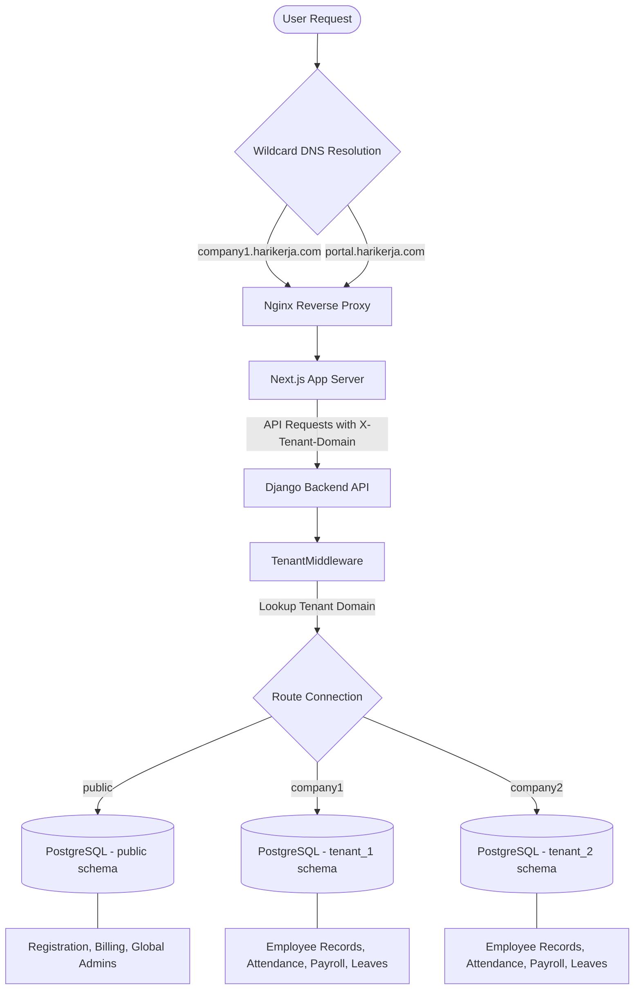

# HariKerja HRMS SaaS

A next-generation, multi-tenant Human Resource Management System (HRMS) built for enterprise scale. This platform provides a comprehensive suite for HR management, attendance tracking with AI biometric verification, Indonesian payroll compliance (TER 2024), and Executive Analytics.

## ✨ Platform Highlights

### Professional Admin Dashboard


_Modern, glassmorphism-based command center for HR professionals._

### Secure Mobile Attendance

<p align="center">
  
  
</p>

_Biometric face verification and real-time ESS (Employee Self-Service) for modern workforces._

### 🛠️ Admin & Operations


_Streamlined tenant onboarding and organizational provisioning._

### 📅 Advanced Scheduling


_Interactive shift planning and calendar-based workforce orchestration._

### 💸 Financial Workflows


_Multi-stage approval lifecycle for expense claims and reimbursements._

### 💳 Commercial Readiness

<p align="center">
  
  
</p>

_Tiered SaaS provisioning and intelligent subscription gating (Essential, Professional, Premium, Enterprise)._

### 📊 Commercial Plans

| Feature            | **FREE** | **ESSENTIAL** | **PROFESSIONAL** | **PREMIUM**      | **ENTERPRISE**   |
| :----------------- | :------- | :------------ | :--------------- | :--------------- | :--------------- |
| **Employee Limit** | 10       | 25            | 100              | 500              | 2,000+           |
| **Core HR**        | ✅ Basic | ✅ Basic      | ✅ Advanced      | ✅ Advanced      | ✅ Advanced      |
| **Attendance**     | ✅ Basic | ✅ Geofencing | ✅ Geo + Photo   | ✅ Correction    | ✅ Shift/Roster  |
| **Payroll**        | ❌       | ❌            | ✅ PPh 21/BPJS   | ✅ Advanced      | ✅ Analytics     |
| **Performance**    | ❌       | ❌            | ❌               | ✅ KPI/Appraisal | ✅ Team Coaching |
| **Analytics**      | ❌       | ❌            | ❌               | ❌               | ✅ Audit/Insight |

## 📦 Getting Started

The platform is orchestrated using a unified Node.js management layer.

### 🚀 Starting the Platform

Run the following command to start all services (Backend, Frontend, DB, Redis) in development mode:

```bash
# Start the entire platform
node up.mjs dev --build

# View logs
node up.mjs dev logs

# Stop the platform
node up.mjs dev down
```

### 🧪 Running the Unified Test Suite

The platform includes a master test orchestrator that runs all tests across the entire stack (Backend, Frontend, and Mobile) and generates a master report:

```bash
# Run all tests for all modules
node scripts/run_all_tests.mjs
```

**Individual Stack Tests:**
For more granular control, you can run tests within each module directory:

- [**Backend Tests**](./backend/README.md#🧪-testing-standard)
- [**Frontend Tests**](./frontend/README.md#🧪-testing-standard)
- [**Mobile Tests**](./mobile/README.md#🧪-testing-standard)

**Access Points (Local Dev):**

- **Public Dashboard**: [http://localhost:3000](http://localhost:3000)
- **Tenant Dashboard**: [http://company1.localhost:3000](http://company1.localhost:3000)
- **Backend API Docs**: [http://localhost:8000/api/schema/swagger-ui/](http://localhost:8000/api/schema/swagger-ui/)
  

## 📁 Project Modules

| Module       | Purpose                             | Documentation                      |
| :----------- | :---------------------------------- | :--------------------------------- |
| **Backend**  | Django REST API & Multi-tenant Core | [**README**](./backend/README.md)  |
| **Frontend** | Next.js Premium Admin Dashboard     | [**README**](./frontend/README.md) |
| **Mobile**   | Flutter Employee Self-Service App   | [**README**](./mobile/README.md)   |

## 🚀 Key Features

- **Multi-Tenant Foundation**: Complete data isolation using PostgreSQL schemas per customer.
- **Biometric Security**: AI-powered Face ID with liveness check using Google ML Kit.
- **Indonesian Payroll Compliance**: Fully compliant **TER 2024 PPh 21** and BPJS engine with Grade-based salary mapping.
- **Strategic Performance**: KPI tracking, Appraisal lifecycle, and multi-stage approval workflows.
- **ESS Profile Management**: Self-service portal for employees to update personal info and upload documents.
- **Auto-Onboarding**: Commercial-ready self-service registration and schema provisioning.

### 🏗️ Multi-Tenant Architecture & Domain Routing Flow



## 🌐 Deployment & Infrastructure

| Tier           | Domain             | Hosting Platform              | Purpose                            |
| :------------- | :----------------- | :---------------------------- | :--------------------------------- |
| **Dev**        | `localhost`        | Local Docker                  | Rapid prototyping & local testing. |
| **QA**         | `harikerja.web.id` | **Biznet / IDCH / Hostinger** | Functional UAT and QA testing.     |
| **Staging**    | `harikerja.my.id`  | **Biznet / Bare-Metal**       | 100K User scaling test.            |
| **Production** | `harikerja.com`    | **Biznet (100K) / AWS (1M)**  | Official enterprise workloads.     |

## 🧪 Testing Standard

The platform achieves a unified **100% test pass rate** across all layers of the stack.

- **Backend**: 423 Tests (403 Unit + 20 E2E) - Pytest. (Verified 100% Passed - July 5, 2026)
- **Frontend**: 340 Tests (251 Unit + 89 E2E) - Vitest & Playwright. (Verified 100% Passed - July 5, 2026)
- **Mobile**: 168 Tests (144 Unit + 24 E2E) - Flutter. (Verified 100% Passed - July 5, 2026)

### 📊 Master Test Report

| Suite | Status | Passed | Unit Passed | E2E Passed | Failed | Errors | Warn | Log |
| :--- | :--- | :--- | :--- | :--- | :--- | :--- | :--- | :--- |
| **Backend Stack** | ✅ PASSED | 423 | 403 | 20 | 0 | 0 | 0 | `/home/afdhal/data/hr/hrms/logs/Backend_Stack_2026-07-04_05-24-01.log` |
| **Frontend Stack** | ✅ PASSED | 340 | 251 | 89 | 0 | 0 | 0 | `/home/afdhal/data/hr/hrms/logs/Frontend_Stack_2026-07-04_05-31-23.log` |
| **Mobile Stack** | ✅ PASSED | 168 | 144 | 24 | 0 | 0 | 1 | `/home/afdhal/data/hr/hrms/logs/Mobile_Stack_2026-07-04_05-37-07.log` |

```text
🏆 ALL HARIKERJA MOBILE TESTS PASSED.

=======================================
📊 FINAL MASTER REPORT
=======================================
┌─────────┬──────────────────┬─────────────┬────────┬─────────────┬────────────┬────────┬────────┬──────┬─────────────────────────────────────────────────────────────────────────┐
│ (index) │ Suite            │ Status      │ Passed │ Unit Passed │ E2E Passed │ Failed │ Errors │ Warn │ Log                                                                     │
├─────────┼──────────────────┼─────────────┼────────┼─────────────┼────────────┼────────┼────────┼──────┼─────────────────────────────────────────────────────────────────────────┤
│ 0       │ 'Backend Stack'  │ '✅ PASSED' │ 423    │ 403         │ 20         │ 0      │ 0      │ 0    │ '/home/afdhal/data/hr/hrms/logs/Backend_Stack_2026-07-04_05-24-01.log'  │
│ 1       │ 'Frontend Stack' │ '✅ PASSED' │ 340    │ 251         │ 89         │ 0      │ 0      │ 0    │ '/home/afdhal/data/hr/hrms/logs/Frontend_Stack_2026-07-04_05-31-23.log' │
│ 2       │ 'Mobile Stack'   │ '✅ PASSED' │ 168    │ 144         │ 24         │ 0      │ 0      │ 1    │ '/home/afdhal/data/hr/hrms/logs/Mobile_Stack_2026-07-04_05-37-07.log'   │
└─────────┴──────────────────┴─────────────┴────────┴─────────────┴────────────┴────────┴────────┴──────┴─────────────────────────────────────────────────────────────────────────┘
```

## 📈 Scalability Strategy: Road to 1 Million Users

As **HariKerja** transitions from a solo-developed MVP to a mission-critical enterprise platform, we have established a clear technical organization roadmap to ensure 99.9% uptime and data integrity for 1 million users.

### Technical Team Organization

To guarantee stability, we have defined a **10-person core team** structure:

- **Development (4 People)**: 2 Backend (Django), 1 Frontend (Next.js), 1 Mobile (Flutter).
- **Platform & Reliability (2 People)**: 1 DevOps/SRE, 1 Security Engineer.
- **Quality & Ops (4 People)**: 1 QA Automation, 3 Technical Support/Implementation.

### Strategic Transition Phases

1.  **Current Phase**: Production Readiness & Performance Optimization (8-12 weeks)
2.  **Next Phase**: 1,000 - 10,000 User Scaling with enhanced monitoring
3.  **Future Phase**: 100,000+ User scaling with full 10-person team deployment

Detailed scaling strategy: [**Organizational Structure & Scaling Roadmap**](./docs/business_strategy/organization_and_scaling.md) ([**Versi Indonesia**](./docs/business_strategy/organization_and_scaling.id.md))

## 📚 Technical Documentation & Directory Map

The platform maintains a comprehensive bilingual (English & Indonesian) documentation vault. Below is the directory tree mapping the purposes and key files of all documentation folders and READMEs:

### 📖 Module README Files

- [**Root README**](./README.md) ([**Indonesian**](./README.id.md)) - General platform overview, scaling strategy, unified test runner, and quick start.
- [**Backend README**](./backend/README.md) ([**Indonesian**](./backend/README.id.md)) - Django core REST API setup, Pytest commands, modular tiering schemas, and compliance database seeders.
- [**Frontend README**](./frontend/README.md) ([**Indonesian**](./frontend/README.id.md)) - Next.js admin dashboard configuration, styling design system, and Vitest/Playwright test suites.
- [**Mobile README**](./mobile/README.md) ([**Indonesian**](./mobile/README.id.md)) - Flutter app build instructions, face biometrics integration details, and geofencing configurations.
- [**Deployment README**](./deploy/README.md) - Infrastructure scripts, nginx reverse proxy configs, environment builds, and promotional path scripts.

### 📚 Platform Documentation Directory (`/docs`)

- **`adr/`**: Architecture Decision Records detailing critical technical choices.
  - [Employee Counter Optimization](./docs/adr/employee_counter_optimization.md) ([Indonesian](./docs/adr/employee_counter_optimization.id.md))
- **`architecture/`**: Systems integration, authentication flow diagrams, and HA designs.
  - [Authentication Architecture: Web vs. Mobile](./docs/architecture/auth_architecture.md) ([Indonesian](./docs/architecture/auth_architecture.id.md))
  - [AWS High Availability Architecture](./docs/architecture/aws_high_availability_architecture.md) ([Indonesian](./docs/architecture/aws_high_availability_architecture.id.md))
  - [Deployment Strategy](./docs/architecture/deployment_strategy.md) ([Indonesian](./docs/architecture/deployment_strategy.id.md))
  - [Email Architecture](./docs/architecture/email_architecture.md) ([Indonesian](./docs/architecture/email_architecture.id.md))
  - [Fingerprint Integration Design (Indonesian only)](./docs/architecture/fingerprint_integration_design.id.md)
  - [Multi-Tenancy System](./docs/architecture/multi_tenancy_system.md) ([Indonesian](./docs/architecture/multi_tenancy_system.id.md))
  - [Scalability Architecture Guide](./docs/architecture/scaling_architecture_guide.md) ([Indonesian](./docs/architecture/scaling_architecture_guide.id.md))
  - [Security Assessment Guide](./docs/architecture/security_self_assessment_guide.md) ([Indonesian](./docs/architecture/security_self_assessment_guide.id.md))
- **`business_strategy/`**: SaaS pricing tiers, SLAs, profit projections, and org charts.
  - [2026 Market Strategy](./docs/business_strategy/market_strategy_2026.md) ([Indonesian](./docs/business_strategy/market_strategy_2026.id.md))
  - [Business Projections & Financial Model](./docs/business_strategy/business_projections.md) ([Indonesian](./docs/business_strategy/business_projections.id.md))
  - [Organizational Structure & Scaling Roadmap](./docs/business_strategy/organization_and_scaling.md) ([Indonesian](./docs/business_strategy/organization_and_scaling.id.md))
  - [Path to 1M Users](./docs/business_strategy/ultimate_target_1m_users.md) ([Indonesian](./docs/business_strategy/ultimate_target_1m_users.id.md))
  - [SLA Enterprise Standard](./docs/business_strategy/sla_enterprise_standard.md) ([Indonesian](./docs/business_strategy/sla_enterprise_standard.id.md))
  - [Subscription Tiers & Pricing Strategy](./docs/business_strategy/pricing_and_plans.md) ([Indonesian](./docs/business_strategy/pricing_and_plans.id.md))
- **`modules/`**: Specific backend module guides.
  - [Attendance](./docs/modules/attendance.md) / [Indonesian](./docs/modules/attendance.id.md)
  - [Billing](./docs/modules/billing.md) / [Indonesian](./docs/modules/billing.id.md)
  - [Core HR](./docs/modules/core.md) / [Indonesian](./docs/modules/core.id.md)
  - [Notifications](./docs/modules/notifications.md) / [Indonesian](./docs/modules/notifications.id.md)
  - [Payroll](./docs/modules/payroll.md) / [Indonesian](./docs/modules/payroll.id.md)
  - [Performance](./docs/modules/performance.md) / [Indonesian](./docs/modules/performance.id.md)
  - [Reimbursement](./docs/modules/reimbursement.md) / [Indonesian](./docs/modules/reimbursement.id.md)
  - [Tenants](./docs/modules/tenants.md) / [Indonesian](./docs/modules/tenants.id.md)
  - [Users](./docs/modules/users.md) / [Indonesian](./docs/modules/users.id.md)
- **`project_management/`**: Implementation roadmap checklist and cross-stack knowledge transfers.
  - [Feature Roadmap Checklist](./docs/project_management/feature_roadmap_checklist.md) ([Indonesian](./docs/project_management/feature_roadmap_checklist.id.md))
  - [Frontend & Mobile Knowledge Transfer](./docs/project_management/knowledge_transfer_frontend_mobile.md) ([Indonesian](./docs/project_management/knowledge_transfer_frontend_mobile.id.md))
  - [Mobile Feature Audit](./docs/project_management/mobile_feature_audit.md) ([Indonesian](./docs/project_management/mobile_feature_audit.id.md))
- **`technical_specs/`**: Route maps, API references, and security audits.
  - [Admin Portal Protection Strategy](./docs/technical_specs/admin_portal_protection_strategy.md) ([Indonesian](./docs/technical_specs/admin_portal_protection_strategy.id.md))
  - [Admin Portals Differentiation](./docs/technical_specs/admin_portals_differentiation.md) ([Indonesian](./docs/technical_specs/admin_portals_differentiation.id.md))
  - [Admin Portals Review](./docs/technical_specs/admin_portals_review.md) ([Indonesian](./docs/technical_specs/admin_portals_review.id.md))
  - [API Reference](./docs/technical_specs/api_reference.md) ([Indonesian](./docs/technical_specs/api_reference.id.md))
  - [Client Access Guide](./docs/technical_specs/client_access_guide.md) ([Indonesian](./docs/technical_specs/client_access_guide.id.md))
  - [Cloudflare Zero Trust Guide](./docs/technical_specs/cloudflare_zero_trust_guide.md) ([Indonesian](./docs/technical_specs/cloudflare_zero_trust_guide.id.md))
  - [Full-Stack Developer Guide & Technical Specifications](./docs/technical_specs/developer_guide.md) ([Indonesian](./docs/technical_specs/developer_guide.id.md))
  - [Payment Environment Guide](./docs/technical_specs/payment_environment_guide.md) ([Indonesian](./docs/technical_specs/payment_environment_guide.id.md))
  - [Security Audit & Compliance](./docs/technical_specs/security_audit.md) ([Indonesian](./docs/technical_specs/security_audit.id.md))
  - [VPN Connection Guide](./docs/technical_specs/vpn_connection_guide.md) ([Indonesian](./docs/technical_specs/vpn_connection_guide.id.md))
- **`workflows_features/`**: Functional business flows and feature details.
  - [Authorization System (RBAC) & Security Classification](./docs/workflows_features/rbac_security.md) ([Indonesian](./docs/workflows_features/rbac_security.id.md))
  - [Deployment & Branching Strategy](./docs/workflows_features/deployment_and_branching.md) ([Indonesian](./docs/workflows_features/deployment_and_branching.id.md))
  - [Direct Payroll Payout Integration Plan](./docs/workflows_features/direct_payroll_payout.md) ([Indonesian](./docs/workflows_features/direct_payroll_payout.id.md))
  - [Employee Lifecycle States](./docs/workflows_features/employee_lifecycle.md) ([Indonesian](./docs/workflows_features/employee_lifecycle.id.md))
  - [Feature Gaps & Development Roadmap](./docs/workflows_features/feature_gaps_and_roadmap.md) ([Indonesian](./docs/workflows_features/feature_gaps_and_roadmap.id.md))
  - [Feature Map & Platform Comparison](./docs/workflows_features/feature_map_and_platform_comparison.md) ([Indonesian](./docs/workflows_features/feature_map_and_platform_comparison.id.md))
  - [Future AI Support Plans](./docs/workflows_features/future_support_ai.md) ([Indonesian](./docs/workflows_features/future_support_ai.id.md))
  - [Helpdesk Ticketing System Design](./docs/workflows_features/help_support_ticketing_design.md) ([Indonesian](./docs/workflows_features/help_support_ticketing_design.id.md))
  - [HRMS Operations Workflow Diagram](./docs/workflows_features/hrms_operations_workflow.md) ([Indonesian](./docs/workflows_features/hrms_operations_workflow.id.md))
  - [Mobile Application Workflows & Flowcharts](./docs/workflows_features/mobile_app_workflows.md) ([Indonesian](./docs/workflows_features/mobile_app_workflows.id.md))
  - [Notification System Architecture & Event Mapping](./docs/workflows_features/notification_system.md) ([Indonesian](./docs/workflows_features/notification_system.id.md))
  - [Registration, Subscription Lifecycles & Billing](./docs/workflows_features/registration_subscription_billing.md) ([Indonesian](./docs/workflows_features/registration_subscription_billing.id.md))
  - [Web Application Workflows & Flowcharts](./docs/workflows_features/web_app_workflows.md) ([Indonesian](./docs/workflows_features/web_app_workflows.id.md))

## 🛠 Tech Stack

- **Backend**: Python 3.12+, Django 5.2, Django-Tenants, DRF.
- **Frontend**: Next.js 16 (App Router), TypeScript, Tailwind CSS, Framer Motion.
- **Mobile**: Flutter 3.19+, Dart, Google ML Kit (Biometrics).
- **Infrastructure**: PostgreSQL 15, Redis 7, PgBouncer, AWS (EKS/RDS/S3).

---

**Status**: 🚀 **Platform Gold Release v1.5.1 (May 11, 2026)**. Ready for Production Readiness Phase.
**Current Focus**: High Priority Performance Optimization & Security Hardening (Phase P5).
