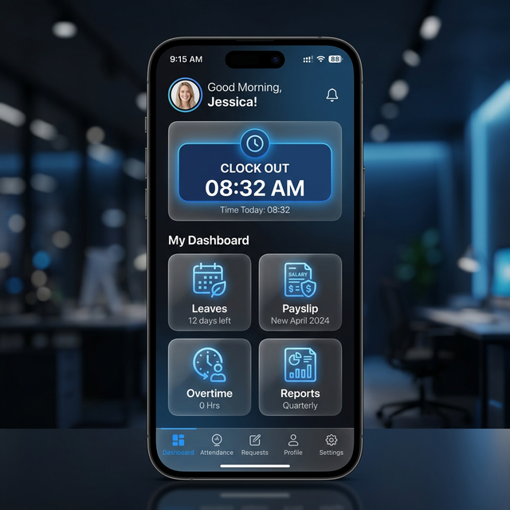

# harikerja HRMS SaaS

A next-generation, multi-tenant Human Resource Management System (HRMS) built for enterprise scale. This platform provides a comprehensive suite for HR management, attendance tracking with AI biometric verification, Indonesian payroll compliance (TER 2024), and Executive Analytics.

## ✨ Platform Highlights

### Professional Admin Dashboard

*Modern, glassmorphism-based command center for HR professionals.*

### Secure Mobile Attendance
<p align="center">
  
  
</p>
*Biometric face verification and real-time shift management for employees.*

---

## 🚀 Quick Start (Docker)

The fastest way to get the environment running is using Docker:

```bash
docker-compose up --build
```

**Access Points:**
- **Public Dashboard**: [http://localhost:3000](http://localhost:3000)
- **Tenant Dashboard**: [http://company1.localhost:3000](http://company1.localhost:3000) (Requires hosts mapping)
- **Backend API Docs (Swagger)**: [http://localhost:8000/api/schema/swagger-ui/](http://localhost:8000/api/schema/swagger-ui/)
- **Django Admin**: [http://localhost:8000/admin/](http://localhost:8000/admin/)

> [!IMPORTANT]
> To access tenant subdomains locally, add an entry to your `hosts` file:
> `127.0.0.1 company1.localhost`

---

## 📁 Project Modules

| Module | Purpose | Documentation |
| :--- | :--- | :--- |
| **Backend** | Django REST API & Multi-tenant Core | [**README**](./backend/README.md) |
| **Frontend** | Next.js Premium Admin Dashboard | [**README**](./frontend/README.md) |
| **Mobile** | Flutter Employee Self-Service App | [**README**](./mobile/README.md) |
| **Docs** | Architecture & Project History | [**Walkthrough**](./docs/walkthrough.md) |

---

## 💎 Premium Features

- **Multi-Tenant Foundation**: Complete data isolation using PostgreSQL schemas per customer.
- **Biometric Security**: AI-powered Face ID with liveness check using Google ML Kit.
- **Payroll Engine**: Fully compliant Indonesian PPh 21 (TER 2024) and BPJS calculation engine.
- **Auto-Onboarding**: Commercial-ready self-service registration and provisioning workflow.
- **Analytics**: High-performance executive dashboards with real-time HR metrics.

## 🛠 Tech Stack

- **Backend**: Python 3.12, Django 5.0, Django-Tenants, DRF Spectacular.
- **Frontend**: Next.js 14, TypeScript, Tailwind CSS, Framer Motion, Vitest.
- **Mobile**: Flutter 3.19+, Dart, Google ML Kit, Secure Storage.
- **Infrastructure**: PostgreSQL, Redis, PgBouncer, Docker Compose.

---
**Status**: Milestone 🎉 Phase 3 100% Complete. Rebranded to **harikerja** on March 16, 2026.
