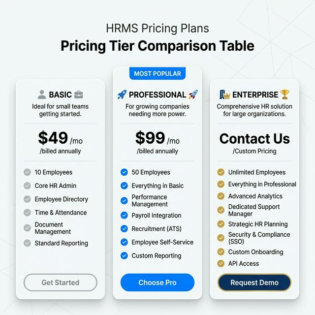

# HariKerja HRMS SaaS

A next-generation, multi-tenant Human Resource Management System (HRMS) built for enterprise scale. This platform provides a comprehensive suite for HR management, attendance tracking with AI biometric verification, Indonesian payroll compliance (TER 2024), and Executive Analytics.

## ✨ Platform Highlights

### Professional Admin Dashboard


_Modern, glassmorphism-based command center for HR professionals._

### Secure Mobile Attendance

<p align="center">
  
  
</p>

_Biometric face verification and real-time ESS (Employee Self-Service) for modern workforces._

### 🛠️ Admin & Operations


_Streamlined tenant onboarding and organizational provisioning._

### 📅 Advanced Scheduling


_Interactive shift planning and calendar-based workforce orchestration._

### 💸 Financial Workflows


_Multi-stage approval lifecycle for expense claims and reimbursements._

### 💳 Commercial Readiness

<p align="center">
  
  
</p>

_Tiered SaaS provisioning and intelligent subscription gating (Essential, Professional, Premium, Enterprise)._

### 📊 Commercial Plans

| Feature | **FREE** | **ESSENTIAL** | **PROFESSIONAL** | **PREMIUM** | **ENTERPRISE** |
| :--- | :--- | :--- | :--- | :--- | :--- |
| **Employee Limit** | 10 | 50 | 100 | 500 | 2,000+ |
| **Core HR** | ✅ Basic | ✅ Basic | ✅ Advanced | ✅ Advanced | ✅ Advanced |
| **Attendance** | ✅ Basic | ✅ Geofencing | ✅ Geo + Photo | ✅ Correction | ✅ Shift/Roster |
| **Payroll** | ❌ | ❌ | ✅ PPh 21/BPJS | ✅ Advanced | ✅ Analytics |
| **Performance** | ❌ | ❌ | ❌ | ✅ KPI/Appraisal | ✅ Team Coaching |
| **Analytics** | ❌ | ❌ | ❌ | ❌ | ✅ Audit/Insight |

## 📦 Getting Started

The platform is orchestrated using a unified Node.js management layer.

### 🚀 Starting the Platform

Run the following command to start all services (Backend, Frontend, DB, Redis) in development mode:

```bash
# Start the entire platform
node up.mjs dev --build

# View logs
node up.mjs dev logs

# Stop the platform
node up.mjs dev down
```

### 🧪 Running the Unified Test Suite

The platform includes a master test orchestrator that runs all tests across the entire stack (Backend, Frontend, and Mobile) and generates a master report:

```bash
# Run all tests for all modules
node scripts/run_all_tests.mjs
```

**Individual Stack Tests:**
For more granular control, you can run tests within each module directory:
- [**Backend Tests**](./backend/README.md#🧪-testing-standard)
- [**Frontend Tests**](./frontend/README.md#🧪-testing-standard)
- [**Mobile Tests**](./mobile/README.md#🧪-testing-standard)

**Access Points (Local Dev):**

- **Public Dashboard**: [http://localhost:3000](http://localhost:3000)
- **Tenant Dashboard**: [http://company1.localhost:3000](http://company1.localhost:3000)
- **Backend API Docs**: [http://localhost:8000/api/schema/swagger-ui/](http://localhost:8000/api/schema/swagger-ui/)
  

## 📁 Project Modules

| Module       | Purpose                             | Documentation                      |
| :----------- | :---------------------------------- | :--------------------------------- |
| **Backend**  | Django REST API & Multi-tenant Core | [**README**](./backend/README.md)  |
| **Frontend** | Next.js Premium Admin Dashboard     | [**README**](./frontend/README.md) |
| **Mobile**   | Flutter Employee Self-Service App   | [**README**](./mobile/README.md)   |

## 🚀 Key Features

- **Multi-Tenant Foundation**: Complete data isolation using PostgreSQL schemas per customer.
- **Biometric Security**: AI-powered Face ID with liveness check using Google ML Kit.
- **Indonesian Payroll Compliance**: Fully compliant **TER 2024 PPh 21** and BPJS engine with Grade-based salary mapping.
- **Strategic Performance**: KPI tracking, Appraisal lifecycle, and multi-stage approval workflows.
- **ESS Profile Management**: Self-service portal for employees to update personal info and upload documents.
- **Auto-Onboarding**: Commercial-ready self-service registration and schema provisioning.

## 🌐 Deployment & Infrastructure

| Tier           | Domain                     | Hosting Platform              | Purpose                            |
| :------------- | :------------------------- | :---------------------------- | :--------------------------------- |
| **Dev**        | `localhost`                | Local Docker                  | Rapid prototyping & local testing. |
| **QA**         | `harikerja.web.id`      | **Biznet / IDCH / Hostinger** | Functional UAT and QA testing.     |
| **Staging**    | `harikerja.my.id` | **Biznet / Bare-Metal**       | 100K User scaling test.            |
| **Production** | `harikerja.com`            | **Biznet (100K) / AWS (1M)**  | Official enterprise workloads.     |

## 🧪 Testing Standard

The platform achieves a unified **100% test pass rate** across all layers of the stack.

- **Backend**: 355 Tests (336 Unit + 19 E2E) - Pytest. (Verified 100% Passed - May 15, 2026)
- **Frontend**: 268 Tests (206 Unit + 62 E2E) - Vitest & Playwright. (Verified 100% Passed - May 15, 2026)
- **Mobile**: 158 Tests (135 Unit + 23 E2E) - Flutter. (Verified 100% Passed - May 15, 2026)

## 📈 Scalability Strategy: Road to 1 Million Users

As **HariKerja** transitions from a solo-developed MVP to a mission-critical enterprise platform, we have established a clear technical organization roadmap to ensure 99.9% uptime and data integrity for 1 million users.

### Technical Team Organization

To guarantee stability, we have defined a **10-person core team** structure:

- **Development (4 People)**: 2 Backend (Django), 1 Frontend (Next.js), 1 Mobile (Flutter).
- **Platform & Reliability (2 People)**: 1 DevOps/SRE, 1 Security Engineer.
- **Quality & Ops (4 People)**: 1 QA Automation, 3 Technical Support/Implementation.

### Strategic Transition Phases

1.  **Current Phase**: Production Readiness & Performance Optimization (8-12 weeks)
2.  **Next Phase**: 1,000 - 10,000 User Scaling with enhanced monitoring
3.  **Future Phase**: 100,000+ User scaling with full 10-person team deployment

Detailed scaling strategy: [**Technical Team Strategy**](./docs/business_strategy/organization_structure_strategy.md) ([**Versi Indonesia**](./docs/business_strategy/organization_structure_strategy-id.md))

## 📚 Technical Documentation

For in-depth technical details, please refer to the platform-wide internal documentation:

- [**Feature Checklist & Roadmap**](./docs/project_management/feature_roadmap_checklist.md) ([**Versi Indonesia**](./docs/project_management/feature_roadmap_checklist-id.md)) - Complete list of existing features and future plans
- [**AWS High Availability Architecture**](./docs/architecture/aws_high_availability_architecture.md) ([**Versi Indonesia**](./docs/architecture/aws_high_availability_architecture-id.md)) - 1M user scaling design
- [**Scalability Architecture Guide**](./docs/architecture/scaling_architecture_guide.md) ([**Versi Indonesia**](./docs/architecture/scaling_architecture_guide-id.md)) - 100k to 1M scaling (AWS vs VPS)

## 🛠 Tech Stack

- **Backend**: Python 3.12+, Django 5.2, Django-Tenants, DRF.
- **Frontend**: Next.js 16 (App Router), TypeScript, Tailwind CSS, Framer Motion.
- **Mobile**: Flutter 3.19+, Dart, Google ML Kit (Biometrics).
- **Infrastructure**: PostgreSQL 15, Redis 7, PgBouncer, AWS (EKS/RDS/S3).

---

**Status**: 🚀 **Platform Gold Release v1.5.1 (May 11, 2026)**. Ready for Production Readiness Phase.
**Current Focus**: High Priority Performance Optimization & Security Hardening (Phase P5).
