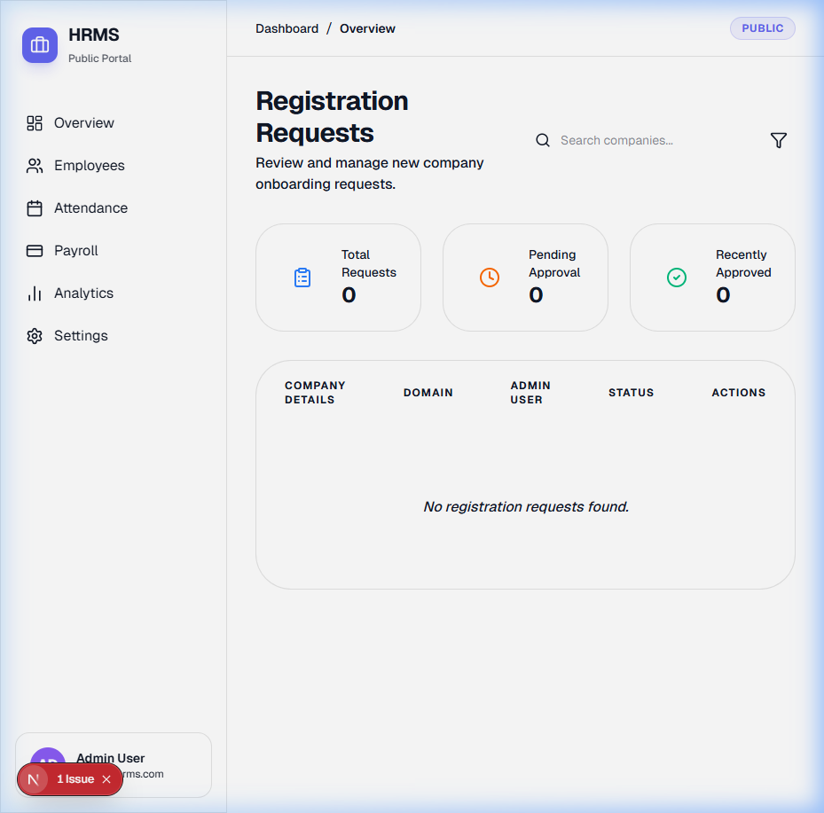

# Technical Walkthrough: Backend (harikerja HRMS)

The **harikerja HRMS** backend is a sophisticated enterprise-grade API built with Django 5.x and Python 3.12. It serves as the single source of truth for the entire ecosystem, enforcing multi-tenant isolation and Indonesian regulatory compliance.

## 🏗 Core Architecture: Multi-Tenancy
The system utilizes **schema-level isolation** via `django-tenants`. Each client (tenant) has its own dedicated PostgreSQL schema, ensuring that data is never leaked between customers.

- **Public Schema**: Contains shared data such as `Tenant` metadata, `User` credentials, and `PublicSignup` requests.
- **Tenant Schemas**: Contains all HR-related data (Employees, Attendance, Payroll, Performance).
- **Domain Routing**: The system automatically identifies the tenant based on the request's `Host` header.

## 💰 Indonesian Payroll Engine (TER 2024)
The payroll module is the most complex part of the system, fully compliant with the latest Indonesian regulations.

### 1. PPh 21 TER (Tarif Efektif Rata-rata)
Implemented the 2024 tax regulation which uses a monthly effective rate based on the employee's category (A, B, or C) and their gross income.

### 2. BPJS Calculations
- **BPJS Kesehatan**: 4% employer, 1% employee (Wage cap: Rp 12,000,000).
- **BPJS Ketenagakerjaan**: Precise 2024 calculations with automated wage capping.

## 🕒 Biometric Attendance & Geofencing
A highly secure attendance system that prevents fraud.

- **Attendance Correction**: Formal workflow for adjusting attendance records with audit trails.
- **Geofencing**: Every clock-in requires high-accuracy GPS coordinates validated against the branch's hard radius (100m).
- **Biometric Metadata**: Stores face reference blinks and head movement metadata from the mobile app's liveness check.

### SaaS Lifecycle & Tiering
- **Modular Tiering**: Plan-based feature gating (Basic/Pro/Enterprise).
- **Subscription Management**: Access control for expired or suspended tenants.

## 🔄 Multi-Stage Workflow Engine
- **Configurable Stages**: Admins can define approval flows (Supervisor -> HR).
- **Automatic Triggers**: Approved workflows automatically update the target record.

## 👤 ESS Profile Management (Phase 70)
- **Restricted Self-Service**: Implemented `EmployeeProfileSerializer` to allow employees to update personal info (Phone, Address, Marital Status) while locking master data (NIK, Salary, Role).
- **Document Management**: Added support for KTP and NPWP image uploads with automated storage pathing in `employee_docs/`.

## 🛠 Testing & Quality Assurance
- **Suite**: 155+ test scenarios using `pytest`.
- **Coverage**: 100% logic coverage for tax, BPJS, and geofencing modules.

---
**Status**: 🏆 Stable Release v1.1.1-Hardened (March 21, 2026)
