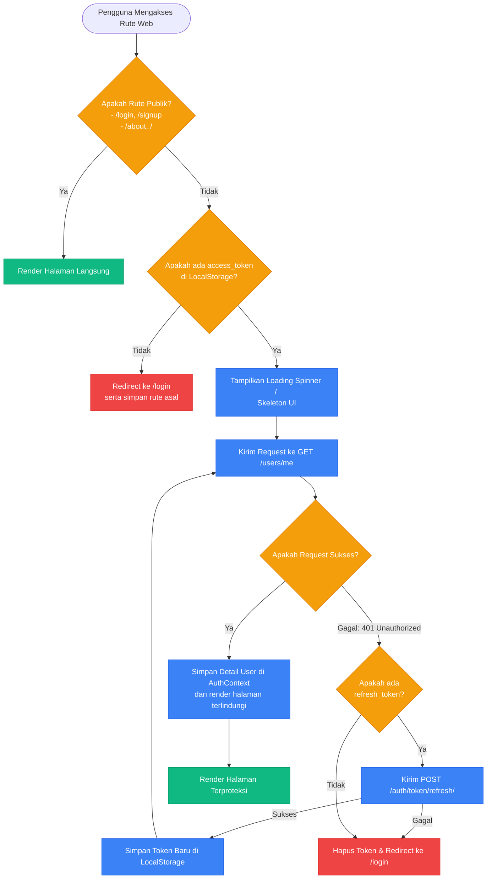
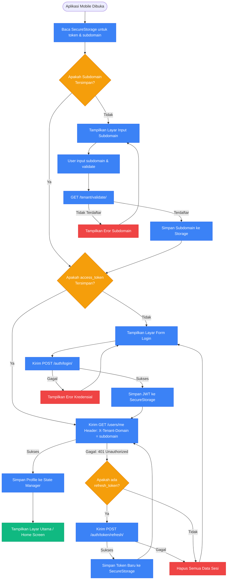

# Arsitektur Autentikasi: Web vs. Mobile

Dokumen ini menjelaskan perbandingan arsitektur, mekanisme kerja, dan diagram alir autentikasi antara aplikasi Web (Next.js) dan Mobile (Flutter) pada platform **HariKerja HRMS**.

---

## 🏗️ 1. Perbedaan Arsitektur Inti

| Fitur | Web (Next.js) | Mobile (Flutter) |
| :--- | :--- | :--- |
| **Navigasi Utama** | Berbasis URL Rute (Next.js App Router) | Berbasis Tumpukan Layar (Screen Stack Navigation) |
| **Penjaga Proteksi** | Pola Layout Guard (`DashboardLayout.tsx`) | Logika Inisialisasi Startup (`initState` & State) |
| **Resolusi Domain Tenant** | Otomatis (dibaca dari Hostname / Subdomain browser) | Manual (diinput pertama kali oleh pengguna) |
| **Penyimpanan Kunci JWT** | Browser `localStorage` / Secure Session Cookies | Hardware-Backed `FlutterSecureStorage` (Terenkripsi) |
| **Header Identifikasi API** | Injeksi otomatis subdomain via axios interceptor | `X-Tenant-Domain` pada setiap outbound http request |

---

## 🌐 2. Mekanisme & Diagram Alir Autentikasi Web (Next.js)

Karena aplikasi Next.js digerakkan oleh rute URL (pengguna bisa mengetik langsung alamat `/en/attendance` di browser), sistem web menerapkan pola **Layout Guard** di tingkat layout utama.

*   **Next.js Middleware/Context**: `TenantContext` menyelesaikan nama tenant dari URL (contoh: `ptmaju.harikerja.com`) sebelum pemeriksaan otentikasi.
*   **Interceptor API**: Menggunakan pembungkus `apiFetch.ts` kustom. Jika API mengembalikan error `401 Unauthorized`, interceptor menangguhkan request saat ini, memicu call refresh token, dan mengulang request asli dengan access token baru.

---

## 📱 3. Mekanisme & Diagram Alir Autentikasi Mobile (Flutter)

Aplikasi mobile Flutter tidak memiliki URL rute browser, sehingga keamanan layar dikelola dengan menyaring widget di layar awal berdasarkan ketersediaan token JWT terenkripsi.

*   **Penyimpanan Kunci Terenkripsi**: Menggunakan `FlutterSecureStorage` yang memanfaatkan *Keychain* (iOS) dan *Keystore* (Android) untuk melindungi token JWT dari serangan fisik perangkat.
*   **API Client Interceptor**: Objek singleton `ApiService` Flutter otomatis menginjeksi header `X-Tenant-Domain` di setiap request HTTP outgoing.

---

## 🔒 4. Praktik Terbaik Pengamanan JWT

Untuk menjaga kerahasiaan sesi pengguna, platform menerapkan aturan keamanan berikut:
1.  **Lifetime Token**: Access token diatur kedaluwarsa pendek (24 jam) untuk menekan penyalahgunaan jika token bocor. Refresh token diatur kedaluwarsa menengah (7 hari).
2.  **Blacklisting Token**: Setiap kali pengguna menekan tombol Logout, sistem mengirim request ke `/api/auth/logout/` yang memasukkan `refresh_token` bersangkutan ke dalam daftar hitam (*blacklist database*) backend. Sesi lama tidak akan bisa di-refresh kembali.
3.  **Cross-Origin Protections (Web)**: Header respons API menyertakan perlindungan CORS ketat, membatasi origin request hanya dari domain tenant yang terdaftar pada skema `public`.
