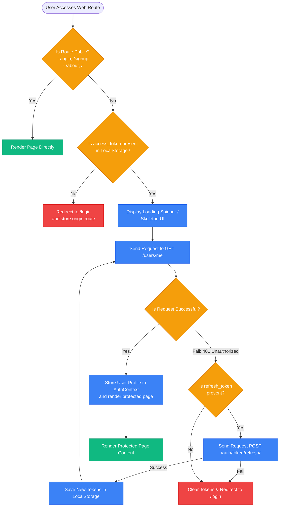
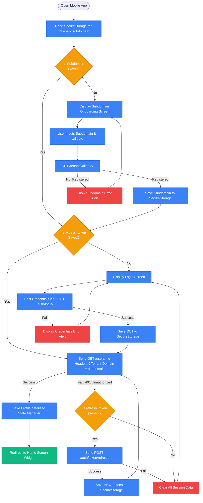

# Authentication Architecture: Web vs. Mobile

This document details the architectural comparisons, runtime mechanisms, and decision flowcharts of the authentication systems implemented in the Web (Next.js) and Mobile (Flutter) applications of the **HariKerja HRMS** platform.

---

## 🏗️ 1. Core Architectural Differences

| Feature | Web (Next.js) | Mobile (Flutter) |
| :--- | :--- | :--- |
| **Primary Navigation** | URL Route-Based (Next.js App Router) | Screen Stack-Based Navigation |
| **Access Control** | Layout Guard Pattern (`DashboardLayout.tsx`) | Startup Lifecycle Initialization (`initState` & State) |
| **Tenant Domain Resolution** | Automated (parsed from browser hostname/subdomain) | Manual (user-entered subdomain during onboarding) |
| **JWT Storage** | Browser `localStorage` / Secure Session Cookies | Hardware-Backed `FlutterSecureStorage` (Encrypted) |
| **API Identification Header** | Intercepts request to inject domain into headers | `X-Tenant-Domain` header on every outbound HTTP request |

---

## 🌐 2. Web Authentication Mechanism & Flow (Next.js)

Since Next.js application navigation is driven by browser URLs (allowing users to bookmark or type `/en/attendance` directly), the web system enforces a **Layout Guard** at the root layout level.

*   **Next.js Middleware & Context**: `TenantContext` resolves the tenant subdomain from the URL (e.g., `ptmaju.harikerja.com`) before any auth checks are executed.
*   **API Interceptor**: Utilizes a custom `apiFetch.ts` wrapper. If a network call returns `401 Unauthorized`, the interceptor halts outbound calls, triggers a token refresh, and retries the original request with the new access token.

---

## 📱 3. Mobile Authentication Mechanism & Flow (Flutter)

The ESS Flutter mobile application does not have a browser URL routing system, so screen security is managed by validating JWT presence in the application startup widget lifecycle.

*   **Secure Storage**: Uses the `FlutterSecureStorage` library, which utilizes Keychains (iOS) and Keystores (Android) to safeguard JWT tokens from physical storage dump attacks.
*   **API Interceptor**: The Flutter `ApiService` singleton automatically appends the `X-Tenant-Domain` header on every outbound network request.

---

## 🔒 4. JWT Security Best Practices

To protect user sessions, the platform enforces the following policies:
1.  **Short Access Lifespans**: Access tokens are configured to expire in 24 hours to limit vulnerability windows in case of token leakage. Refresh tokens last 7 days.
2.  **Server-Side Blacklisting**: When a user logs out, a request is dispatched to `/api/auth/logout/` which registers the `refresh_token` in the database blacklist. Subsequent refresh attempts using this token are rejected.
3.  **Strict CORS Headers**: API responses utilize tight CORS controls, restricting valid origin requests to verified tenant subdomains in the `public` schema.
