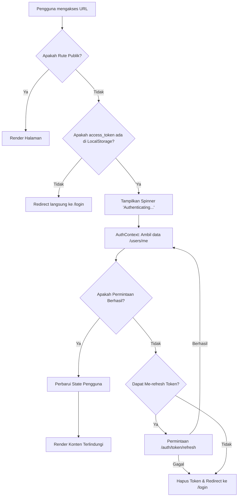

# Alur Autentikasi Frontend (Web)

Dokumen ini menjelaskan siklus hidup autentikasi dan mekanisme perlindungan untuk Aplikasi Web HRMS.

## Tumpukan Teknologi
- **Framework**: Next.js (App Router)
- **Manajemen State**: React Context (AuthContext, TenantContext)
- **Penyimpanan**: Browser LocalStorage (JWT Tokens)
- **Routing**: `next-intl` untuk routing yang terlokalisasi.

## Rute Publik vs. Terlindungi
Komponen `DashboardLayout` mengklasifikasikan rute untuk menentukan akses.

### Rute Publik
- `/login`
- `/signup`
- `/registration`
- `/about`
- `/pricelist`
- `/` (Hanya landing page utama)

### Rute Terlindungi
Semua rute lainnya memerlukan JWT yang valid.

## Alur Guard Autentikasi

## Mekanisme Kunci

### 1. Resolusi Tenant
Frontend mengidentifikasi tenant berdasarkan subdomain (`subdomain.harikerja.web.id`). Hal ini terjadi di `TenantContext.tsx` sebelum pemeriksaan autentikasi.

### 2. Refresh Token Otomatis
Jika panggilan API mengembalikan `401 Unauthorized`, utilitas `apiFetch` secara otomatis mencoba me-refresh token menggunakan `refresh_token` yang disimpan di LocalStorage.

### 3. Persistensi Sesi
Token disimpan di `localStorage`. Access token biasanya kedaluwarsa dalam 24 jam, sedangkan refresh token bertahan selama 7 hari.
