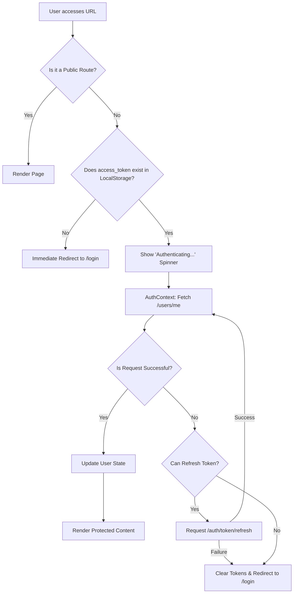

# Frontend Authentication Flow (Web)

This document describes the authentication lifecycle and protection mechanisms for the HRMS Web Application.

## Technology Stack
- **Framework**: Next.js (App Router)
- **State Management**: React Context (AuthContext, TenantContext)
- **Storage**: Browser LocalStorage (JWT Tokens)
- **Routing**: `next-intl` for localized routing.

## Public vs. Protected Routes
The `DashboardLayout` component classifies routes to determine access.

### Public Routes
- `/login`
- `/signup`
- `/registration`
- `/about`
- `/` (Master landing page only)

### Protected Routes
Everything else requires a valid JWT.

## Authentication Guard Flow

## Key Mechanisms

### 1. Tenant Resolution
The frontend identifies the tenant based on the subdomain (`subdomain.harikerja.web.id`). This happens in `TenantContext.tsx` before the auth check.

### 2. Automatic Token Refresh
If an API call returns a `401 Unauthorized`, the `apiFetch` utility automatically attempts to refresh the token using the `refresh_token` stored in LocalStorage.

### 3. Session Persistence
Tokens are stored in `localStorage`. Access tokens usually expire in 24 hours, while refresh tokens last for 7 days.
