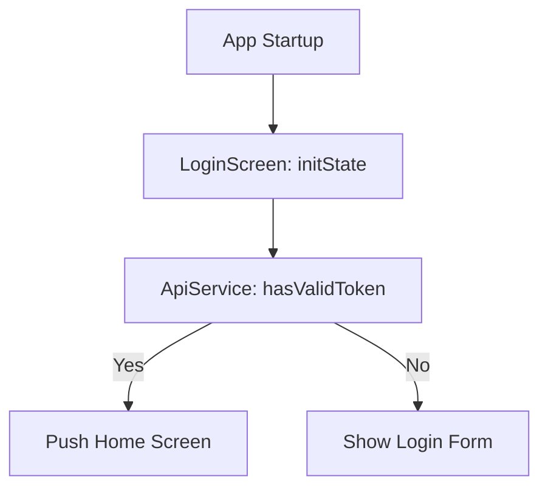
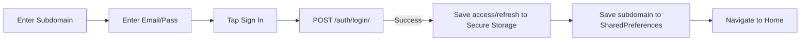

# Mobile Authentication Flow (Flutter)

This document describes the authentication lifecycle for the HRMS Mobile Application.

## Technology Stack
- **Framework**: Flutter
- **Security**: `flutter_secure_storage` (Keychain/Keystore)
- **Settings**: `shared_preferences`
- **Networking**: `http` package with custom `ApiService` wrapper.

## Authentication Process

### 1. Startup Logic
The application starts at `LoginScreen`.

### 2. Login Workflow
Unlike the web version, the mobile app requires the user to specify their company subdomain manually.

## Security & Networking

### Secure Storage
- **JWT Access Token**: Stored in encrypted storage (`jwt_token`).
- **Refresh Token**: Stored in encrypted storage (`refresh_token`).
- **Tenant ID**: Stored in plain shared preferences (`tenant_subdomain`).

### Authenticated Requests
All requests to protected endpoints use the `_authenticatedRequest` helper:
1. Appends `Authorization: Bearer <token>` header.
2. Appends `X-Tenant-Domain: <tenant>.<domain_suffix>` header.
3. If a request fails with `401 Unauthorized`, it automatically calls `refreshToken()`.
4. If refresh fails, it clears the storage and prompts for login.

## Known Limitations
- **Subdomain Input**: Users must know their company's unique subdomain to log in.
- **Auto-Login Flicker**: The login screen is briefly visible before the auto-login redirect occurs.
