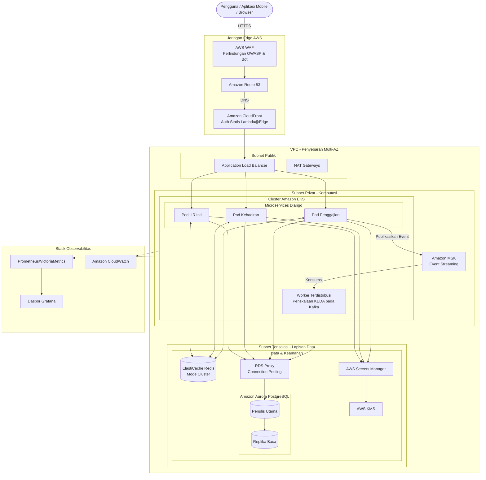

# Arsitektur High Availability HRMS (1 Juta Pengguna)

Dokumen ini menguraikan arsitektur AWS yang dirancang untuk mendukung Sistem Manajemen Sumber Daya Manusia (HRMS) yang skalabel, terurai (decoupled), dan elastis yang mampu menangani hingga 1 juta pengguna, secara khusus menangani lonjakan lalu lintas yang tajam selama absensi pagi.

## Diagram Arsitektur Sistem

---

## Metrik Skalabilitas & Target Kinerja

Untuk mendukung **1 juta pengguna**, arsitektur ini diukur terhadap target produksi berikut:

| Metrik | Target (p95) | Deskripsi |
| :--- | :--- | :--- |
| **Latensi API** | < 150ms | Diukur dari ALB hingga Respons. |
| **Throughput (Puncak)** | 5.000 RPS | Lonjakan absensi puncak pagi (08:00 AM). |
| **Latensi Database** | < 50ms | Latensi tulis utama melalui RDS Proxy. |
| **Waktu Cold-Start** | < 30s | Waktu untuk menyediakan pod EKS baru saat lonjakan. |
| **Aset Statis** | < 200ms | Pengiriman global melalui CloudFront. |

---

## Komponen Infrastruktur Inti

| Lapisan | Layanan | Deskripsi | Rincian Skalabilitas Kunci |
|---|---|---|---|
| **Edge** | **CloudFront + WAF** | CDN Global dan Firewall Web. | Menggunakan **Lambda@Edge** untuk perutean sadar tenant. |
| **Komputasi** | **AWS EKS (Graviton)** | Kubernetes pada node **ARM64**. | **KEDA** menskalakan worker Celery berdasarkan backlog tugas. |
| **Database** | **Aurora + RDS Proxy** | Lapisan data relasional. | **RDS Proxy** me-multipleks koneksi untuk konkurensi tinggi. |
| **Caching** | **ElastiCache Redis** | Cache terdistribusi. | **Mode Cluster** diaktifkan untuk penskalaan memori horizontal. |

---

## Strategi Partisi Data (PostgreSQL)

Pada skala 1 juta pengguna, tabel standar akan menjadi hambatan. Kami menerapkan **Partisi Tabel Asli (Native Table Partitioning)**:

1.  **Log Kehadiran**: Dipartisi berdasarkan **Bulan** (misalnya, `attendance_2026_04`).
2.  **Jejak Audit (Audit Trails)**: Dipartisi berdasarkan **Grup Tenant** atau **Kuartal**.
3.  **Keuntungan**:
    *   **Vacuuming Lebih Cepat**: Autovacuum berjalan pada partisi yang lebih kecil.
    *   **Pengarsipan Efisien**: Menghapus partisi lama (lebih dari 2 tahun) ke S3/Glacier dengan mudah.
    *   **Query Pruning**: PostgreSQL hanya memindai partisi yang relevan untuk rentang tanggal tertentu.

---

## Peta Jalan Penskalaan: Menuju 1 Juta (Pendekatan Hibrida)

Untuk memaksimalkan efisiensi biaya, platform ini menggunakan **Perjalanan Infrastruktur Hibrida**, menskalakan pada penyedia Bare-Metal lokal sebelum bermigrasi ke arsitektur Perusahaan AWS yang dijelaskan dalam dokumen ini.

| Fase | Tujuan | Infrastruktur | Paradigma Arsitektur |
| :--- | :--- | :--- | :--- |
| **Fase 1: MVP & Pertumbuhan Awal** | 10.000 Pengguna | **Biznet/VPS Lokal** (Penskalaan Vertikal) | Monolit, PostgreSQL Lokal, Antrean Celery Sederhana. |
| **Fase 2: Scale-Out** | 100.000 Pengguna | **Biznet Bare-Metal** (Penskalaan Horizontal) | Monolit Load Balanced, DB Primary-Replica, Penyimpanan Objek S3. |
| **Fase 3: Cloud Perusahaan** | 1.000.000 Pengguna | **AWS EKS + MSK + Fargate** | Microservices, Sharding Database, Berbasis Event (Kafka). |

---

## Evolusi ke Microservices & Arsitektur Berbasis Event

Mencapai 1 juta pengguna mengharuskan pemecahan Monolit Django untuk mencegah lonjakan lalu lintas lokal (misalnya, absensi pagi) agar tidak merusak seluruh sistem.

1. **Ekstraksi Microservices**: Monolit dipecah menjadi pod independen (HR Inti, Kehadiran, Penggajian). Masing-masing dapat diskalakan secara independen melalui HPA (Horizontal Pod Autoscaling) berdasarkan permintaan CPU/RAM spesifik.
2. **Integrasi Amazon MSK (Kafka)**: Mengandalkan Redis/SQS untuk pemrosesan gaji massal pada 1 juta pengguna berisiko karena batas memori. Amazon MSK (Managed Kafka) bertindak sebagai tulang punggung yang tangguh untuk semua event asinkron (misalnya, mengalirkan ribuan event clock-in ke mesin kalkulasi gaji tanpa kehilangan data).

---

## Optimalisasi Biaya & Efisiensi

| Strategi | Implementasi | Penghematan |
| :--- | :--- | :--- |
| **Node Graviton** | Gunakan instans `t4g` / `m6g` untuk EKS. | ~40% Peningkatan Harga/Performa. |
| **Instans Spot** | Gunakan Spot untuk **Worker Celery** (tugas latar belakang). | Pengurangan biaya hingga 70%. |
| **S3 Intelligent-Tiering** | Pindahkan foto biometrik dan slip gaji lama. | Pengurangan biaya otomatis untuk data dingin. |
| **Savings Plans** | Berkomitmen pada penggunaan komputasi 1/3 tahun. | ~30% diskon pada EKS/Fargate. |

---

## Praktik Terbaik Operasional (Tips Performa Tinggi)

Untuk memastikan sistem tetap stabil selama puncak lalu lintas (08:00 AM), terapkan strategi operasional berikut:

1.  **Penskalaan Terjadwal (Proaktif)**:
    *   Jangan hanya mengandalkan auto-scaling reaktif.
    *   Gunakan **AWS Auto Scaling Plans** untuk melakukan "Warm-up" (pra-penskalaan pod/node) 15 menit sebelum jam sibuk (misalnya, pada pukul 07:45 AM).
2.  **Fokus Penulisan Database**:
    *   Pastikan Master DB hanya menangani transaksi penulisan.
    *   Gunakan **Redis Cluster** untuk manajemen sesi, metadata tenant, dan pengaturan global sehingga DB tidak terbebani oleh kueri BACA yang berulang.
3.  **Optimalisasi Gambar Sisi Klien**:
    *   Terapkan kompresi gambar sisi klien pada Aplikasi Mobile/Browser sebelum mengunggah ke S3.
    *   Targetkan ukuran foto biometrik di bawah **200KB** untuk mengurangi beban bandwidth dan latensi S3.
4.  **Multiplexing Koneksi**:
    *   Manfaatkan **RDS Proxy** dengan fitur "Pinning avoidance" untuk menjaga koneksi database tetap terbuka dan efisien bagi ribuan pod Django secara bersamaan.

---

## Pustaka Integrasi Django Esensial

| Pustaka | Tujuan |
|---|---|
| `django-prometheus` | Mengekspor metrik tingkat aplikasi. |
| `django-db-geventpool` | Mengoptimalkan konkurensi untuk tugas yang terikat I/O. |
| `keda-python-sdk` | (Opsional) Integrasi untuk metrik kustom ke KEDA. |
| `django-health-check` | Probe Liveness dan Readiness untuk Kubernetes. |

---

**Status**: 🚀 **Arsitektur Dioptimalkan untuk 1 Juta Pengguna**
**Terakhir Diperbarui**: 13 April 2026
