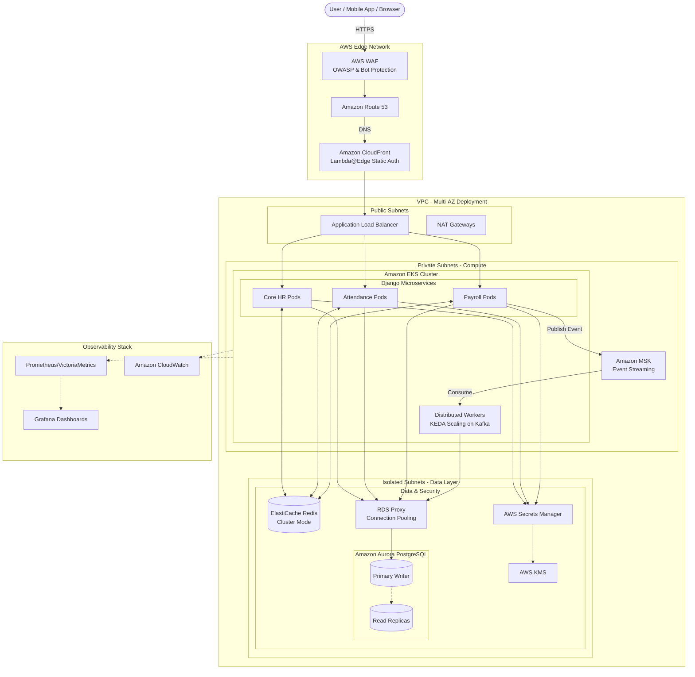

# HRMS High Availability Architecture (1 Million Users)

This document outlines the AWS architecture designed to support a scalable, decoupled, and elastic Human Resource Management System (HRMS) capable of handling up to 1 million users, specifically addressing sharp traffic spikes during morning attendance.

## System Architecture Diagram

---

## Scalability Metrics & Performance targets

To support **1 million users**, the architecture is benchmarked against these production targets:

| Metric | Target (p95) | Description |
| :--- | :--- | :--- |
| **API Latency** | < 150ms | Measured from ALB to Response. |
| **Throughput (Peak)** | 5,000 RPS | Morning peak (08:00 AM) attendance burst. |
| **Database Latency** | < 50ms | Primary write latency via RDS Proxy. |
| **Cold-Start Time** | < 30s | Time to provision new EKS pods during spikes. |
| **Static Assets** | < 200ms | Global delivery via CloudFront. |

---

## Core Infrastructure Components

| Layer | Service | Description | Key Scalability Detail |
|---|---|---|---|
| **Edge** | **CloudFront + WAF** | Global CDN and Web Firewall. | Uses **Lambda@Edge** for tenant-aware routing. |
| **Compute** | **AWS EKS (Graviton)** | Kubernetes on **ARM64** nodes. | **KEDA** scales Celery workers based on task backlog. |
| **Database** | **Aurora + RDS Proxy** | Relational data layer. | **RDS Proxy** multiplexes connections for high concurrency. |
| **Caching** | **ElastiCache Redis** | Distributed cache. | **Cluster Mode** enabled for horizontal memory scaling. |

---

## Data Partitioning Strategy (PostgreSQL)

At 1M user scale, standard tables will become bottlenecks. We implement **Native Table Partitioning**:

1.  **Attendance Logs**: Partitioned by **Month** (e.g., `attendance_2026_04`).
2.  **Audit Trails**: Partitioned by **Tenant Group** or **Quarter**.
3.  **Benefits**:
    *   **Faster Vacuuming**: Autovacuum runs on smaller partitions.
    *   **Efficient Archiving**: Drop old partitions (older than 2 years) to S3/Glacier easily.
    *   **Query Pruning**: PostgreSQL only scans the relevant partition for a specific date range.

---

## Scaling Roadmap: Road to 1 Million (Hybrid Approach)

To maximize cost-efficiency, the platform utilizes a **Hybrid Infrastructure Journey**, scaling on local Bare-Metal providers before migrating to the AWS Enterprise architecture described in this document.

| Phase | Goal | Infrastructure | Architecture Paradigm |
| :--- | :--- | :--- | :--- |
| **Phase 1: MVP & Early Growth** | 10,000 Users | **Biznet/Local VPS** (Vertical Scaling) | Monolith, Local PostgreSQL, Simple Celery Queue. |
| **Phase 2: Scale-Out** | 100,000 Users | **Biznet Bare-Metal** (Horizontal Scaling) | Load Balanced Monolith, DB Primary-Replica, S3 Object Storage. |
| **Phase 3: Enterprise Cloud** | 1,000,000 Users | **AWS EKS + MSK + Fargate** | Microservices, Database Sharding, Event-Driven (Kafka). |

---

## Evolution to Microservices & Event-Driven Architecture

Reaching 1 million users necessitates breaking down the Django Monolith to prevent localized traffic spikes (e.g., morning attendance) from crashing the entire system.

1. **Microservices Extraction**: The monolith is split into independent pods (Core HR, Attendance, Payroll). Each can scale independently via HPA (Horizontal Pod Autoscaling) based on specific CPU/RAM demands.
2. **Amazon MSK (Kafka) Integration**: Relying on Redis/SQS for mass payroll processing at 1M users is risky due to memory limits. Amazon MSK (Managed Kafka) acts as the resilient backbone for all asynchronous events (e.g., streaming thousands of clock-in events to the payroll calculation engine without dropping data).

---

## Cost Optimization & Efficiency

| Strategy | Implementation | Savings |
| :--- | :--- | :--- |
| **Graviton Nodes** | Use `t4g` / `m6g` instances for EKS. | ~40% Price/Perf improvement. |
| **Spot Instances** | Use Spot for **Celery Workers** (background tasks). | Up to 70% cost reduction. |
| **S3 Intelligent-Tiering** | Move biometric photos and old payslips. | Automatic cost reduction for cold data. |
| **Savings Plans** | Commit to 1/3 year compute usage. | ~30% discount on EKS/Fargate. |

---

## Operational Best Practices (High Performance Tips)

To ensure the system remains stable during peak traffic (08:00 AM), implement the following operational strategies:

1.  **Scheduled Scaling (Proactive)**:
    *   Do not rely solely on reactive auto-scaling.
    *   Use **AWS Auto Scaling Plans** to perform a "Warm-up" (pre-scaling pods/nodes) 15 minutes before peak hours (e.g., at 07:45 AM).
2.  **Database Write Focus**:
    *   Ensure the Master DB only handles write transactions.
    *   Use **Redis Cluster** for session management, tenant metadata, and global settings so the DB is not overloaded by repetitive READ queries.
3.  **Client-Side Image Optimization**:
    *   Implement client-side image compression on the Mobile App/Browser before uploading to S3.
    *   Target biometric photo sizes under **200KB** to reduce bandwidth load and S3 latency.
4.  **Connection Multiplexing**:
    *   Leverage **RDS Proxy** with "Pinning avoidance" features to keep database connections open and efficient for thousands of Django pods simultaneously.

---

## Essential Django Integration Libraries

| Library | Purpose |
|---|---|
| `django-prometheus` | Exports application-level metrics. |
| `django-db-geventpool` | Optimizes concurrency for I/O bound tasks. |
| `keda-python-sdk` | (Optional) Integration for custom metrics to KEDA. |
| `django-health-check` | Liveness and Readiness probes for Kubernetes. |

---

**Status**: 🚀 **Architecture Optimized for 1M Users**
**Last Updated**: April 13, 2026
