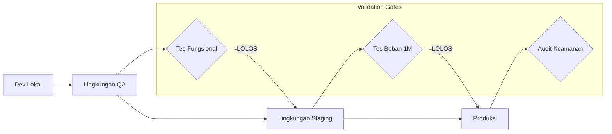

# Strategi Penyebaran & Jalur Promosi

Dokumen ini menetapkan siklus hidup teknis platform **harikerja HRMS**, memetakan perjalanan dari mesin lokal pengembang hingga produksi dengan ketersediaan tinggi (high-availability) untuk 1 juta pengguna.

## 🚀 Jalur Promosi

Kami mengikuti jalur promosi satu arah yang ketat untuk memastikan stabilitas dan integritas data.

---

## 🏗️ Matriks Lingkungan

| Lingkungan | Tujuan | Hosting | Domain |
| :--- | :--- | :--- | :--- |
| **Development** | Coding fitur & debugging. | Docker Lokal | `localhost` |
| **QA** | Pengujian fungsional & UAT. | VPS Tunggal (Ubuntu) | `harikerja.web.id` |
| **Staging** | Tes Penskalaan 100 Ribu Pengguna | **Biznet / Bare-Metal** | `harikerja.my.id` |
| **Production** | Beban kerja perusahaan langsung. | **Biznet (100K) / AWS (1M)** | `harikerja.com` |

---

## 🛠️ Rincian Tahapan Langkah-demi-Langkah

### Tahap 1: Integrasi Berkelanjutan (CI)
*   **Pemicu**: Push ke cabang (branch) mana pun.
*   **Tindakan**: 
    1.  Jalankan Linting (Prettier/ESLint/Flake8).
    2.  Jalankan Unit Test Backend (Pytest).
    3.  Jalankan Unit Test Frontend (Vitest).
    4.  Build Docker Image untuk memverifikasi tidak ada kesalahan kompilasi.
*   **Tujuan**: Tingkat kelulusan 100%.

### Tahap 2: Penjaminan Kualitas (QA)
*   **Pemicu**: Merge ke cabang `develop`.
*   **Tindakan**: Deploy ke VPS melalui `deploy/qa/deploy_qa.sh`.
*   **Pengujian**: UAT manual oleh tim produk.
*   **Durasi**: 1-3 hari per sprint.

### Tahap 3: Staging & Performa (Pre-Prod)
*   **Pemicu**: Tag rilis (misal, `v1.4.0-rc1`) atau Merge ke `release/*`.
*   **Tindakan**: Deploy ke Biznet / Bare-Metal (Staging).
*   **Pengujian**: 
    1.  End-to-End Test (Playwright).
    2.  **Tes Beban 100 Ribu Pengguna** (Locust).
*   **Tujuan**: Verifikasi arsitektur Penskalaan Horizontal.

### Tahap 4: Produksi (Go-Live)
*   **Pemicu**: Merge ke cabang `main`.
*   **Tindakan**: Deploy ke Cluster Produksi (Biznet atau AWS).
*   **Pasca-Penyebaran**: 
    1.  Verifikasi Pemeriksaan Kesehatan (Health Check).
    2.  Pemindaian Keamanan (Security Scanning).
    3.  Pemeriksaan integritas data di seluruh tenant.

---

## 📦 Tautan Dokumentasi Penyebaran

- [**Panduan QA Manual**](../deploy/qa/qa-id.md)
- [**Panduan Staging AWS**](../deploy/staging/staging-id.md)
- [**Panduan Produksi AWS**](../deploy/production/production-id.md)
- [**Desain High Availability (EKS)**](./aws_high_availability_architecture-id.md)

---

## 🔒 Keamanan & Kepatuhan
Semua lingkungan harus mematuhi:
1.  **Isolasi Rahasia yang Ketat**: Jangan pernah membagikan file `.env` di seluruh lingkungan.
2.  **Data Terenkripsi**: Semua instans RDS harus menggunakan enkripsi AES-256.
3.  **Log Audit**: Setiap tindakan administratif harus dicatat dan tidak dapat diubah (immutable).

---

**Status**: 🛠️ **Strategi Penyebaran Ditetapkan**
**Tanggal Efektif**: 13 April 2026
