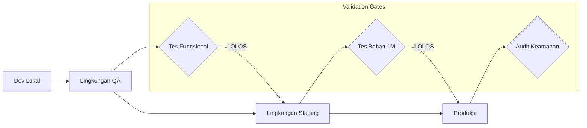

# Strategi Penyebaran & Jalur Promosi

Dokumen ini menetapkan siklus hidup teknis platform **harikerja HRMS**, memetakan perjalanan dari mesin lokal pengembang hingga produksi dengan ketersediaan tinggi (high-availability) untuk 1 juta pengguna.

## 🚀 Jalur Promosi

Kami mengikuti jalur promosi satu arah yang ketat untuk memastikan stabilitas dan integritas data.

---

## 🏗️ Matriks Lingkungan

| Lingkungan | Tujuan | Hosting | Domain |
| :--- | :--- | :--- | :--- |
| **Development** | Coding fitur & debugging. | Docker Lokal | `localhost` |
| **QA** | Pengujian fungsional & UAT. | VPS Biznet (Spek Rendah) | `harikerja.web.id` |
| **Staging** | *Ditiadakan pada Fase 1* (Rencana masa depan). | Biznet / Bare-Metal | `harikerja.my.id` |
| **Production** | Beban kerja langsung (Hingga 10K User). | **VPS Biznet (Spek Tinggi)** | `harikerja.com` |
| **Production AWS** | Migrasi setelah skala melebihi 10K User. | **AWS EKS / Aurora** | `harikerja.com` |

---

## 🛠️ Rincian Tahapan Langkah-demi-Langkah

### Tahap 1: Integrasi Berkelanjutan (CI)
*   **Pemicu**: Push ke cabang (branch) mana pun.
*   **Tindakan**: 
    1.  Jalankan Linting (Prettier/ESLint/Flake8).
    2.  Jalankan Unit Test Backend (Pytest).
    3.  Jalankan Unit Test Frontend (Vitest).
    4.  Build Docker Image untuk memverifikasi tidak ada kesalahan kompilasi.
*   **Tujuan**: Tingkat kelulusan 100%.

### Tahap 2: Penjaminan Kualitas (QA)
*   **Pemicu**: Merge ke cabang `develop`.
*   **Tindakan**: Deploy ke VPS melalui `deploy/qa/deploy_qa.sh`.
*   **Pengujian**: UAT manual oleh tim produk.
*   **Durasi**: 1-3 hari per sprint.

### Tahap 3: Staging & Performa (Pre-Prod)
*   **Status**: **Dilewati/Ditunda (Deferred)** untuk menghemat biaya infrastruktur awal. QA langsung dipromosikan ke Produksi setelah lolos pengujian fungsional.
*   **Rencana Masa Depan**: Akan diaktifkan kembali jika skala pengguna mendekati transisi ke AWS EKS (simulasi beban kerja 100K+).

### Tahap 4: Produksi (Go-Live)
*   **Pemicu**: Merge ke cabang cabang `main` setelah rilis QA disetujui.
*   **Tindakan**: Deploy ke server Produksi Biznet menggunakan konfigurasi di `deploy/production-10k/`.
*   **Pasca-Penyebaran**: 
    1.  Verifikasi Pemeriksaan Kesehatan (Health Check).
    2.  Verifikasi Integritas Data & Tenant.
    3.  Pencadangan berkas basis data otomatis.
    4.  *(Masa depan)* Migrasi ke AWS EKS jika skala melampaui 10.000 pengguna aktif.

---

## 📦 Tautan Dokumentasi Penyebaran

- [**Panduan QA Manual**](../../deploy/qa/qa.id.md)
- [**Panduan Staging AWS**](../../deploy/staging/staging.md)
- [**Panduan Produksi AWS**](../../deploy/production/production.md)
- [**Desain High Availability (EKS)**](./aws_high_availability_architecture.id.md) ([**English Version**](./aws_high_availability_architecture.md))

---

## 🔒 Keamanan & Kepatuhan
Semua lingkungan harus mematuhi:
1.  **Isolasi Rahasia yang Ketat**: Jangan pernah membagikan file `.env` di seluruh lingkungan.
2.  **Data Terenkripsi**: Semua instans RDS harus menggunakan enkripsi AES-256.
3.  **Log Audit**: Setiap tindakan administratif harus dicatat dan tidak dapat diubah (immutable).

---

**Status**: 🛠️ **Strategi Penyebaran Ditetapkan**
**Tanggal Efektif**: 13 April 2026
