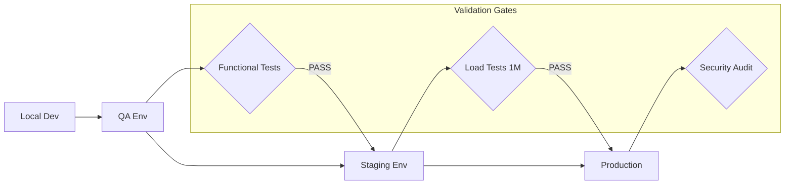

# Deployment Strategy & Promotion Path

This document defines the technical lifecycle of the **harikerja HRMS** platform, charting the journey from a developer's local machine to high-availability production for 1 million users.

## 🚀 The Promotion Path

We follow a strict, one-way promotion path to ensure stability and data integrity.

---

## 🏗️ Environment Matrix

| Environment | Purpose | Hosting | Domain |
| :--- | :--- | :--- | :--- |
| **Development** | Feature coding & debugging. | Local Docker | `localhost` |
| **QA** | Functional & UAT testing. | Single VPS (Ubuntu) | `harikerja.web.id` |
| **Staging** | 100K User Scaling Tests | **Biznet / Bare-Metal** | `harikerja.my.id` |
| **Production** | Live enterprise workloads. | **Biznet (100K) / AWS (1M)** | `harikerja.com` |

---

## 🛠️ Step-by-Step Stage Details

### Stage 1: Continuous Integration (CI)
*   **Trigger**: Push to any branch.
*   **Action**: 
    1.  Run Linting (Prettier/ESLint/Flake8).
    2.  Run Backend Unit Tests (Pytest).
    3.  Run Frontend Unit Tests (Vitest).
    4.  Build Docker Images to verify no compile errors.
*   **Goal**: 100% Pass rate.

### Stage 2: Quality Assurance (QA)
*   **Trigger**: Merge to `develop` branch.
*   **Action**: Deploy to VPS via `deploy/qa/deploy_qa.sh`.
*   **Testing**: Manual UAT by the product team.
*   **Duration**: 1-3 days per sprint.

### Stage 3: Staging & Performance (Pre-Prod)
*   **Trigger**: Tag release (e.g., `v1.4.0-rc1`) or Merge to `release/*`.
*   **Action**: Deploy to Biznet / Bare-Metal (Staging).
*   **Testing**: 
    1.  End-to-End Tests (Playwright).
    2.  **100K User Load Test** (Locust).
*   **Goal**: Verify the Horizontal Scaling architecture.

### Stage 4: Production (Go-Live)
*   **Trigger**: Merge to `main` branch.
*   **Action**: Deploy to Production Cluster (Biznet or AWS).
*   **Post-Deploy**: 
    1.  Health Check Verification.
    2.  Security Scanning.
    3.  Data Integrity checks across tenants.

---

## 📦 Deployment Documentation Links

- [**Manual QA Guide**](../deploy/qa/qa.md)
- [**AWS Staging Guide**](../deploy/staging/staging.md)
- [**AWS Production Guide**](../deploy/production/production.md)
- [**High Availability (EKS) Design**](./aws_high_availability_architecture.md)

---

## 🔒 Security & Compliance
All environments must adhere to:
1.  **Strict Secrets Isolation**: Never share `.env` files across environments.
2.  **Encrypted Data**: All RDS instances must use AES-256 encryption.
3.  **Audit Logs**: Every administrative action must be logged and immutable.

---

**Status**: 🛠️ **Deployment Strategy Defined**
**Effective Date**: April 13, 2026
