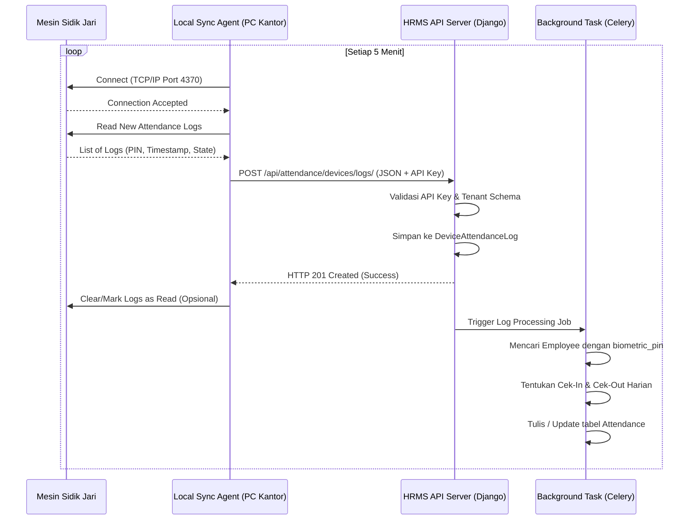

# Desain Integrasi Absensi Sidik Jari (Fingerprint Attendance Integration Design)

Dokumen ini merancang arsitektur integrasi sistem absensi sidik jari ke dalam platform **HRMS (Human Resource Management System)**. Untuk mengakomodasi kebutuhan operasional perusahaan, sistem ini dirancang dengan pendekatan hibrida (*hybrid approach*):

1. **Metode A: Integrasi Mesin Sidik Jari Fisik (Office/On-Site)**
   Digunakan untuk karyawan yang bekerja di kantor atau cabang fisik menggunakan mesin absensi biometrik stand-alone (contoh: ZKTeco, Solution, Hikvision).
2. **Metode B: Integrasi Biometrik Sidik Jari Mobile (Field/Remote)**
   Digunakan untuk karyawan lapangan, *sales*, atau WFH (*Work From Home*) menggunakan sensor sidik jari bawaan smartphone pada aplikasi mobile Flutter.

---

## 1. Kebijakan Opsional Tingkat Tenant (Tenant Policy)

Sama halnya dengan verifikasi biometrik wajah (`is_biometric_enabled`), fitur integrasi absensi sidik jari ini dirancang bersifat **opsional** dan dikontrol sepenuhnya di tingkat penyewa (*Tenant*).

* **Konfigurasi Penyewa (Tenant Config)**: Ditambahkan field `is_fingerprint_enabled = models.BooleanField(default=False)` pada model `Tenant` di skema `public`. Fitur ini dinonaktifkan secara default dan dapat diaktifkan oleh administrator tenant/superadmin jika diperlukan.
* **Validasi Sisi Server (Server-side Validation)**: Setiap request API untuk logging sidik jari fisik atau clock-in mobile akan memvalidasi field ini terlebih dahulu. Jika bernilai `False`, server akan mengembalikan respon `403 Forbidden` dengan keterangan bahwa fitur sidik jari belum diaktifkan untuk penyewa tersebut.
* **Kontrol Sisi Klien (Client-side Control)**: Aplikasi Flutter memuat konfigurasi profil tenant saat pertama kali login. Jika `is_fingerprint_enabled` bernilai `false`, maka opsi absensi sidik jari pada layar pengaturan (*Settings*) dan layar presensi (*Clock-in*) akan disembunyikan secara otomatis.

---

## 2. Arsitektur Umum & Aliran Data

Sistem HRMS menggunakan arsitektur **Multi-Tenancy** dengan pendekatan *Shared Database, Separate Schemas* (menggunakan `django-tenants`). Setiap perusahaan memiliki skema database PostgreSQL sendiri, sehingga integrasi ini harus mendukung pemisahan konteks tenant secara dinamis.

### Diagram Alur Data Integrasi

```mermaid
graph TD
    subgraph Kantor Cabang (Physical Location)
        A[Mesin Sidik Jari Fisik] -->|Koneksi Lokal TCP/IP| B[Local Sync Agent]
        B -->|Kirim Log via HTTPS + API Key| C{Router / Gateway}
    end

    subgraph Smartphone Karyawan
        D[Flutter Mobile App] -->|Kunci Sidik Jari Lokal| E[BiometricPrompt API]
        E -->|Kirim Clock-in via HTTPS + JWT| C
    end

    subgraph Backend Cloud (Django Multi-Tenant)
        C -->|Pencocokan Tenant Subdomain| F[Tenant Middleware]
        F -->|Identifikasi Tenant Schema| G[API Endpoint]
        G -->|Simpan Log Mentah| H[(DeviceAttendanceLog)]
        G -->|Simpan Absensi| I[(Attendance)]
    end

    subgraph Background Workers (Celery / Django Q)
        H -->|Asynchronous Parser| J[Log Processing Task]
        J -->|Resolusi PIN & Waktu Kerja| I
    end
```

---

## 3. Metode A: Integrasi Mesin Sidik Jari Fisik (ZKTeco / Solution)

Mesin fisik stand-alone umumnya menyimpan sidik jari secara lokal dan menetapkan nomor **Enrollment ID (PIN)** unik untuk setiap sidik jari karyawan.

### 2.1 Alur Autentikasi dan Multi-Tenancy
Mesin absensi fisik atau *agent* lokal harus mengautentikasi ke API Server menggunakan model **`APIKey`** yang disediakan oleh modul `core`.
* **Identifikasi Tenant**: Request dikirim ke subdomain organisasi terkait (misalnya `https://client-a.hrms.com/api/attendance/devices/logs/`).
* **Autentikasi Header**: `X-API-KEY: key_prefix.secret_hash`.

### 2.2 Penyesuaian Model Basis Data (Django)
Untuk mendukung pencatatan mesin, kita memerlukan modifikasi pada skema basis data penyewa (*tenant schema*):

1. **Menambahkan Kolom Mapping pada `core.Employee`**
   * Tambahkan kolom `biometric_pin` (CharField/IntegerField, nullable, unique) untuk memetakan PIN di mesin ke data karyawan di HRMS.

2. **Membuat Model Baru `attendance.FingerprintDevice`**
   Model ini digunakan untuk mengelola mesin sidik jari yang terdaftar di setiap kantor cabang.
   ```python
   class FingerprintDevice(AuditModel):
       name = models.CharField(max_length=100)
       device_model = models.CharField(max_length=100, blank=True)
       serial_number = models.CharField(max_length=100, unique=True)
       ip_address = models.GenericIPAddressField(blank=True, null=True, help_text="IP Lokal jika menggunakan Local Agent")
       port = models.IntegerField(default=4370)
       branch = models.ForeignKey('core.Branch', on_delete=models.CASCADE, related_name='fingerprint_devices')
       is_active = models.BooleanField(default=True)
       last_sync_at = models.DateTimeField(null=True, blank=True)

       def __str__(self):
           return f"{self.name} - {self.serial_number} ({self.branch.name})"
   ```

3. **Membuat Model Baru `attendance.DeviceAttendanceLog`**
   Digunakan untuk menampung data mentah log transaksi presensi dari mesin sebelum diproses ke tabel utama `Attendance`. Ini penting untuk menjamin tidak ada log yang hilang (*fault tolerance*) dan memungkinkan re-proses jika terjadi kesalahan sistem.
   ```python
   class DeviceAttendanceLog(AuditModel):
       device = models.ForeignKey(FingerprintDevice, on_delete=models.SET_NULL, null=True, related_name='logs')
       biometric_pin = models.CharField(max_length=50, help_text="PIN Karyawan pada mesin")
       timestamp = models.DateTimeField()
       verification_mode = models.IntegerField(help_text="1: Finger, 2: Face, 3: Card, 4: Password")
       in_out_state = models.CharField(max_length=10, choices=[('IN', 'Masuk'), ('OUT', 'Keluar'), ('AUTO', 'Deteksi Otomatis')])
       is_processed = models.BooleanField(default=False)
       processed_at = models.DateTimeField(null=True, blank=True)
       processing_error = models.TextField(blank=True, null=True)

       class Meta:
           unique_together = ('biometric_pin', 'timestamp')

       def __str__(self):
           return f"Log PIN {self.biometric_pin} at {self.timestamp}"
   ```

### 2.3 Desain API Endpoint
Endpoint ini diakses oleh *Local Sync Agent* atau mesin dengan protokol ADMS untuk mengirimkan log kehadiran terbaru:

* **URL**: `POST /api/attendance/devices/logs/`
* **Headers**:
  ```http
  Content-Type: application/json
  X-API-KEY: d3v1c3.a1b2c3d4e5f6g7h8...
  ```
* **Payload JSON**:
  ```json
  {
    "device_serial": "ZK-K40-2026119",
    "logs": [
      {
        "biometric_pin": "105",
        "timestamp": "2026-05-21T08:02:15+07:00",
        "verification_mode": 1,
        "in_out_state": "IN"
      },
      {
        "biometric_pin": "108",
        "timestamp": "2026-05-21T17:05:42+07:00",
        "verification_mode": 1,
        "in_out_state": "OUT"
      }
    ]
  }
  ```
* **Response**:
  ```json
  {
    "status": "success",
    "received": 2,
    "inserted": 2
  }
  ```

### 2.4 Mekanisme Sinkronisasi & Komunikasi Hardware
Ada dua arsitektur komunikasi yang bisa diimplementasikan berdasarkan tipe mesin:

#### Opsi 1: Menggunakan ADMS (Automatic Data Master System) - Paling Direkomendasikan
Banyak mesin ZKTeco modern mendukung protokol ADMS (atau WDMS).
* Mesin bertindak sebagai *HTTP Client* yang terhubung ke internet.
* Mesin akan melakukan polling berkala dan mengirim HTTP POST berisi log kehadiran langsung ke API Server HRMS cloud kita.
* **Keuntungan**: Tidak membutuhkan komputer server lokal di kantor cabang. Mesin langsung terhubung ke cloud.

#### Opsi 2: Menggunakan Local Sync Agent (Python / Node.js Daemon)
Jika mesin hanya mendukung SDK lokal (tidak mendukung ADMS/Cloud), kita perlu memasang skrip *Daemon* (Agent) di satu PC yang berada dalam jaringan lokal yang sama dengan mesin.
* Agent terhubung ke mesin menggunakan protokol TCP/IP Port `4370` dengan library seperti `pyzk` (Python) atau `zklib` (Node.js).
* Skrip berjalan di latar belakang (misalnya setiap 5 menit via Cron/Task Scheduler).
* Skrip melakukan *pull* log mentah dari mesin, lalu mengirimkannya melalui HTTP POST ke API Server HRMS.



---

## 4. Metode B: Integrasi Biometrik Sidik Jari Mobile (Flutter App)

Untuk karyawan remote/mobile, proses sidik jari dilakukan secara lokal pada smartphone melalui API Biometrik bawaan (Android BiometricPrompt / iOS FaceID & TouchID).

### 3.1 Integrasi Client-Side (Flutter)
1. **Tambahkan Paket**: Gunakan library [local_auth](https://pub.dev/packages/local_auth) di Flutter.
2. **Konfigurasi Platform**:
   * **Android**: Tambahkan permission `<uses-permission android:name="android.permission.USE_BIOMETRIC"/>` pada `AndroidManifest.xml`.
   * **iOS**: Tambahkan `NSFaceIDUsageDescription` on `Info.plist`.
3. **Logika Verifikasi**:
   * Sebelum Clock-In/Out, aplikasi memeriksa ketersediaan sensor biometrik.
   * Aplikasi menampilkan dialog sidik jari bawaan OS.
   * Setelah verifikasi lokal berhasil, aplikasi mengirimkan flag verifikasi ke backend.

### 3.2 Penyesuaian API Mobile Clock-In (`POST /api/attendance/clock-in/`)
Ketika karyawan melakukan clock-in via handphone dengan sidik jari, payload API akan menambahkan informasi parameter metode verifikasi:

```json
{
  "employee_id": 42,
  "latitude": -6.2088,
  "longitude": 106.8456,
  "verification_method": "MOBILE_FINGERPRINT",
  "biometric_verified": true,
  "device_id": "UUID-1234-5678-ABCD"
}
```

Backend Django akan memproses request ini:
1. Memverifikasi apakah karyawan berada di radius cabang penugasan (jika kebijakan geofencing aktif).
2. Membuat data `Attendance` baru dengan status `verification_method` diatur ke `'MOBILE_FINGERPRINT'`.

---

## 5. Pipeline Pemrosesan Log Kehadiran Mesin (Backend Worker)

Proses pengolahan data mentah dari `DeviceAttendanceLog` ke `Attendance` utama dijalankan di background untuk menghindari pemblokiran API request (*non-blocking*).

### Algoritma Pencocokan Log Harian
Untuk setiap log mentah baru:
1. Cari objek `Employee` yang memiliki `biometric_pin == log.biometric_pin`.
2. Dapatkan tanggal dari `log.timestamp` (dikonversi ke timezone kantor cabang `device.branch.timezone`).
3. Cari apakah sudah ada data `Attendance` untuk karyawan tersebut pada tanggal tersebut.
4. Tentukan aksi berdasarkan waktu log:
   * **Log Masuk (Check-In)**:
     Jika belum ada data `Attendance` untuk tanggal tersebut:
     * Buat baris baru.
     * Set `check_in = log.timestamp.time()`.
     * Hitung status (`PRESENT` atau `LATE` berdasarkan ketentuan jam masuk shift karyawan).
     * Set `verification_method = 'FINGERPRINT'`.
   * **Log Keluar (Check-Out)**:
     Jika data `Attendance` sudah ada:
     * Set `check_out = log.timestamp.time()`.
     * Hitung total jam kerja (`total_hours`).
     * Update baris tersebut.
     Jika data `Attendance` belum ada (karyawan lupa clock-in tetapi clock-out terekam):
     * Buat baris baru.
     * Set `check_out = log.timestamp.time()`.
     * Set `status = 'ABSENT'` (atau status sesuai regulasi internal karena tidak ada check-in).
5. Tandai `log.is_processed = True`.

---

## 6. Rencana Langkah Implementasi (Implementation Steps)

> [!IMPORTANT]
> Pengembangan akan dibagi menjadi 3 fase utama untuk meminimalkan risiko gangguan pada sistem presensi yang sudah berjalan.

### Fase 1: Backend & Database Schema
1. Jalankan migrasi database untuk menambahkan bidang mapping PIN pada model `Employee`.
2. Buat tabel `FingerprintDevice` dan `DeviceAttendanceLog` beserta migrasinya.
3. Buat API endpoint `POST /api/attendance/devices/logs/` dengan `APIKeyAuthentication`.
4. Implementasikan modul admin Django untuk pendaftaran mesin oleh HR Admin.

### Fase 2: Background Job & Integrasi Hardware
1. Buat Celery task `process_device_attendance_logs` untuk memproses log mentah secara berkala (misalnya setiap 5 menit).
2. Tulis skrip *Local Sync Agent* (menggunakan library `pyzk` di Python) untuk klien yang menggunakan mesin konvensional non-ADMS.
3. Lakukan pengujian integrasi dengan mesin simulator / mock data.

### Fase 3: Integrasi Aplikasi Mobile
1. Tambahkan dependency `local_auth` di Flutter (`mobile/pubspec.yaml`).
2. Perbarui `settings_screen.dart` untuk mengaktifkan opsi "Biometric Clock-In" (menyimpan preferensi ini secara lokal menggunakan `shared_preferences` atau `flutter_secure_storage`).
3. Perbarui layar clock-in utama untuk meminta sidik jari sebelum memanggil API.
4. Perbarui serializer backend untuk menerima metode `'MOBILE_FINGERPRINT'`.
