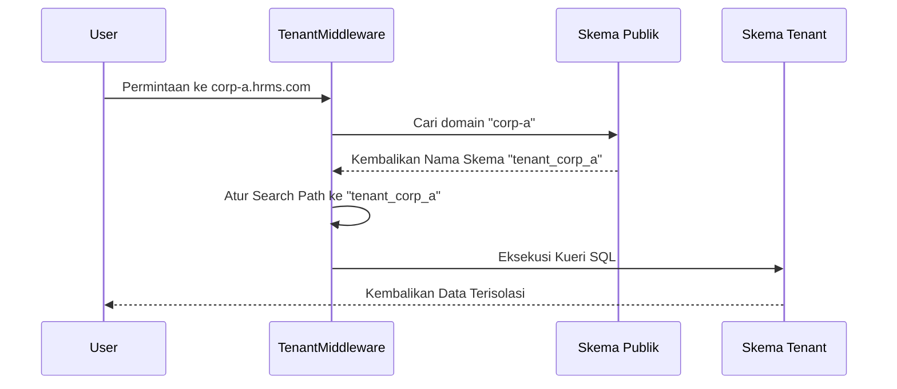

# Arsitektur Multi-Tenancy

Dokumen ini menjelaskan implementasi multi-tenancy pada platform HRMS. Sistem ini dirancang untuk mendukung banyak organisasi (tenant) menggunakan satu instans database dengan isolasi data yang ketat.

## Konsep Inti: Skema PostgreSQL

Sistem ini mengikuti strategi **"Shared Database, Separate Schemas"** (Database Bersama, Skema Terpisah). Alih-alih membuat database terpisah untuk setiap perusahaan, kami menggunakan **Skema** PostgreSQL untuk menyediakan isolasi logis.

*   **Skema Publik:** Skema "Master" yang mengelola data global dan perutean tenant.
*   **Skema Tenant:** Setiap organisasi mendapatkan skemanya sendiri yang didedikasikan (misalnya, `tenant_a`, `tenant_b`) di mana data bisnis spesifik mereka (karyawan, penggajian, kehadiran) berada.

## 1. Tenant Publik (Master)

Tenant Publik adalah pendaftar inti dari seluruh sistem. Ia bertindak sebagai "resepsionis" yang mengarahkan pengguna ke data organisasi mereka masing-masing.

### Fungsi Utama:
*   **Registri Tenant:** Menyimpan daftar semua perusahaan yang terdaftar (model `tenants.Tenant`).
*   **Pemetaan Domain:** Memetakan subdomain (misalnya, `corp-a.hrms.com`) ke skema internal yang benar.
*   **Akun Pengguna Global:** Menyimpan kredensial pengguna (model `users.User`). Pengguna bersifat global tetapi dikaitkan dengan tenant tertentu melalui hubungan Many-to-Many.
*   **Manajemen Pendaftaran:** Menangani pendaftaran baru dan penyediaan skema tenant baru.
*   **Langganan & Penagihan:** Mengelola rencana SaaS, kuota (maksimal karyawan, penyimpanan), dan tanggal kedaluwarsa untuk semua tenant.

## 2. Skema Tenant (Data Terisolasi)

Ketika sebuah perusahaan baru disetujui, sistem secara otomatis membuat skema PostgreSQL baru untuk mereka. Skema ini berisi tabel untuk "Aplikasi Tenant" yang meliputi:

*   **Data Master HR (`core`):** Karyawan, Departemen, Posisi, dll.
*   **Kehadiran (`attendance`):** Catatan clock-in/out, jadwal, dan koreksi.
*   **Penggajian (`payroll`):** Struktur gaji, slip gaji, dan perhitungan pajak.
*   **Reimbursement (`reimbursement`):** Klaim biaya dan alur kerja persetujuan.

### Keuntungan Isolasi Skema:
1.  **Keamanan:** Data dari Perusahaan A dipisahkan secara fisik dari Perusahaan B di tingkat database. Kueri SQL dalam konteks satu tenant tidak dapat mengakses data tenant lain secara tidak sengaja.
2.  **Kinerja:** Indeks dan tabel lebih kecil per tenant dibandingkan dengan satu tabel raksasa untuk semua pengguna.
3.  **Pemeliharaan:** Lebih mudah untuk melakukan pencadangan (backup) atau migrasi untuk tenant tertentu jika diperlukan.

## 3. Cara Kerja Alur Kerja Permintaan

Sistem menggunakan middleware untuk menentukan konteks tenant untuk setiap permintaan yang masuk.

1.  **Perutean:** Sistem mengidentifikasi tenant berdasarkan subdomain atau header khusus.
2.  **Peralihan Konteks:** `TenantMiddleware` mengatur `search_path` PostgreSQL ke skema tenant target.
3.  **Eksekusi:** Selama durasi permintaan tersebut, semua kueri database (misalnya, `SELECT * FROM employees`) hanya akan menargetkan tabel di dalam skema spesifik tersebut.

## 4. Data Bersama vs Data Tenant

| Jenis Aplikasi | Lokasi Penyimpanan | Contoh |
| :--- | :--- | :--- |
| **Aplikasi Bersama** | Skema Publik | Akun Pengguna, Daftar Tenant, Domain, Penagihan |
| **Aplikasi Tenant** | Skema Individu | Karyawan, Kehadiran, Penggajian, Pengaturan |

---

## Referensi Teknis
- **Pustaka:** `django-tenants`
- **Database:** PostgreSQL
- **Model Utama:** 
    - `tenants.Tenant`: Mendefinisikan organisasi dan kuotanya.
    - `tenants.Domain`: Mendefinisikan URL/subdomain untuk perutean.
    - `users.User`: Identitas pengguna global.
