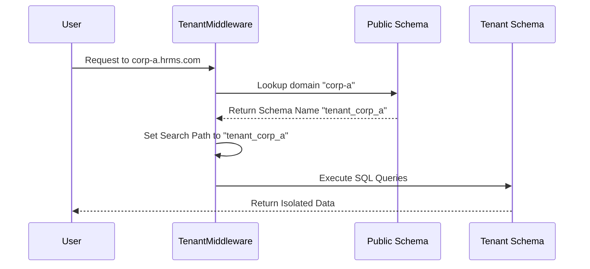

# Multi-Tenancy Architecture

This document explains the multi-tenancy implementation in the HRMS platform. The system is designed to support multiple organizations (tenants) using a single database instance with strict data isolation.

## Core Concept: PostgreSQL Schemas

The system follows the **"Shared Database, Separate Schemas"** strategy. Instead of creating a separate database for each company, we use PostgreSQL **Schemas** to provide logical isolation.

*   **Public Schema:** The "Master" schema that manages global data and tenant routing.
*   **Tenant Schemas:** Each organization gets its own dedicated schema (e.g., `tenant_a`, `tenant_b`) where their specific business data (employees, payroll, attendance) resides.

## 1. The Public Tenant (Master)

The Public Tenant is the core registry of the entire system. It acts as the "receptionist" that directs users to their respective organization's data.

### Primary Functions:
*   **Tenant Registry:** Stores the list of all registered companies (`tenants.Tenant` model).
*   **Domain Mapping:** Maps subdomains (e.g., `corp-a.hrms.com`) to the correct internal schema.
*   **Global User Accounts:** Stores user credentials (`users.User` model). Users are global but are associated with specific tenants via a Many-to-Many relationship.
*   **Registration Management:** Handles new sign-ups and the provisioning of new tenant schemas.
*   **Subscription & Billing:** Manages the SaaS plans, quotas (max employees, storage), and expiry dates for all tenants.

## 2. Tenant Schemas (Isolated Data)

When a new company is approved, the system automatically creates a new PostgreSQL schema for them. This schema contains tables for "Tenant Apps" which include:

*   **HR Master Data (`core`):** Employees, Departments, Positions, etc.
*   **Attendance (`attendance`):** Clock-in/out records, schedules, and corrections.
*   **Payroll (`payroll`):** Salary structures, payslips, and tax calculations.
*   **Reimbursement (`reimbursement`):** Expense claims and approval workflows.

### Benefits of Schema Isolation:
1.  **Security:** Data from Company A is physically separated from Company B at the database level. A SQL query in one tenant's context cannot accidentally access another tenant's data.
2.  **Performance:** Indexes and tables are smaller per tenant compared to a single giant table for all users.
3.  **Maintenance:** It is easier to perform backups or migrations for a specific tenant if needed.

## 3. How the Request Workflow Works

The system uses middleware to determine the tenant context for every incoming request.

1.  **Routing:** The system identifies the tenant based on the subdomain or a custom header.
2.  **Context Switching:** The `TenantMiddleware` sets the PostgreSQL `search_path` to the target tenant's schema.
3.  **Execution:** For the duration of that request, all database queries (e.g., `SELECT * FROM employees`) will only target the tables within that specific schema.

## 4. Shared vs Tenant Data

| App Type | Storage Location | Examples |
| :--- | :--- | :--- |
| **Shared Apps** | Public Schema | User Accounts, Tenant List, Domains, Billing |
| **Tenant Apps** | Individual Schema | Employees, Attendance, Payroll, Settings |

---

## Technical Reference
- **Library:** `django-tenants`
- **Database:** PostgreSQL
- **Key Models:** 
    - `tenants.Tenant`: Defines the organization and its quotas.
    - `tenants.Domain`: Defines the URL/subdomain for routing.
    - `users.User`: Global user identity.
