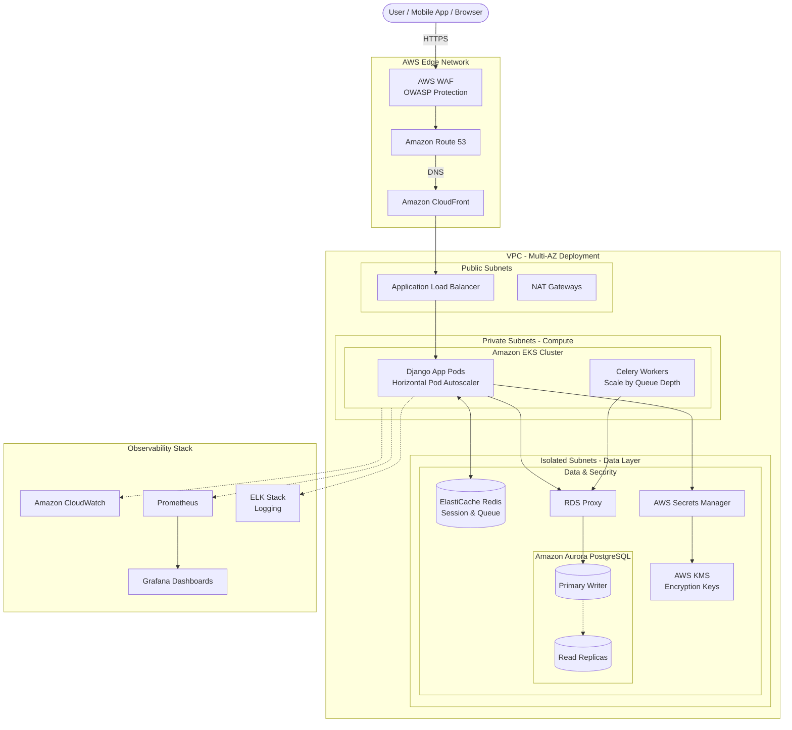

# HRMS High Availability Architecture (1 Million Users)

This document outlines the AWS architecture designed to support a scalable, decoupled, and elastic Human Resource Management System (HRMS) capable of handling up to 1 million users, specifically addressing sharp traffic spikes during morning attendance.

## System Architecture Diagram

## Core Infrastructure Components

| Layer | Service | Description | Key Details |
|---|---|---|---|
| **Security** | **AWS WAF & KMS** | Protects endpoints and encrypts sensitive HR data. | **WAF:** Blocks SQLi/XSS. **KMS/Secrets:** Secure rotation of DB credentials & PII encryption. |
| **Compute** | **AWS EKS (Fargate)** | Managed Kubernetes for elastic scaling. | **HPA:** Scales pods based on CPU/RAM. **Fargate:** No server management required. |
| **Database** | **Aurora PostgreSQL** | Multi-AZ database with automatic failover. | **RDS Proxy:** Prevents connection exhaustion during 08:00 AM spikes. **Read Replicas:** Offloads reporting query load. |
| **Observability** | **Prometheus & Grafana** | Real-time monitoring and alerting. | **CloudWatch:** Infrastructure metrics. **ELK:** Centralized log analysis for audit trails. |
| **Caching** | **ElastiCache Redis** | High-performance session & queue manager. | **Multi-AZ:** Global session persistence even during AZ failure. |
| **Storage & CDN**| **S3 + CloudFront** | Secure asset storage and global delivery. | **Lifecycle:** Auto-archive old payslips to Glacier after 6 months. |

---

## Data Flow Summary

| Step | Action | Operational Detail |
|---|---|---|
| 1 | **Entry & Filter** | Traffic hits **CloudFront** and is filtered by **AWS WAF** to block malicious bots. |
| 2 | **Routing** | **ALB** forwards traffic to active **EKS Pods** across multiple Availability Zones. |
| 3 | **Secret Retrieval** | Django retrieves DB credentials from **Secrets Manager** (decrypted via **KMS**) at runtime. |
| 4 | **Processing** | Django checks **Redis** for sessions; if MISS, it queries **Aurora** via **RDS Proxy**. |
| 5 | **Async Tasks** | Heavy payroll/PDF tasks are sent to **Redis Queue** and processed by **Celery Workers**. |

---

## Cost-Efficiency & Scaling Roadmap

To ensure the project remains affordable during launch while being "future-proof," we recommend a phased implementation approach.

### Phase 1: MVP (Launch & Early Beta)
*   **Goal:** Minimize baseline costs and DevOps overhead while verifying core features.
*   **Compute:** **AWS App Runner** (Highly recommended for Solo Devs; handles Load Balancing/SSL automatically) or ECS Fargate.
*   **Database:** RDS PostgreSQL Single-AZ (t4g.small instance).
*   **Networking:** Public Subnets with strict Security Groups (saves $32/mo/AZ for NAT Gateways).

### Phase 2: Growth (Institutional Rollout)
*   **Goal:** Increase reliability and performance for the first 10k-50k users.
*   **Compute:** Migrate to EKS (Kubernetes) for unified orchestration.
*   **Database:** Aurora PostgreSQL (Single Instance or Serverless v2).
*   **Networking:** Private Subnets + 1 shared NAT Gateway.

### Phase 3: Enterprise Scale (1 Million Users)
*   **Goal:** Maximum availability, security, and global responsiveness.
*   **Compute:** EKS with HPA + Multi-AZ Fargate.
*   **Database:** Aurora Multi-AZ + RDS Proxy + Read Replicas.
*   **Networking:** Fully isolated subnets + Multi-AZ NAT Gateways.
*   **Security:** AWS WAF Enforcement + Secrets Manager Automation.

---

## Infrastructure Right-Sizing Comparison

| Service | Phase 1: MVP | Phase 2: Growth | Phase 3: Scale | Impact on Cost |
|---|---|---|---|---|
| **Cluster Fee** | $0 (App Runner/ECS) | $73 / month (EKS) | $73 / month (EKS) | Medium |
| **Networking** | $0 (Public Subnet) | ~$32 / month (1x NAT) | $96+ / month (3x NAT) | Very High |
| **Database** | ~$25 / month (RDS) | ~$60 / month (Aurora v2) | ~$300+ / month (Aurora HA) | High |
| **WAF** | $0 (Disabled) | ~$10 / month (Basic) | $20+ / month (Enterprise) | Low |
| **Baseline Total** | **~$45 - $70 / month** | **~$175 - $220 / month** | **~$500 - $800 / month** | **Scalable** |

---

## Operational Excellence & Reliability

### Disaster Recovery (DR)
*   **Target RPO (Recovery Point Objective):** 5 Minutes (Max data loss).
*   **Target RTO (Recovery Time Objective):** 15 Minutes (Max downtime).
*   **Backups:** Automated Aurora snapshots replicated to a secondary region.

### Scaling Strategy
*   **Vertical:** Right-sizing pods via **AWS Compute Optimizer**.
*   **Horizontal:** **HPA (Horizontal Pod Autoscaler)** doubles pod count 10 minutes before 08:00 AM based on cron-predictive scaling.

### Security Enforcement
*   **Encryption:** TLS 1.3 for all traffic. AES-256 encryption at rest for RDS and S3.
*   **Network:** Data layer in **Isolated Subnets** with no egress/ingress to the public internet.
*   **Audit:** All administrative actions logged to **CloudTrail** and **ELK**.

---

## Essential Django Integration Libraries

| Library | Purpose |
|---|---|
| `django-prometheus` | Exports application metrics to Prometheus for Grafana dashboards. |
| `boto3` & `django-storages` | Managed S3 integration with IAM Roles (no hardcoded keys). |
| `django-health-check` | Provides `/health/` probes for EKS Liveness/Readiness. |
| `django-db-geventpool` | Optimizes connection pooling for high-concurrency environments. |

