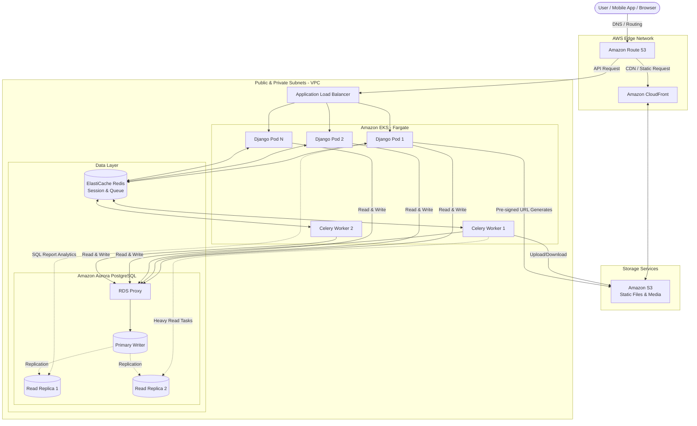

# HRMS High Availability Architecture (1 Million Users)

This document outlines the AWS architecture designed to support a scalable, decoupled, and elastic Human Resource Management System (HRMS) capable of handling up to 1 million users, specifically addressing sharp traffic spikes during morning attendance.

## System Architecture Diagram

## Core Infrastructure Components

| Layer | Service | Description | Key Details |
|---|---|---|---|
| Compute | **AWS EKS (Kubernetes)** | Handles application scaling and runs Django containers without manual EC2 management. | **Auto-scaling:** Spins up pods during 08:00 AM spikes. **AWS Fargate:** Serverless compute for containers. |
| Database | **Amazon RDS Multi-AZ + Read Replicas** | The multi-tenant heart of the system supporting intense queries. | **Primary:** Write transactions. **Read Replicas:** 2-3 replicas for Dashboard Analytics. **Aurora PostgreSQL:** Auto-scaling storage without downtime. **RDS Proxy:** Crucial connection pooling for concurrent traffic. |
| Storage & CDN | **Amazon S3 + CloudFront** | Offloads media and delivers static front-end assets globally. | **S3:** Central lake for biometric photos and PDF slips. **CloudFront (CDN):** Delivers Next.js build caches and media with low latency. |
| Traffic | **Application Load Balancer (ALB)** | Routes API requests and handles SSL natively. | Distributes traffic evenly to EKS pods and unloads decryption CPU overhead. |
| Caching & Queue | **ElastiCache (Redis)** | High-concurrency in-memory cache and message broker. | **Session Management:** Stateless authentication (prevents logouts). **Queue (Celery):** Background processing for tax rules and payrolls. |

---

## Data Flow Summary

| Step | Action | Main Service Route | Detailed Operation |
|---|---|---|---|
| 1 | **User Request** | Route 53 → CloudFront / ALB | Traffic initiates via DNS and routes to CDN (for UI/Static) or ALB (for API queries). |
| 2 | **API Routing** | ALB → EKS (Django) | ALB balances the HTTP proxies to optimal pods inside the Kubernetes cluster. |
| 3 | **Optimized Lookups** | Django → Redis & Aurora | Django checks Redis cache first. If void, it hits PostgreSQL exclusively passing through RDS Proxy. |
| 4 | **Asynchronous Hand-off** | Django → Redis Queue → Celery | Payrolls and heavy operations are pushed to the Queue, immediately freeing up the UI, while Celery crunches tasks. |
| 5 | **Direct Storage Routing** | Django → S3 | Biometric uploads request signed URLs from Django, then directly upload massive image payloads to S3 bucket edges. |

---

## Cost Optimization & Efficiency Strategies

| Strategy | Target | Impact & Benefit |
|---|---|---|
| **Reserved Instances (RI)** | Aurora DB & Fargate | Committing upfront for 1-3 years yields roughly ~40% discount versus on-demand options. |
| **S3 Lifecycle Policies** | Amazon S3 & Glacier | Automatically archives old biometric photos and docs (>6 months) to much cheaper Glacier storage retainment. |
| **AWS Compute Optimizer** | EKS Pods & DB Memory | Intelligent ML evaluation to right-size global architectures, ensuring nothing is wastefully oversized. |

---

## Essential Django Backend Libraries Integration

To properly support the cloud infrastructure above, the codebase requires the following critical packages:

| Library | Purpose Description | Key Configuration Focus |
|---|---|---|
| `boto3` & `django-storages` | Integrates native AWS S3 routing logic for overriding dynamic media files storage locations. | Explicitly mapping `DEFAULT_FILE_STORAGE` and `STATICFILES_STORAGE` via environment constants safely replacing local machine directories. |
| `django-redis` | Exposes connections allocating Redis nodes as primary cache and robust session framework backends. | Setting core settings variables `SESSION_ENGINE = 'django.contrib.sessions.backends.cache'` alongside establishing internal `CACHES` structures. |
| `celery` & `redis` | Establishes queue workers ecosystems capable to digest extensive procedures isolated from HTTP web threads. | Establishing explicit `CELERY_BROKER_URL` routing strictly aiming at ElastiCache VPC nodes. |
| `psycopg2-binary` | Production-grade C wrappers ensuring optimal Postgres server integration pipelines natively. | Setting `DATABASES['default']` blocks explicitly towards `django.db.backends.postgresql` targets bridging RDS Proxy instances. |
| `gunicorn` / `uvicorn` | WSGI / ASGI runners maximizing scalable concurrent threads capacity safely encapsulated inside worker spaces. | Designing robust CMD instructions within standard Dockerfiles dynamically utilizing variable worker boundaries limits. |
| `django-health-check` | Yielding internal system heartbeat routes instructing external load balancers and node autoscalers. | Adding `/health/` view sets confirming functional states ensuring no bad or degraded pods operate web transactions internally. |
| `django-environ` | Structuring secure and strict deployment environment injections parsing dynamically hidden key sets variables accurately. | Unlocking straightforward mapping mechanisms resolving external systems strictly without establishing vulnerable hardcoded configurations layouts. |
| `django-db-geventpool` | *(Optional module)* Enables pooling algorithms safely inside Django layer threads accommodating intense blocking instances specifically resolving external proxies configurations optimally. | Configured primarily internally inside specialized Gunicorn settings layouts natively serving high density network connections efficiently. |
