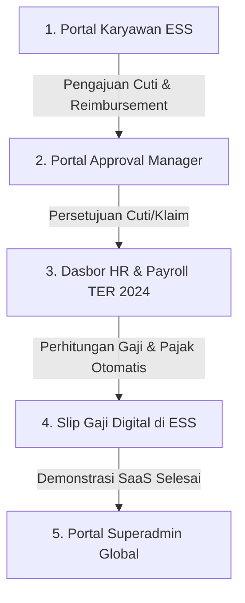

# Panduan Demonstrasi (Demo Playbook) HariKerja HRMS - QA Environment

Dokumen ini adalah panduan interaktif langkah-demi-langkah (End-to-End Playbook) untuk membantu Anda mendemokan prototipe **HariKerja HRMS** secara lancar dan meyakinkan di hadapan investor/ventur kapitalis (seperti East Ventures) langsung di environment QA (`harikerja.web.id`).

---

## 🛠️ Langkah 1: Pengisian Data Demo Secara Live di QA Server

Sebelum mendemokan produk, sangat penting untuk mengisi database QA dengan data simulasi yang realistis (tidak kosong). Kami telah menyesuaikan script seeder database agar dapat mendeteksi variabel environment QA secara otomatis tanpa merusak perutean domain.

Jalankan perintah berikut di terminal server VPS QA Anda untuk melakukan *clean-slate seeding* (menghapus data lama yang kotor dan menanamkan data demo baru):

```bash
# 1. SSH masuk ke server QA
ssh -i ~/Downloads/afdhal-qa.pem afdhalqa@103.197.190.47

# 2. Masuk ke direktori root proyek di server
cd /home/afdhalqa/hrms

# 3. Jalankan script seeder di dalam container backend
docker compose -f deploy/qa/docker-compose.qa.yml exec backend python scripts/seed_test_db.py --workers 2 --preset full
```

> [!NOTE]
> Perbaikan yang baru saja kami terapkan memastikan bahwa domain tenant yang dibuat di server QA akan diakhiri dengan `.harikerja.web.id` (bukan `.localhost`), sehingga perutean web SaaS akan langsung berfungsi secara otomatis di browser Anda.

---

## 🔑 Kredensial Demo

Gunakan kredensial berikut untuk melakukan login saat presentasi:

### A. Portal Manajemen Tenant & Bisnis (SaaS Admin Portal)
Digunakan untuk mendemonstrasikan bagaimana Anda sebagai pemilik platform mengelola seluruh tenant perusahaan, status billing, dan tiket bantuan.
* **URL Akses:** `https://harikerja.web.id/id/login/portal-admin-secure-39f28j`
* **Email:** `superadmin@harikerja.com`
* **Password:** `password123`

### B. Portal Perusahaan Utama (Company 1)
Ini adalah tenant contoh utama dengan modul lengkap (*Core HR, Kehadiran, Payroll TER 2024, KPI, Reimbursement*).
* **URL Tenant:** `https://company1.harikerja.web.id`

| Peran (Role) | Email Login | Password | Fungsi Demo |
| :--- | :--- | :--- | :--- |
| **HR / Owner (Tenant Admin)** | `admin@company1.com` | `password123` | Konfigurasi sistem, manajemen karyawan, kelola shift, dan proses penggajian (Payroll TER 2024) |
| **Manager** | `manager1@company1.com` | `password123` | Persetujuan cuti/reimbursement, penilaian KPI tim |
| **Staf (Employee 1)** | `employee1@company1.com` | `password123` | Presensi Geofencing, pengajuan cuti, klaim reimbursement, cetak slip gaji |

---

## 🚀 Alur Demonstrasi Emas (The Golden Demo Path)

Ikuti alur ini untuk mendemonstrasikan kekuatan utama platform HariKerja dalam waktu **10 - 15 menit**:



### 📱 Skenario 1: Layanan Mandiri Karyawan (ESS)
*Tujuan: Menunjukkan antarmuka pengguna yang bersih, responsif, dan mudah digunakan oleh karyawan.*
1. Buka browser dan akses **`https://company1.harikerja.web.id`**.
2. Login sebagai **Employee 1** (`employee1@company1.com` / `password123`).
3. **Poin Demo Utama:**
   * Tunjukkan **Dasbor Kehadiran** dengan visual peta/geofencing. Beritahu investor bahwa platform ini memvalidasi lokasi GPS secara presisi untuk menghindari kecurangan presensi.
   * Ajukan **Koreksi Kehadiran** atau **Reimbursement**:
     * Buka menu Reimbursement -> klik **Submit Claim**.
     * Isi Kategori: *Medical/Internet*, Nominal: *Rp 250.000*, unggah dokumen/resi contoh, lalu kirim.
   * Log out.

### 👥 Skenario 2: Alur Persetujuan Manajer (Manager Approval)
*Tujuan: Menunjukkan alur delegasi wewenang dan kolaborasi tim.*
1. Login sebagai **Manager One** (`manager1@company1.com` / `password123`).
2. Masuk ke halaman **Pending Approvals** (Persetujuan Tertunda).
3. Anda akan melihat pengajuan klaim Rp 250.000 dari Employee 1 yang baru saja dibuat.
4. **Poin Demo Utama:**
   * Klik **Approve** pada klaim tersebut.
   * Jelaskan bahwa sistem persetujuan ini terintegrasi secara real-time dan manajer dapat melihat sisa anggaran departemen sebelum melakukan approval.
5. Log out.

### 💼 Skenario 3: Pusat Operasional HR & Proses Penggajian (The Killer Feature)
*Tujuan: Menunjukkan keunggulan kepatuhan hukum perpajakan Indonesia terbaru (PPh 21 TER 2024).*
1. Login sebagai **Admin One** (`admin@company1.com` / `password123`).
2. Navigasikan ke menu **Payroll > Periode Penggajian**.
3. Pilih periode bulan berjalan, lalu klik **Calculate Payroll (Hitung Massal)**.
4. **Poin Demo Utama (Sampaikan ke Investor):**
   * **TER 2024 Compliance:** Tunjukkan bahwa sistem secara otomatis menghitung potongan **PPh 21** menggunakan mekanisme *Tarif Efektif Rata-rata (TER)* terbaru yang dirilis oleh Direktorat Jenderal Pajak RI. Ini membedakan HariKerja dengan kompetitor yang masih menggunakan cara manual/lama.
   * **BPJS Integration:** Perhitungan BPJS Kesehatan dan BPJS Ketenagakerjaan (JKK, JKM, JHT, JP) terhitung otomatis secara proporsional sesuai ketentuan pagu terbaru.
   * **Slip Gaji Dinamis:** Buka salah satu slip gaji karyawan, tunjukkan ringkasan slip yang rapi dan siap unduh dalam format PDF.

### 📊 Skenario 4: Kinerja & KPI (Performance Management)
*Tujuan: Menunjukkan nilai tambah platform dalam meningkatkan produktivitas perusahaan.*
1. Di akun Admin/Manager, buka menu **Performance > KPI Dashboard**.
2. Tunjukkan grafik pencapaian target individu dan departemen.
3. Jelaskan bahwa integrasi antara KPI dan bonus penggajian terjalin secara otomatis dalam platform ini.

### 🌐 Skenario 5: Skalabilitas Bisnis (SaaS Superadmin Portal)
*Tujuan: Menyakinkan investor mengenai model bisnis SaaS multi-tenant dan skalabilitas platform.*
1. Buka URL **`https://harikerja.web.id/id/login/portal-admin-secure-39f28j`**.
2. Login sebagai **Superadmin** (`superadmin@harikerja.com` / `password123`).
3. **Poin Demo Utama:**
   * Tunjukkan daftar tenant yang terdaftar (`company1`, `company2`, dll.).
   * Jelaskan fitur **Resource Masking**: Platform secara otomatis menonaktifkan atau mengunci fitur (misalnya, kuota jumlah karyawan atau batas penyimpanan media) bagi perusahaan yang terlambat melakukan pembayaran langganan.
   * Jelaskan arsitektur **Schema-based Multi-tenancy** yang menjamin isolasi data 100% aman antar perusahaan, mematuhi standar ISO 27001 dan perlindungan data pribadi (UU PDP).

---

## 💡 Tips Tambahan untuk Demo yang Sukses
* **Gunakan Browser Incognito:** Selalu buka sesi browser rahasia (Incognito/Private) saat melakukan demonstrasi untuk menghindari konflik cookie session antar akun yang berbeda peran (Staf, Manajer, HR).
* **Siapkan Tab Terpisah:** Sebelum presentasi dimulai, buka tab browser terpisah untuk masing-masing URL di atas agar Anda dapat beralih peran dengan cepat tanpa membuang waktu mengetik URL.
* **Gunakan Data Riil yang Sudah Terisi:** Jangan mendemokan proses penginputan data dasar (seperti departemen/jabatan) secara manual dari nol kecuali diminta, fokuslah pada fitur bernilai tinggi seperti penggajian otomatis dan ESS presensi.
