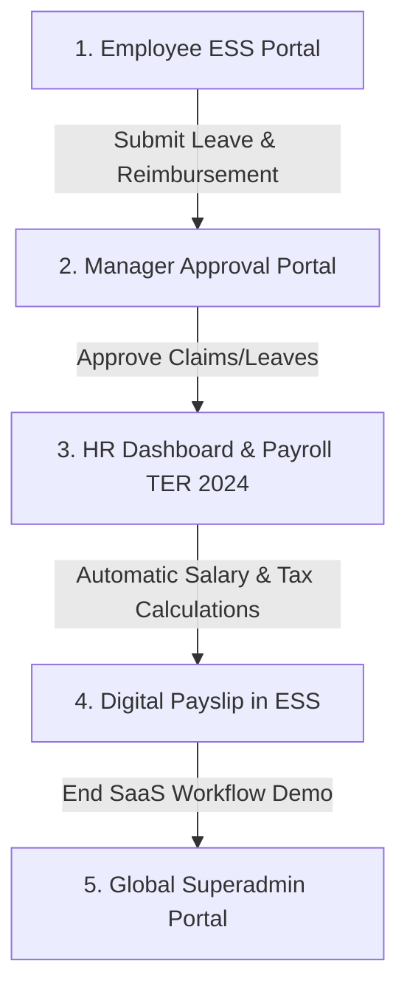

# Demo Playbook HariKerja HRMS - QA Environment

This document is a comprehensive, step-by-step interactive demo flow (End-to-End Playbook) to help you confidently showcase the **HariKerja HRMS** prototype to VCs/investors (e.g., East Ventures) directly on the live QA environment (`harikerja.web.id`).

---

## 🛠️ Step 1: Populating Live Demo Data on the QA Server

Before demoing the product, it is crucial to populate the QA database with realistic simulation data (no blank dashboards). We have updated the database seeder to automatically detect the QA environment variables without breaking multi-tenant domain routing.

Run the following commands in your QA VPS terminal to perform a clean-slate seeding (clearing out old data and writing fresh demo records):

```bash
# 1. SSH into the QA server
ssh -i ~/Downloads/afdhal-qa.pem afdhalqa@103.197.190.47

# 2. Navigate to the project root directory on the server
cd /home/afdhalqa/hrms

# 3. Execute the database seeding script inside the backend container
docker compose -f deploy/qa/docker-compose.qa.yml exec backend python scripts/seed_test_db.py --workers 2 --preset full
```

> [!NOTE]
> The improvements we applied ensure that tenant domains created on the QA server are suffixed with `.harikerja.web.id` (instead of `.localhost`), allowing immediate routing resolution in your web browser.

---

## 🔑 Demo Credentials

Use the following credentials to log in during your presentation:

### A. Global SaaS Admin Portal
Used to demonstrate how you, as the platform owner, manage all client companies (tenants), subscription/billing statuses, and support tickets.
* **URL:** `https://harikerja.web.id/en/login/portal-admin-secure-39f28j`
* **Email:** `superadmin@harikerja.com`
* **Password:** `password123`

### B. Main Enterprise Tenant (Company 1)
The primary mock company configured with all active modules (*Core HR, Attendance, Payroll TER 2024, KPI, Reimbursements*).
* **Tenant URL:** `https://company1.harikerja.web.id`

| Role | Email Login | Password | Demo Focus |
| :--- | :--- | :--- | :--- |
| **HR / Owner (Tenant Admin)** | `admin@company1.com` | `password123` | System configurations, employee management, shifts, and bulk payroll processing (PPh 21 TER 2024) |
| **Manager** | `manager1@company1.com` | `password123` | Leave/reimbursement approvals, reviewing team KPIs |
| **Staff (Employee 1)** | `employee1@company1.com` | `password123` | Geofenced clock-in/out, submitting leave requests, claiming reimbursements, viewing payslips |

---

## 🚀 The Golden Demo Path

Follow this path to showcase the core strengths of the HariKerja platform in **10 - 15 minutes**:



### 📱 Scenario 1: Employee Self-Service (ESS)
*Objective: Show the clean, responsive, and intuitive interface for everyday employees.*
1. Open a browser window and navigate to **`https://company1.harikerja.web.id`**.
2. Log in as **Employee 1** (`employee1@company1.com` / `password123`).
3. **Core Demo Points:**
   * Show the **Attendance Dashboard** with geofencing visual mapping. Explain to investors that the platform validates exact GPS locations against branch coordinates to prevent attendance fraud.
   * Submit a **Reimbursement Claim**:
     * Go to Reimbursements -> click **Submit Claim**.
     * Choose Category: *Medical/Internet*, Amount: *Rp 250,000*, upload a mock receipt file, and submit.
   * Log out.

### 👥 Scenario 2: Manager Approvals
*Objective: Demonstrate organizational hierarchy, delegation, and real-time collaboration.*
1. Log in as **Manager One** (`manager1@company1.com` / `password123`).
2. Navigate to **Pending Approvals**.
3. Point out the Rp 250,000 reimbursement claim submitted by Employee 1.
4. **Core Demo Points:**
   * Click **Approve** on the claim.
   * Highlight that approvals are instant and manager portals display department budget statuses to prevent over-allocation.
5. Log out.

### 💼 Scenario 3: HR Operations & Automated Payroll (The Killer Feature)
*Objective: Demonstrate full compliance with the latest Indonesian taxation (PPh 21 TER 2024).*
1. Log in as **Admin One** (`admin@company1.com` / `password123`).
2. Go to **Payroll > Payroll Periods**.
3. Select the active payroll period and click **Calculate Payroll (Bulk Calculation)**.
4. **Core Demo Points (Highlight to VCs):**
   * **TER 2024 Compliance:** Show that the system automatically calculates employee **PPh 21** using the newly enacted *Tarif Efektif Rata-rata (TER)* regulations by the Indonesian Directorate General of Taxes. This is a major selling point over outdated legacy software.
   * **BPJS Integration:** Calculations for BPJS Kesehatan and BPJS Ketenagakerjaan (JKK, JKM, JHT, JP) are automatically calculated and deducted according to legal caps.
   * **Digital Payslips:** Open a calculated payslip to show a clean breakdown of earnings, deductions, and taxes, ready to download as a secure PDF.

### 📊 Scenario 4: Performance & KPI Management
*Objective: Highlight how the platform aids in driving employee performance and alignment.*
1. From the Admin/Manager dashboard, open **Performance > KPI Dashboard**.
2. Show target achievement progress for individuals and departments.
3. Explain that performance scores dynamically feed into salary bonuses during payroll runs.

### 🌐 Scenario 5: Multi-Tenant Architecture & Platform Business Model
*Objective: Assure investors of the platform's commercial viability, data security, and scalability.*
1. Go to the Global SaaS URL **`https://harikerja.web.id/en/login/portal-admin-secure-39f28j`**.
2. Log in as **Superadmin** (`superadmin@harikerja.com` / `password123`).
3. **Core Demo Points:**
   * View the registered client list (`company1`, `company2`, etc.) and subscription tiers.
   * Explain **Resource Masking**: The platform automatically limits or freezes features (e.g., maximum employee counts or media storage caps) for tenants who default on payments.
   * Highlight **Schema-based Multi-tenancy**: Explain that each tenant operates on a fully isolated PostgreSQL schema, ensuring 100% data separation for compliance with security standards and the Indonesian Personal Data Protection law (UU PDP).

---

## 💡 Practical Demo Tips
* **Use Incognito Mode:** Always run the demo in a private/incognito window to avoid cookies cache clashes between different roles (Staff, Manager, HR).
* **Pre-open Tabs:** Keep separate browser tabs open for each role URL to switch roles instantly and maintain a smooth demo flow.
* **Focus on Value:** Avoid manual data entry (like adding departments or employees) live unless asked. Focus on high-value features (dynamic payroll calculations, geofenced presence, and SaaS controls).
