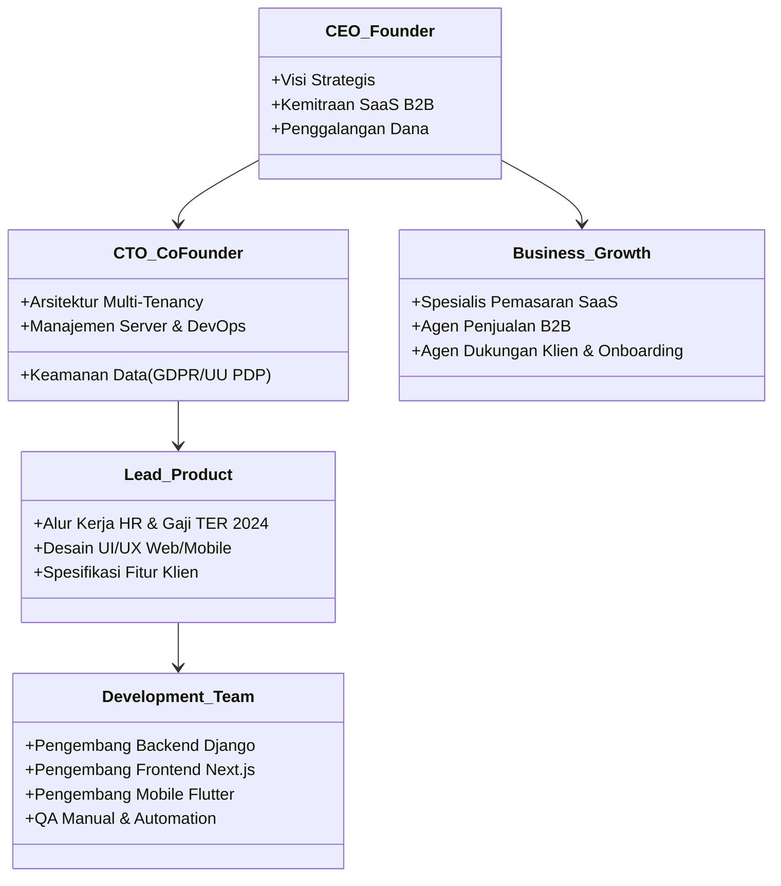

# Struktur Organisasi & Peta Jalan Skala Tim (Scaling Roadmap)

Dokumen ini menjelaskan rancangan struktur organisasi internal HariKerja serta peta jalan (*roadmap*) skala tim pengembang dari fase bootstrap awal hingga mampu mendukung 1 juta pengguna aktif secara global.

---

## 🏢 1. Struktur Organisasi Internal (Fase Awal)

Untuk membangun platform SaaS HRMS yang kokoh dengan tim yang ramping, struktur organisasi awal difokuskan pada fleksibilitas peran (*cross-functional roles*):

---

## 🚀 2. Peta Jalan Penskalaan Tim (Scaling Roadmap)

Seiring bertambahnya jumlah tenant dan pengguna aktif di platform, organisasi tim diperluas melalui 4 tahap perkembangan terstruktur:

### Tahap 1: Fase Bootstrapping (Hingga 10 Anggota Tim)
*   **Target Pengguna**: 1 - 100 Tenant (Hingga 5.000 Karyawan Aktif).
*   **Fokus Operasional**: Validasi kesesuaian produk dengan pasar (*Product-Market Fit*), kepatuhan perpajakan Indonesia PPh 21 TER 2024, kestabilan isolasi skema PostgreSQL.
*   **Susunan Tim**:
    *   1 CEO (Penjualan & Produk)
    *   1 CTO (Full-Stack Engineer & DevOps)
    *   2 Full-Stack Developers (Next.js & Django REST)
    *   1 Mobile Developer (Flutter)
    *   1 UI/UX Designer
    *   1 Staf Onboarding & Support

### Tahap 2: Fase Pendanaan Awal / Seed (10 - 50 Anggota Tim)
*   **Target Pengguna**: 100 - 500 Tenant (Hingga 50.000 Karyawan Aktif).
*   **Fokus Operasional**: Kecepatan rilis fitur, integrasi otomatis Midtrans, pemantauan sistem (Prometheus/Sentry), pemasaran agresif B2B.
*   **Susunan Tim**:
    *   **Departemen Teknik**: 1 VP of Engineering, 1 Lead Backend (Django), 3 Backend Engineers, 3 Frontend Engineers, 2 Mobile Engineers, 2 QA Automation Engineers, 1 DevOps Engineer.
    *   **Departemen Produk**: 1 Product Manager, 2 UI/UX Designers.
    *   **Departemen Komersial**: 1 Head of Sales, 3 Sales Reps, 2 Marketing Specialists.
    *   **Departemen Layanan**: 1 Head of Support, 4 Customer Support Agents.

### Tahap 3: Fase Seri A / Growth (50 - 200 Anggota Tim)
*   **Target Pengguna**: 500 - 2.500 Tenant (Hingga 250.000 Karyawan Aktif).
*   **Fokus Operasional**: Keamanan SOC 2 & ISO 27001, skalabilitas API (Connection pooling PgBouncer, partisi PostgreSQL), ekspansi ke pasar korporat (Enterprise Tier).
*   **Susunan Tim**:
    *   Pemisahan tim teknis menjadi divisi independen (*Squads*): *Squad Payroll*, *Squad Attendance & AI*, *Squad Platform Infrastructure & Security*.
    *   Pembentukan tim khusus **Data Engineering** untuk analitik pelaporan HR tingkat lanjut.
    *   Pembentukan tim **Legal & Compliance** untuk memastikan kepatuhan regulasi UU PDP.

### Tahap 4: Fase Ekspansi Massal (200 - 1.000+ Anggota Tim)
*   **Target Pengguna**: 5.000+ Tenant (Lebih dari 1 Juta Pengguna Aktif).
*   **Fokus Operasional**: Arsitektur High Availability global (Multi-Region AWS), mitigasi latensi data, ekspansi pasar internasional Asia Tenggara.
*   **Susunan Tim**:
    *   Kantor regional terdistribusi dengan tim Penjualan, Pemasaran, dan Dukungan Teknis lokal.
    *   Tim R&D khusus untuk kecerdasan buatan (Machine Learning) dalam analisis prediktif performa karyawan.
