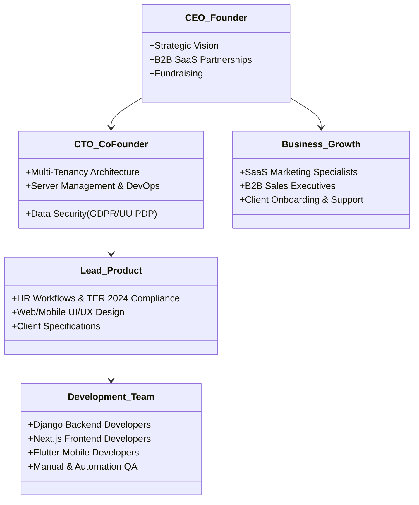

# Organizational Structure & Scaling Roadmap

This document outlines the internal organizational design of HariKerja and the developer scaling roadmap from early bootstrapping stages to supporting 1.5 million active users globally.

---

## 🏢 1. Internal Organizational Structure (Initial Phase)

To build a robust multi-tenant HRMS SaaS platform with a lean team, the initial organizational structure focuses on cross-functional agility:

---

## 🚀 2. Team Scaling Roadmap

As client counts and active users grow, the organizational structure expands across four developmental stages:

### Stage 1: Bootstrapping Phase (Up to 10 Team Members)
*   **Target Capacity**: 1 - 100 Tenants (Up to 5,000 active employees).
*   **Operational Focus**: Product-Market Fit validation, Indonesian tax law compliance (TER 2024 PPh 21), and PostgreSQL schema isolation stability.
*   **Team Composition**:
    *   1 CEO (Sales & Product Management)
    *   1 CTO (Full-Stack Engineer & DevOps)
    *   2 Full-Stack Developers (Next.js & Django REST)
    *   1 Mobile Developer (Flutter)
    *   1 UI/UX Designer
    *   1 Customer Onboarding & Support Specialist

### Stage 2: Seed Stage (10 - 50 Team Members)
*   **Target Capacity**: 100 - 500 Tenants (Up to 50,000 active employees).
*   **Operational Focus**: Rapid feature rollouts, automated Midtrans billing, system telemetry (Prometheus/Sentry), and aggressive B2B sales.
*   **Team Composition**:
    *   **Engineering Department**: 1 VP of Engineering, 1 Lead Backend Developer (Django), 3 Backend Engineers, 3 Frontend Engineers, 2 Mobile Engineers, 2 QA Automation Engineers, 1 DevOps Engineer.
    *   **Product Department**: 1 Product Manager, 2 UI/UX Designers.
    *   **Growth Department**: 1 Head of Sales, 3 Sales Reps, 2 Marketing Specialists.
    *   **Customer Support**: 1 Head of Support, 4 Customer Support Agents.

### Stage 3: Series A / Growth Stage (50 - 200 Team Members)
*   **Target Capacity**: 500 - 2,500 Tenants (Up to 250,000 active employees).
*   **Operational Focus**: SOC 2 & ISO 27001 security compliance, API scalability (PgBouncer connection pooling, database partitioning), and B2B Enterprise tier acquisitions.
*   **Team Composition**:
    *   **Feature Squads**: Segregated into dedicated functional teams (*Squad Payroll*, *Squad Attendance & AI*, *Squad Platform Infrastructure & Security*).
    *   **Data Department**: Formed to build advanced HR reporting and predictive HR analytics.
    *   **Legal & Compliance**: Dedicated division to govern data privacy laws (Indonesian UU PDP).

### Stage 4: Scale Stage (200 - 1,000+ Team Members)
*   **Target Capacity**: 5,000+ Tenants (Over 1 Million active users).
*   **Operational Focus**: Global high-availability infrastructure (Multi-Region AWS setup), database write performance optimization, and international Southeast Asian market expansion.
*   **Team Composition**:
    *   Distributed regional offices containing local Sales, Marketing, and Customer Success divisions.
    *   Dedicated R&D laboratory focusing on Machine Learning models for predictive employee attrition analysis.
