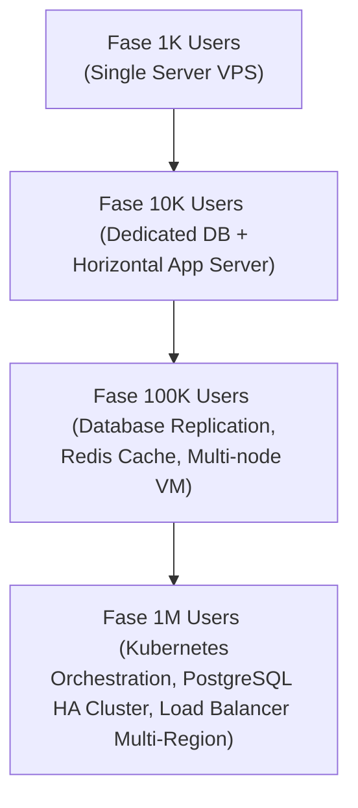

# 🎯 HariKerja HRMS: Proyeksi Finansial Target Utama (Ultimate Target - 1,5 Juta Users)

Dokumen ini menyajikan rencana strategis, unit ekonomi, struktur biaya operasional, dan proyeksi keuntungan bersih untuk platform **HariKerja HRMS** dalam mencapai target utama (*Ultimate Target*): **1.500.000 Pengguna Aktif (Karyawan)**.

---

## 💎 1. Visi Strategis & Ukuran Pasar

Satu juta pengguna aktif bukanlah angka teoritis, melainkan target realistis yang dapat dicapai dengan mendisrupsi pasar HRIS di Indonesia menggunakan model penetapan harga **Flat-Tier**.

* **Basis Pengguna yang Dapat Dijangkau**: Terdapat sekitar 50–60 Juta pekerja formal di Indonesia. Target 1,5 juta pengguna aktif hanya mewakili **±3% pangsa pasar**.
* **Model Akuisisi B2B**: Target ini dicapai dengan mengakuisisi **30.000 Perusahaan/Tenant** dengan ukuran rata-rata **50 karyawan** per perusahaan.
* **Keunggulan Kompetitif**: Skema harga tetap HariKerja membuat biaya berlangganan **75% lebih efisien** dibandingkan kompetitor utama (seperti Mekari Talenta atau Gadjian) yang membebankan biaya per kepala karyawan.

---

## 📊 2. Model Pendapatan & ARPU (Average Revenue Per Tenant)

Berdasarkan data historis dan tren pasar SaaS HRMS, sebaran paket langganan dari 30.000 tenant berbayar diproyeksikan sebagai berikut:

### 2.1 Distribusi Paket Langganan
1. **Essential Tier** (Rp 125.000 /bulan)
   * *Target Porsi*: 60% (~18.000 Tenant)
   * *Modul Utama*: Presensi GPS & Geofencing, Manajemen Cuti, Approval Berjenjang.
2. **Professional Tier** (Rp 750.000 /bulan)
   * *Target Porsi*: 30% (~9.000 Tenant)
   * *Modul Utama*: Payroll Indonesia (TER 2024 PPh 21 & BPJS), Slip Gaji, Reimbursements.
3. **Premium Tier** (Rp 1.500.000 /bulan)
   * *Target Porsi*: 10% (~3.000 Tenant)
   * *Modul Utama*: KPI & Performance Management, RBAC Kustom, Integrasi Multi-Cabang.

### 2.2 Perhitungan ARPU Bulanan
$$\text{ARPU} = (0.60 \times \text{Rp } 125.000) + (0.30 \times \text{Rp } 750.000) + (0.10 \times \text{Rp } 1.500.000)$$
$$\text{ARPU} = \text{Rp } 75.000 + \text{Rp } 225.000 + \text{Rp } 150.000 = \mathbf{\text{Rp } 450.000 \text{ per tenant/bulan}}$$

### 2.3 Pendapatan Kotor Bulanan (Gross Revenue)
$$\text{Gross Revenue} = 20.000 \text{ Tenant} \times \text{Rp } 450.000 = \mathbf{\text{Rp } 9.000.000.000 \text{ (Rp 13,5 Miliar / bulan)}}$$

---

## 📉 3. Struktur Biaya Operasional Bulanan (OpEx)

Untuk mengelola 1,5 juta karyawan aktif secara stabil di bawah infrastruktur cloud yang andal serta didukung oleh layanan pelanggan yang prima, dialokasikan anggaran bulanan sebagai berikut:

### 3.1 Biaya Infrastruktur Cloud (High Availability)
Sistem menggunakan arsitektur *Multi-Tenant* terdistribusi yang efisien:
* **Database Cluster (PostgreSQL + Replica)**: Rp 120.000.000 (Konfigurasi High Memory, SSD NVMe, Multi-AZ).
* **Application Servers (Kubernetes Node/Docker Swarm)**: Rp 100.000.000 (vCPU terdedikasi untuk memproses jutaan absensi harian).
* **Redis Cache & Celery Workers Cluster**: Rp 50.000.000 (Untuk memproses antrean email slip gaji dan kalkulasi payroll massal).
* **S3 Object Storage & Backup**: Rp 30.000.000 (Penyimpanan file kuitansi *reimbursement* dan dokumen karyawan).
* **CDN, Load Balancers, & Cloudflare Enterprise WAF**: Rp 50.000.000.
* **Total Infrastruktur**: **Rp 350.000.000 /bulan**

### 3.2 Biaya Sumber Daya Manusia (Tim Operasional - 35 Staf)
* **Tim Engineering & DevOps (8 Orang)**: Rp 280.000.000.
* **Customer Success & Onboarding Specialist (18 Orang)**: Rp 270.000.000 (Melayani konfigurasi awal HR secara mandiri maupun terpandu).
* **Sales & Account Executive (6 Orang)**: Rp 120.000.000.
* **Tim Operasional, Legal, & Keuangan (3 Orang)**: Rp 80.000.000.
* **Management & Overhead**: Rp 50.000.000.
* **Total Biaya SDM**: **Rp 800.000.000 /bulan**

### 3.3 Biaya Pemasaran (B2B Acquisition)
* **Google Search & SEO (High-Intent)**: Rp 500.000.000.
* **Retargeting & Branding Ads (LinkedIn, Meta)**: Rp 300.000.000.
* **B2B Event, Webinar, & Content Marketing**: Rp 200.000.000.
* **Total Pemasaran**: **Rp 1.000.000.000 /bulan**

### 3.4 Biaya Administrasi & Gerbang Pembayaran
* **Payment Gateway (Midtrans snaps/e-wallet fee ±2%)**: Rp 180.000.000.
* **Sewa Kantor & Biaya Utilitas**: Rp 100.000.000.
* **Total Administrasi**: **Rp 280.000.000 /bulan**

---

### 💸 Rekapitulasi OpEx Bulanan
| Kategori | Jumlah Alokasi | Persentase dari Revenue |
| :--- | :--- | :--- |
| **Pemasaran (B2B)** | Rp 1.000.000.000 | 11,11% |
| **Sumber Daya Manusia (SDM)** | Rp 800.000.000 | 8,89% |
| **Infrastruktur Cloud** | Rp 350.000.000 | 3,89% |
| **Gateway Pembayaran (Midtrans)** | Rp 180.000.000 | 2,00% |
| **Sewa Kantor & Operasional** | Rp 100.000.000 | 1,11% |
| **TOTAL BIAYA OPERASIONAL** | **Rp 2.430.000.000** | **27,00%** |

---

## 💰 4. Proyeksi Keuntungan Bersih (Profitability Analysis)

Dengan efisiensi skala besar (*operating leverage*) khas bisnis perangkat lunak (SaaS), rasio profitabilitas HariKerja sangat tinggi:

* **EBITDA (Pendapatan Sebelum Bunga, Pajak, Depresiasi)**:
  $$\text{EBITDA} = \text{Gross Revenue} - \text{Total OpEx}$$
  $$\text{EBITDA} = \text{Rp } 9.000.000.000 - \text{Rp } 2.430.000.000 = \mathbf{\text{Rp } 6.570.000.000 \text{ /bulan}}$$
* **Margin EBITDA**: **82,00%**
* **Pajak Penghasilan Badan (PPh Badan 22%)**:
  $$\text{PPh Badan} = 22\% \times \text{Rp } 6.570.000.000 = \mathbf{\text{Rp } 2.435.400.000 \text{ /bulan}}$$
* **Laba Bersih Setelah Pajak (Net Profit)**:
  $$\text{Net Profit} = \text{Rp } 6.570.000.000 - \text{Rp } 2.435.400.000 = \mathbf{\text{Rp } 8.634.600.000 \text{ /bulan}}$$
* **Margin Laba Bersih Akhir**: **63,96%**

---

## ⚡ 5. Analisis Sensitivitas (Skenario Diskon Tahunan)

Berdasarkan kebijakan di [pricing_and_plans.id.md](file:///home/afdhal/data/hr/hrms/docs/business_strategy/pricing_and_plans.id.md#L53-L56), tenant yang melakukan pembayaran tahunan di muka berhak mendapatkan **diskon sebesar 20%**. 

Jika diproyeksikan **30% dari total tenant** memilih paket tahunan untuk menghemat anggaran mereka, maka perhitungan unit ekonominya bergeser secara positif dalam hal arus kas:

* **Porsi Tenant Bulanan (70%)**: $14.000 \text{ tenant} \times \text{Rp } 450.000 = \text{Rp } 9.450.000.000$
* **Porsi Tenant Tahunan dengan Diskon 20% (30%)**: $6.000 \text{ tenant} \times (\text{Rp } 450.000 \times 0.8) = \text{Rp } 3.240.000.000$
* **Total Pendapatan Bulanan yang Disesuaikan**: **Rp 12.690.000.000 /bulan**
* **Laba Bersih Setelah Pajak Disesuaikan (Net Profit)**: 
  $$\text{EBITDA Baru} = \text{Rp } 12.690.000.000 - \text{Rp } 2.430.000.000 = \text{Rp } 10.260.000.000$$
  $$\text{Net Profit Baru} = \text{Rp } 10.260.000.000 \times 0.78 = \mathbf{\text{Rp } 8.002.800.000 \text{ /bulan}}$$

> [!TIP]
> Meskipun diskon tahunan menurunkan laba bulanan sebesar ±8%, skema ini memberikan **arus kas masuk instan di muka (*upfront cash*)** yang sangat besar, yang dapat digunakan langsung untuk membiayai pengeluaran pemasaran (CAC) tanpa perlu bergantung pada pendanaan eksternal (*bootstrapped growth*).

---

## 🛠️ 6. Peta Jalan Peningkatan Infrastruktur (Infrastructure Scaling Roadmap)

Untuk mencapai skala 1,5 juta pengguna aktif tanpa mengalami degradasi performa:

1. **Skalabilitas Database**: Database PostgreSQL dikonfigurasi menggunakan teknik *Connection Pooling* (dengan PgBouncer), *Read-Write Splitting*, serta pemisahan skema per tenant (*Multi-tenant Schema Isolation*) untuk memastikan kueri absensi dan payroll berjalan di bawah **100ms**.
2. **Kemandirian Aplikasi**: Backend Django dijalankan menggunakan Gunicorn workers asynchronous dan ditempatkan di belakang Kluster Load Balancer Nginx yang mendistribusikan trafik secara merata.

---
**Status**: Strategi Keuangan Final - Target Utama
**Penyusun**: Antigravity AI
**Tanggal**: 29 Mei 2026
