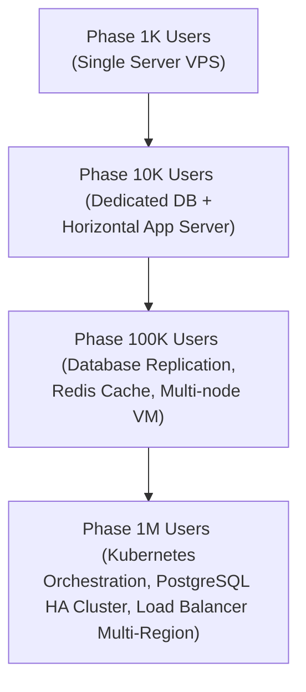

# 🎯 HariKerja HRMS: Financial Projections for the Ultimate Target (1 Million Active Users)

This document outlines the strategic roadmap, unit economics, monthly operating expenses (OpEx), and net profitability projections for the **HariKerja HRMS** platform upon reaching its ultimate target: **1,000,000 Active Users (Employees)**.

---

## 💎 1. Strategic Vision & Market Size

Reaching one million active users is a highly realistic objective achieved by disrupting the Indonesian HRIS market with our **Flat-Tier** pricing model.

* **Addressable Market**: There are approximately 50–60 million formal workers in Indonesia. A target of 1 million active users represents only **±2% market share**.
* **B2B Acquisition Model**: This target is met by acquiring **20,000 Companies/Tenants** with an average company size of **50 employees**.
* **Competitive Edge**: HariKerja’s flat-rate pricing makes subscription costs **75% more cost-effective** than major competitors (such as Mekari Talenta or Gadjian), which charge steep per-user fees.

---

## 📊 2. Revenue Model & ARPU (Average Revenue Per Tenant)

Based on market trends and subscription patterns in the Indonesian B2B SaaS space, the tier distribution among the 20,000 active paying tenants is projected as:

### 2.1 Subscription Tier Distribution
1. **Essential Tier** (Rp 125,000 /month)
   * *Target Share*: 60% (~12,000 Tenants)
   * *Core Modules*: GPS Attendance & Geofencing, Leave & Permit Management, Multi-level Approval.
2. **Professional Tier** (Rp 750,000 /month)
   * *Target Share*: 30% (~6,000 Tenants)
   * *Core Modules*: Indonesian Payroll (TER 2024 PPh 21 & BPJS), Payslips, Reimbursements.
3. **Premium Tier** (Rp 1,500,000 /month)
   * *Target Share*: 10% (~2,000 Tenants)
   * *Core Modules*: KPI & Performance Management, Custom RBAC, Multi-branch Integration.

### 2.2 Monthly ARPU Calculation
$$\text{ARPU} = (0.60 \times \text{Rp } 125,000) + (0.30 \times \text{Rp } 750,000) + (0.10 \times \text{Rp } 1,500,000)$$
$$\text{ARPU} = \text{Rp } 75,000 + \text{Rp } 225,000 + \text{Rp } 150,000 = \mathbf{\text{Rp } 450,000 \text{ per tenant/month}}$$

### 2.3 Monthly Gross Revenue
$$\text{Gross Revenue} = 20,000 \text{ Tenants} \times \text{Rp } 450,000 = \mathbf{\text{Rp } 9,000,000,000 \text{ (Rp 9 Billion / month)}}$$

---

## 📉 3. Monthly Operating Expenses (OpEx)

Supporting 1 million active users across 20,000 tenants with high system stability and excellent customer support requires the following monthly budget allocation:

### 3.1 Cloud Infrastructure Costs (High Availability)
The system leverages a highly efficient multi-tenant architecture:
* **Database Cluster (PostgreSQL + Replica)**: Rp 120,000,000 (High-Memory, SSD NVMe, Multi-AZ).
* **Application Servers (Kubernetes Nodes/Docker Swarm)**: Rp 100,000,000 (Dedicated compute to handle millions of daily check-ins).
* **Redis Cache & Celery Workers Cluster**: Rp 50,000,000 (To process queue bursts for payslip distribution and bulk payroll generation).
* **S3 Object Storage & Backup**: Rp 30,000,000 (Storage for receipt images, ID cards, and official HR documents).
* **CDN, Load Balancers, & Cloudflare Enterprise WAF**: Rp 50,000,000.
* **Total Infrastructure**: **Rp 350,000,000 /month**

### 3.2 Human Resources (35-Person Team)
* **Engineering & DevOps Team (8 People)**: Rp 280,000,000.
* **Customer Success & Onboarding Specialists (18 People)**: Rp 270,000,000 (Handles self-service optimization and live chat setup assistance).
* **Sales & Account Executives (6 People)**: Rp 120,000,000.
* **Legal, Finance, & Administration (3 People)**: Rp 80,000,000.
* **Management & General Overhead**: Rp 50,000,000.
* **Total HR Cost**: **Rp 800,000,000 /month**

### 3.3 B2B Marketing & Customer Acquisition (CAC)
* **Google Search Ads & SEO (High-Intent)**: Rp 500,000,000.
* **Retargeting & Branding Ads (LinkedIn, Meta)**: Rp 300,000,000.
* **B2B Events, Webinars, & Content Marketing**: Rp 200,000,000.
* **Total Marketing**: **Rp 1,000,000,000 /month**

### 3.4 Administration & Merchant Fees
* **Payment Gateway Fees (Midtrans snapped/e-wallet fee ±2%)**: Rp 180,000,000.
* **Office Space Rental & Utilities**: Rp 100,000,000.
* **Total Administrative Cost**: **Rp 280,000,000 /month**

---

### 💸 Monthly OpEx Summary
| Category | Allocation | Percentage of Revenue |
| :--- | :--- | :--- |
| **B2B Marketing** | Rp 1,000,000,000 | 11.11% |
| **Human Resources (SDM)** | Rp 800,000,000 | 8.89% |
| **Cloud Infrastructure** | Rp 350,000,000 | 3.89% |
| **Payment Gateway (Midtrans)** | Rp 180,000,000 | 2.00% |
| **Office Space & Utilities** | Rp 100,000,000 | 1.11% |
| **TOTAL OPERATING EXPENSES** | **Rp 2,430,000.000** | **27.00%** |

---

## 💰 4. Profitability Analysis

Software-as-a-Service (SaaS) businesses benefit from massive operational leverage. The profitability ratios at scale are highly lucrative:

* **EBITDA (Earnings Before Interest, Tax, Depreciation, & Amortization)**:
  $$\text{EBITDA} = \text{Gross Revenue} - \text{Total OpEx}$$
  $$\text{EBITDA} = \text{Rp } 9,000,000,000 - \text{Rp } 2,430,000,000 = \mathbf{\text{Rp } 6,570,000,000 \text{ /month}}$$
* **EBITDA Margin**: **73.00%**
* **Corporate Income Tax (PPh Badan 22%)**:
  $$\text{PPh Badan} = 22\% \times \text{Rp } 6,570,000,000 = \mathbf{\text{Rp } 1,445,400,000 \text{ /month}}$$
* **Net Profit After Tax**:
  $$\text{Net Profit} = \text{Rp } 6,570,000,000 - \text{Rp } 1,445,400,000 = \mathbf{\text{Rp } 5,124,600,000 \text{ /month}}$$
* **Net Profit Margin**: **56.94%**

---

## ⚡ 5. Sensitivity Analysis (Annual Discount Scenario)

According to the policy defined in [pricing_and_plans.id.md](file:///home/afdhal/data/hr/hrms/docs/business_strategy/pricing_and_plans.id.md#L53-L56), tenants who pay upfront for a 12-month period receive a **20% discount**.

Assuming **30% of tenants** opt for the annual package to optimize their budget, the monthly economics adjust favorably in terms of immediate cash flow:

* **Monthly-paying Tenant Portion (70%)**: $14,000 \text{ tenants} \times \text{Rp } 450,000 = \text{Rp } 6,300,000,000$
* **Annual-paying Tenant Portion with 20% Discount (30%)**: $6,000 \text{ tenants} \times (\text{Rp } 450,000 \times 0.8) = \text{Rp } 2,160,000,000$
* **Adjusted Monthly Revenue**: **Rp 8,460,000,000 /month**
* **Adjusted Net Profit After Tax**:
  $$\text{New EBITDA} = \text{Rp } 8,460,000,000 - \text{Rp } 2,430,000,000 = \text{Rp } 6,030,000,000$$
  $$\text{New Net Profit} = \text{Rp } 6,030,000,000 \times 0.78 = \mathbf{\text{Rp } 4,703,400,000 \text{ /month}}$$

> [!TIP]
> While the annual discount lowers bookkeeping profit by ±8%, it generates a massive **upfront cash flow** that can be directly used to fund customer acquisition (CAC) without relying on dilutive external funding.

---

## 🛠️ 6. Infrastructure Scaling Roadmap

To transition to 1 million active users smoothly without any performance degradation:

1. **Database Scalability**: PostgreSQL is configured with Connection Pooling (via PgBouncer), Read-Write splitting, and multi-tenant schema isolation to ensure all attendance check-ins and payroll processing queries run under **100ms**.
2. **App Server Decoupling**: The Django backend runs on asynchronous Gunicorn workers managed behind an Nginx Load Balancer to ensure zero downtime rolling deployments.

---
**Status**: Final Financial Strategy - Ultimate Target
**Author**: Antigravity AI
**Date**: May 29, 2026
