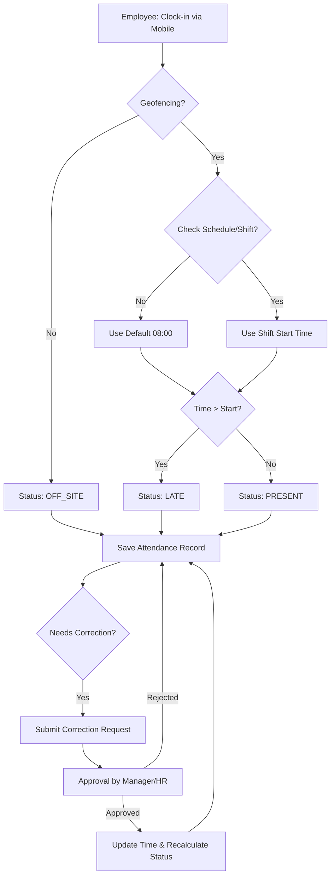
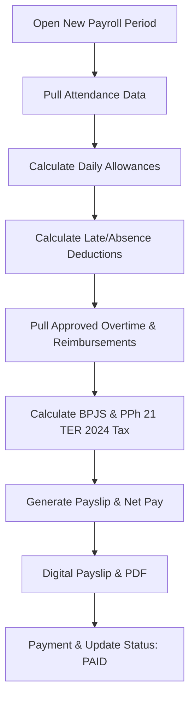

# HRMS Operations Workflow: Attendance & Payroll

This document explains the integrated operational workflow between the Attendance and Payroll systems within the HRMS platform.

---

## Process Overview

---

## 1. Attendance Workflow

The attendance system utilizes location-based validation (Geofencing) and face recognition (Biometric) to ensure data integrity.

### Attendance Flowchart

### Logic Details
*   **Geofencing**: Validation is performed against the branch's coordinate radius (`branch.radius_meters`). If the employee is outside this radius, the status is automatically set to `OFF_SITE`.
*   **Shift Mapping**: If no specific `Schedule` exists, the system sets a default tolerance limit of 08:00 AM.
*   **Lateness & Absence Handling**: The `LATE` status is an automatic result of business rules. To resolve a lateness penalty (e.g., due to field duty or technical issues), employees must use the **Attendance Correction** workflow. Once approved, the status is recalculated, and any associated payroll deductions are waived.

---

## 2. Payroll Workflow

Attendance data flows directly into the payroll module as the basis for calculating daily allowances and deduction penalties.

### Payroll Flowchart

### Attendance-to-Payroll Integration
The system uses parameters configurable by the Tenant Admin in the Settings menu:
*   **Late Deduction**: Deducted for every occurrence of a `LATE` status.
*   **Absence Deduction**: Deducted daily for an `ABSENT` status.
*   **Daily Allowances**: Meal and transport allowances are only granted for the number of days worked (`PRESENT` + `LATE`).

---

## 3. Calculation Components (Rules Engine)

### Salary Configuration
*   **Basic Salary**: Retrieved based on the employee's **Grade (Golongan)**.
*   **Custom Components**: Fixed allowances, bonuses, or loan deductions configured per individual via `EmployeeSalaryComponent`.

### Tax & BPJS Compliance
*   **Health (BPJS Kesehatan)**: 4% Employer, 1% Employee (Cap: 12m wage).
*   **Employment (BPJS Ketenagakerjaan)**: JKK, JKM, JHT (3.7% / 2%), JP (2% / 1%).
*   **PPh 21 (TER 2024)**: Automatic tax calculation using TER categories (A, B, C) based on the latest Indonesian PTKP status.

---

## 4. Output & Reporting
*   **Digital Payslip**: Employees can view detailed salary breakdowns via their self-service portal.
*   **Document Storage**: PDF versions of payslips are automatically generated and stored in secure cloud storage.
*   **Audit Trail**: Every change to work hours (corrections) or salary calculations is logged for internal audit purposes.

---
> [!IMPORTANT]
> All deduction rates (Late & Absence) can be adjusted by the Tenant Admin through the Dashboard Settings to align with the company's internal policies.
