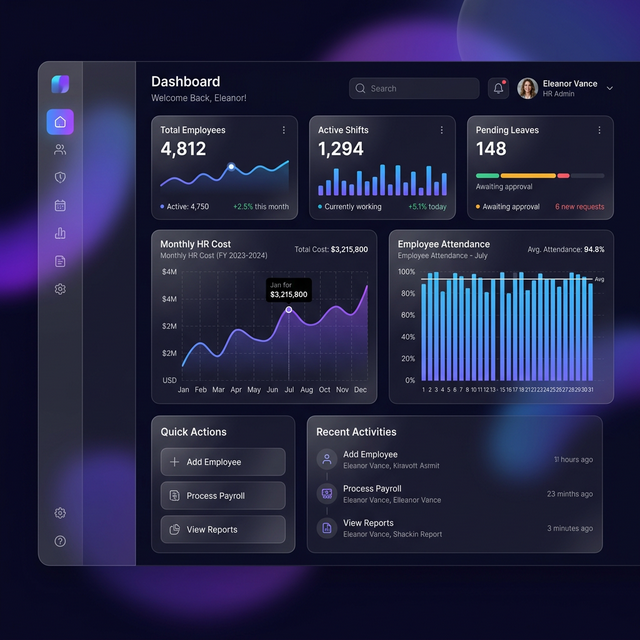
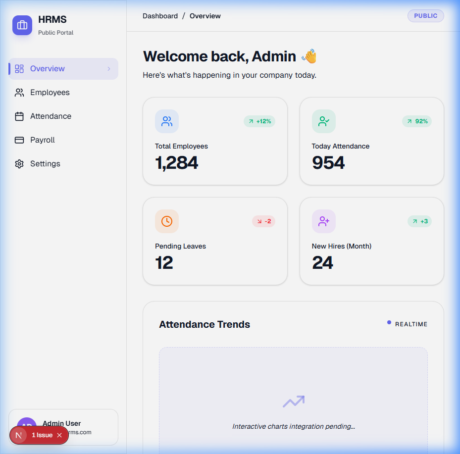

# HRMS SaaS Architecture & Feature Implementation Plan

This plan expands the foundational multi-tenant architecture with the specific HR, Attendance, and Payroll features required for the SaaS platform, based on the provided reference materials.

## Features Extracted from References
The system requires three main modules inside each tenant's schema:
1. **Core HR Data Master**: Departments, Roles (Jabatan), Job Levels (Golongan), Employees, and PTKP (Non-Taxable Income Status).
2. **Attendance Management**: Daily Check-in/out, Leaves/Permissions (Izin/Sakit/Cuti), and Overtime (Lembur).
3. **Payroll & Taxation**: Standard salary calculation involving Basic Salary, Allowances (Tunjangan Makan, Transport), Overtime Pay, Deductions (Potongan/Pinjaman), PPh 21 Tax calculation, and Payslip Generation.

## Phase 1: Foundation (Complete)
The initial setup of the multi-tenant core and basic HR modules.

### 1. Backend API Development (Django)
Grouped by app, creating serializers and viewsets for frontend consumption.
- [PayrollCalculator](file:///d:/hr/hrms/backend/payroll/services.py): Comprehensive engine for Indonesian payroll.
- [BPJSManager](file:///d:/hr/hrms/backend/payroll/services.py): Logic for Kesehatan & Ketenagakerjaan.
- [TaxEngine](file:///d:/hr/hrms/backend/payroll/services.py): Implements TER (Tarif Efektif Rata-rata) 2024.
- [PDFGenerator](file:///d:/hr/hrms/backend/payroll/pdf_generator.py): Service for formal Payslip generation.

### 2. Frontend Integration (Next.js)
- **Layout**: Sidebar with navigation for HR, Attendance, and Payroll.
- **Tenant Context**: Automatically detect tenant from subdomain/hostname.
- **API Client**: Service layer with tenant header handling.

### 3. Mobile App Development (Flutter)
- **Auth**: Multi-tenant login system.
- **Attendance**: GPS-based check-in/out tracking.
- **Payslip**: Mobile-optimized viewer.

## Phase 2: Enterprise Scaling & Advanced Features (Complete)
Infrastructure and sophisticated logic for business scaling.

### 1. Infrastructure (Traffic Management)
- **Redis**: Caching layer for high-frequency tenant and session lookups.
- **PgBouncer**: Connection pooling to handle heavy 08:00 AM clock-in spikes.

### 2. Advanced Attendance (Mobile)
- **Geofencing Verification**: Hard radius checks (100m) validated strictly on the backend.
- **Audit System**: Universal tracking (created_by/updated_by) across all data models.

### 3. Executive Analytics (Next.js)
- **Cost Dashboard**: Dedicated analytics for real-time HR costs, overtime expenses, and department efficiency.

## Phase 3: Operational Scale & Security (Complete)
Advanced security features and workforce management.

### 1. Biometric Attendance (Face Recognition)
- **Liveness Flow:** Camera-based UI that detects blinks/movements before check-in.
- **ML Kit Integration:** Using `google_mlkit_face_detection` for local face analysis.

### 2. Complex Shift Management (Backend & Web)
- **Shift Model:** Master data for Work Hours and Piket patterns.
- **Scheduling:** Grid-based assignment of shifts to employees by date.
- **Dynamic Logic:** Automated "Late" flagging based on specific shift start times.

### 3. Tenant-Specific Security
- **Login Guard:** Restricting access to ensure company admins only access their respective domains.
- **API Security:** Swagger/OpenAPI documentation for standardized integration.

## Phase 4: Global Enterprise Scale (Roadmap)
To reliably serve **1 Million+ Users**, the following architectural shifts are required:

### 1. Database Sharding & Partitioning
- **Sharding**: Distributing tenants across multiple physical database clusters.
- **Partitioning**: Horizontal partitioning for high-volume logs (Attendance).

### 2. Horizontal Compute Clustering
- **Kubernetes (K8s)**: Deploying backend pods with Auto-Scaling (HPA).
- **Global CDN**: Serving assets via Edge networks to reduce global latency.

### 3. Asynchronous Operations
- **Celery + RabbitMQ**: Offloading bulk payroll generation to background workers to keep the main API fast.

## Phase 5: DevOps & Environment Management (Complete)
To manage the transition between these phases, a multi-environment strategy is implemented:
- **Development**: Local Docker setup for rapid coding.
- **Staging**: Validation environment for UAT (Phase 3 features).
- **Production**: High-availability cluster for Phase 4 scale.

All templates (`.env.development.example`, `.env.staging.example`, `.env.production.example`) are managed in the [environments/](file:///d:/hr/hrms/environments) directory, and [settings.py](file:///d:/hr/hrms/backend/config/settings.py) has been refactored for dynamic environment injection.

## Phase 6: Testing, Reliability & Security (QA Hub)
A dedicated [qa/](file:///d:/hr/hrms/qa) hub is established for:
- [x] **Backend Unit Testing**: 100% logic coverage for Attendance, Payroll, HR, Config, Tenants, and Users (42+ Integration Scenarios).
- [x] **Performance Testing**: Using Locust to simulate high-traffic clock-in waves.
- [x] **Manual QA**: Structured checklists for human-centric verification.
- [ ] **Security Audits**: Tracking vulnerabilities and tenant isolation scans.
- [ ] **End-to-End (E2E)**: Automated browser testing for core flows (Playwright).

## Phase 7: Tenant Onboarding & Approval Workflow (Complete)
To enable self-service registration while maintaining control over new schemas.
- [x] **RegistrationRequest Model**: Store pending signups in the `public` schema.
- [x] **Public Signup API**: Unauthenticated endpoint for new leads.
- [x] **Admin Approval Logic**: Logic to trigger `Tenant` creation upon approval.
- [x] **Auto-Provisioning**: Automated first-user creation for the approved tenant.
- [x] **Notifications**: Email notifications for signup receipt and approval status.

## Phase 8: Dynamic Host Management & Global Configuration (Complete)
Centralizing system-wide constants for high-availability scaling.
- [x] **TENANT_DOMAIN_SUFFIX**: Migration from hardcoded `.localhost` to an environment-injected variable.
- [x] **Dynamic Base Discovery**: Implementation of `settings.TENANT_DOMAIN_SUFFIX` in `RegistrationApprovalViewSet` and `bootstrap_tenants`.
- [x] **Agnostic Testing**: Refactored the `tenants` test suite to support dynamic host environments.
- [x] **Documentation**: Updated README with multi-environment domain configuration guides.

## Phase 9: Frontend Integration: Onboarding & Dynamic Config (Complete)
Modernizing the user interface for self-service scale.
- [x] **Dynamic Context**: Updated `TenantContext` and `api.ts` to support configurable domain suffixes.
- [x] **Signup UI**: Implemented a premium glassmorphism registration page at `/signup`.
- [x] **Approval Dashboard**: Created a registration management interface for internal admins at `/admin/registrations`.

## Phase 10: Frontend Unit Testing & Logic Verification (Complete)
Standardizing verification for high-impact frontend logic.
- [x] **API Logic**: Unit tests for `getBaseUrl` in `api.ts` covering local, staging, and production scenarios.
- [x] **Tenant Context**: Tests for `TenantContext` subdomain extraction with custom `NEXT_PUBLIC_DOMAIN_SUFFIX`.
- [x] **Component Logic**: Testing form states and validation in `/signup` and `/admin/registrations`.
- [x] **Mocking**: Implementation of `vitest` mocks for `fetch` to simulate backend responses.

---
**Status**: Milestone 🎉 Frontend Testing 100% Complete. All Logic Verified.
