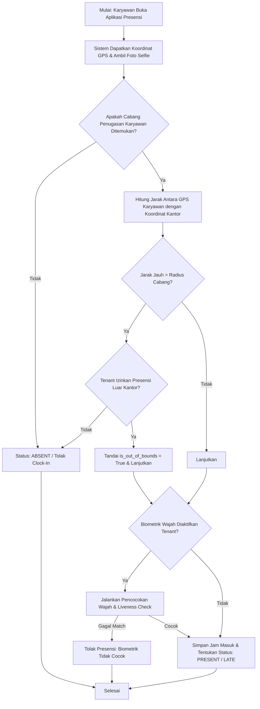
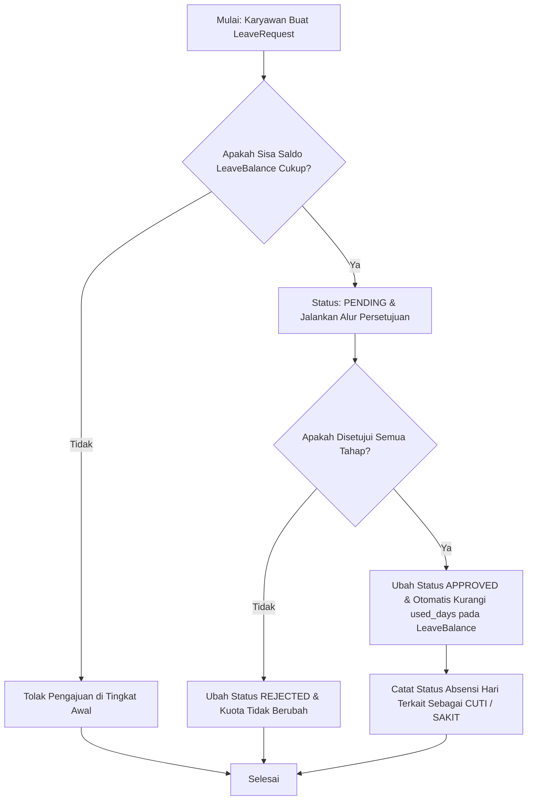

# Dokumentasi Modul: Kehadiran & Kelola Cuti Karyawan

## 1. Deskripsi Umum
Modul **Attendance** mengelola seluruh aspek kedisplinan pencatatan waktu kehadiran karyawan harian, pengaturan jadwal kerja bergilir (*shift*), alokasi kuota cuti tahunan, pelaporan lembur operasional, serta proses pengajuan koreksi ketidakhadiran secara digital. Modul ini dilengkapi dengan teknologi keamanan tinggi untuk meminimalisasi kecurangan presensi melalui validasi lokasi koordinat GPS (*geofencing*) dan kecocokan biometrik wajah disertai deteksi keaktifan (*face recognition + liveness detection*).

* **Target Pengguna**: Karyawan, Manajer/Atasan Langsung, dan HR Admin.

---

## 2. Model Basis Data Utama
Modul ini bertumpu pada model Django utama di dalam Django App `attendance`:

1. **`Attendance`**: Menyimpan data presensi harian karyawan. Menyimpan catatan waktu masuk (*check-in*), waktu keluar (*check-out*), status (Hadir, Terlambat, Alpa, Luar Lokasi), koordinat GPS, foto bukti presensi masuk/pulang, validasi biometrik, indikasi di luar radius kantor (*is_out_of_bounds*), serta jarak meter presensi dari lokasi kantor.
2. **`LeaveRequest`**: Pengajuan permohonan ketidakhadiran (Cuti, Izin, Sakit) beserta alasan, berkas bukti (misal: surat sakit dokter), tahapan persetujuan aktif (`current_stage`), serta status keputusannya.
3. **`LeaveBalance`**: Informasi jatah kuota cuti tahunan karyawan pada tahun tertentu, melacak jumlah cuti yang sudah digunakan dan sisa saldo cuti aktif.
4. **`Overtime`**: Pengajuan pengerjaan lembur karyawan di luar jam shift standar kerja, mencakup durasi jam, tujuan pengerjaan, dan alur integrasi persetujuannya.
5. **`Shift`**: Definisi jam kerja standar karyawan (jam masuk, jam keluar, durasi istirahat), opsi fleksibilitas waktu, serta penentuan hari-hari aktif kerja dalam seminggu.
6. **`Schedule`**: Pemetaan penugasan shift kerja spesifik bagi setiap karyawan pada tanggal kalender tertentu.
7. **`AttendanceCorrectionRequest`**: Permohonan revisi pencatatan waktu check-in/out akibat kendala teknis atau lupa presensi harian.

---

## 3. Fitur Utama & Kegunaan
* **Presensi Anti-Fraud (Geofencing & Biometrik)**: Verifikasi ketat clock-in/out dengan menghitung jarak relatif dari koordinat cabang terdekat dan pencocokan foto selfi wajah terhadap master biometrik.
* **Manajemen Jadwal & Shift**: Mendukung pembuatan jam kerja tetap (misal: Shift Pagi/Malam) atau jam kerja fleksibel untuk mengakomodasi berbagai jenis profesi kerja.
* **Pengajuan Cuti & Izin Mandiri**: Karyawan dapat memantau sisa saldo cuti dan mengajukan izin secara digital tanpa perlu formulir kertas fisik.
* **Pencatatan Jam Lembur**: Otomatisasi perekaman jam lembur terintegrasi dengan persetujuan atasan sebelum diteruskan menjadi komponen penggajian bulanan.
* **Permohonan Koreksi Absensi**: Memberikan ruang koreksi transparan bagi data kehadiran karyawan yang bermasalah.

---

## 4. Alur Proses & Flowchart (Mermaid Diagram)

### A. Alur Pencatatan Kehadiran Karyawan (Clock-In)

### B. Pengajuan Cuti & Pengurangan Saldo Cuti

---

## 5. Integrasi Antar-Modul
* **Integrasi dengan Modul `core`**: Membaca profil karyawan (`Employee`) untuk data biodata dasar, supervisor yang menyetujui dokumen, serta mengambil detail radius lokasi fisik kantor pada model `Branch`. Menggunakan modul core untuk memetakan tahapan persetujuan pada model `WorkflowStage`.
* **Integrasi dengan Modul `payroll`**: Data akumulasi ketidakhadiran (alpa), hari terlambat (*late minutes*), jam kerja lembur yang disetujui, serta durasi hari izin/sakit diekspor secara otomatis pada akhir bulan untuk menentukan potongan gaji atau penambahan upah lembur karyawan.
* **Integrasi dengan Modul `notifications`**: Mengirimkan notifikasi push in-app atau email instan kepada atasan ketika ada pengajuan cuti baru, dan mengirimkan kembali notifikasi keputusan ke karyawan.

---

## 6. Hak Akses (RBAC) & Keamanan
* **`tenant_approve_leave`**: Hak akses yang harus dimiliki oleh manajer atau HR untuk menyetujui pengajuan cuti.
* **`tenant_approve_overtime`**: Otorisasi menyetujui pengerjaan jam lembur karyawan.
* **`tenant_approve_attendance_correction`**: Hak otorisasi untuk menyetujui perbaikan absensi.
* **Biometric Fallback Policy**: Modul ini membaca properti tenant `is_biometric_enabled`. Jika dimatikan (misalnya saat kondisi darurat atau kapasitas media penuh), proses presensi diizinkan untuk melewati verifikasi biometrik selfie wajah.
