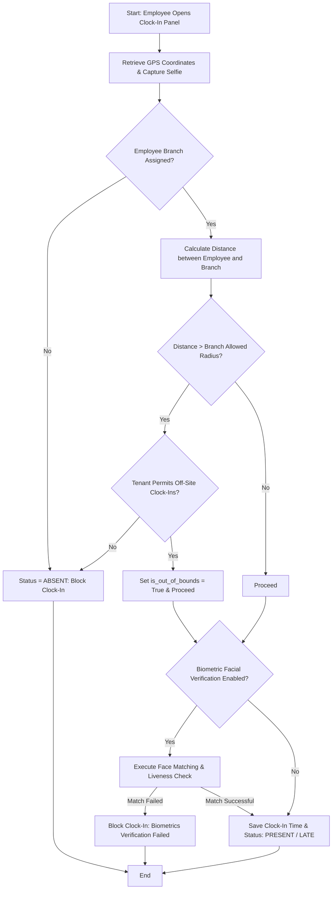
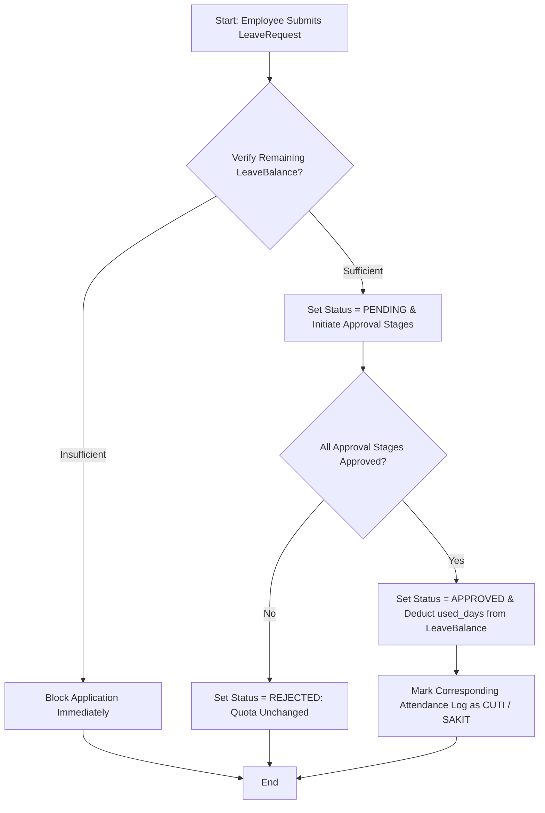

# Module Documentation: Attendance & Leave Management

## 1. General Overview
The **Attendance** module handles daily employee check-ins, scheduling shifts, annual leave allocations, overtime submissions, and digital correction requests. The system prevents attendance fraud by combining virtual boundary validation (*geofencing*) with selfie face verification and keeness checks (*face recognition + liveness detection*).

* **Target Users**: General Employees, Managers/Approvers, and HR Administrators.

---

## 2. Key Database Models
This module utilizes several database tables inside the `attendance` Django app:

1. **`Attendance`**: Stores daily attendance logs. Captures check-in/out timestamps, GPS coordinates, selfies, biometric validation indicators, out-of-bounds flags (`is_out_of_bounds`), and distance calculations from the designated branch.
2. **`LeaveRequest`**: Manages paid leave, medical leaves, and permissions. Tracks dates, proof uploads, stage routing (`current_stage`), and supervisor/HR statuses.
3. **`LeaveBalance`**: Tracks annual leave allocations, used days, and remaining balances per year for each employee.
4. **`Overtime`**: Captures overtime assignments, duration, business context, and approval hierarchies.
5. **`Shift`**: Defines standard working schedules (start, end, break durations), day-of-week active bounds, and flexible scheduling flags.
6. **`Schedule`**: Maps specific employees to a particular shift on a given calendar day.
7. **`AttendanceCorrectionRequest`**: Allows employees to request check-in/out timestamp overrides due to technical issues or forgetfulness.

---

## 3. Core Features & Capabilities
* **Fraud-Resistant Check-Ins (Geofencing & Biometrics)**: Enforces proximity verification by comparing mobile coordinates against the assigned office branch radius, and verifies identities using selfie face matching.
* **Flexible Shifts & Schedules**: Accommodates variable shift rotations, standard office hours, and flexible schedules.
* **Self-Service Leave Management**: Employees can check remaining leave balances and submit digital leave requests.
* **Overtime Auditing**: Automatically logs overtime hours, routing them to supervisors before feeding into the monthly payroll module.
* **Digital Attendance Corrections**: Provides an audited, transparent pipeline for employees to resolve missing check-ins.

---

## 4. Workflows & Process Flows (Mermaid Diagrams)

### A. Geofenced Clock-In Pipeline

### B. Leave Application & Quota Lifecycle

---

## 5. Module Integrations
* **Integration with `core` Module**: Pulls biographical employee profiles (`Employee`), supervisor hierarchies, and office configurations (`Branch`). Uses `WorkflowConfig` and `WorkflowStage` models to handle multi-stage document approvals.
* **Integration with `payroll` Module**: Automatically feeds monthly unpaid leaves (absences), late minutes, and approved overtime hours to compute deductions and bonuses.
* **Integration with `notifications` Module**: Instantly triggers in-app and email alerts to supervisors when requests are filed, and notifies employees once decisions are made.

---

## 6. Permissions & Security Control
* **`tenant_approve_leave`**: Required to approve or reject employee leave requests.
* **`tenant_approve_overtime`**: Required to validate employee overtime hours.
* **`tenant_approve_attendance_correction`**: Required to approve shift/clock-in overrides.
* **Biometric Fallback Policy**: Obeys the tenant-level `is_biometric_enabled` policy. If disabled, check-ins are allowed to bypass selfie validation.
