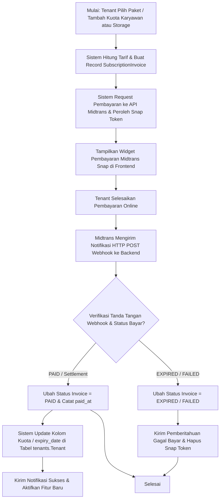

# Dokumentasi Modul: Tagihan & Kuota Langganan SaaS

## 1. Deskripsi Umum
Modul **Billing** adalah komponen vital komersial SaaS yang mengelola transaksi keuangan pelanggan tenant, integrasi dengan payment gateway online, penyediaan kuota tambahan kapasitas, serta proses peninjauan penurunan kapasitas penyimpanan (*storage downgrade*). Modul ini bekerja di tingkat global publik untuk memastikan kelancaran transaksi langganan dan penegakan batasan sumber daya tenant secara waktu nyata (*real-time*).

* **Target Pengguna**: Superadmin SaaS (pengelola platform) dan Administrator Tenant (pembayar tagihan).

---

## 2. Model Basis Data Utama
Siklus penagihan dan kuota diatur oleh model-model berikut di dalam Django App `billing` (skema database `public`):

1. **`SubscriptionInvoice`**: Dokumen faktur tagihan langganan. Menyimpan informasi tenant pembayar, paket yang dipilih, total tagihan (`amount`), status pembayaran (`PENDING`, `PAID`, `FAILED`, `EXPIRED`), nomor order unik Midtrans (`midtrans_order_id`), tautan pembayaran Midtrans Snap Token (`snap_token`), jenis metode pembayaran, penambahan masa aktif (jumlah bulan), indikator pembelian kuota tambahan karyawan/storage (*addons*), serta penanda waktu pembayaran (`paid_at`).
2. **`QuotaReductionRequest`**: Formulir pengajuan resmi oleh tenant untuk mengurangi kapasitas penyimpanan ekstra (*storage addon*) guna menekan biaya bulanan. Menyimpan jumlah GB yang ingin dikurangi, status pengajuan (`PENDING`, `APPROVED`, `REJECTED`, `CANCELLED`), alasan penurunan, keputusan peninjauan Superadmin, dan tanggal persetujuan.

---

## 3. Fitur Utama & Kegunaan
* **Pembayaran Otomatis Midtrans**: Integrasi lancar dengan API Midtrans Snap SDK untuk melayani pembayaran online instan via Transfer Bank (Virtual Account), Kartu Kredit, GoPay, ShopeePay, QRIS, atau ritel minimarket.
* **Pembelian Kuota Tambahan Karyawan (Employee Addon)**: Mengizinkan tenant untuk memperbesar batas kapasitas jumlah karyawan aktif di atas kapasitas paket standar tanpa harus memaksa melakukan upgrade ke tier paket yang lebih mahal.
* **Pembelian Kapasitas Penyimpanan (Storage Addon)**: Menyediakan ruang penyimpanan berkas tambahan (dalam ukuran GB) untuk menampung scan KTP/NPWP, foto presensi liveness wajah, atau nota keuangan reimbursement.
* **Alur Penurunan Kapasitas Terkendali**: Mencegah hilangnya data tenant secara mendadak akibat penurunan kuota dengan mengharuskan proses pengajuan (`QuotaReductionRequest`) ditinjau dan divalidasi terlebih dahulu oleh Superadmin SaaS.

---

## 4. Alur Proses & Flowchart (Mermaid Diagram)

### A. Alur Upgrade Paket / Pembelian Add-on Melalui Midtrans Gateway

---

## 5. Integrasi Antar-Modul
* **Integrasi dengan Modul `tenants`**: Modul billing beroperasi langsung pada model `Tenant` di skema public. Ketika status invoice dinyatakan lunas (`PAID`), sistem memperbarui kolom `expiry_date`, menambah kapasitas `extra_employees` (kuota karyawan), menambah kapasitas `extra_storage_mb` (kuota storage), serta memulihkan status tenant dari `EXPIRED` kembali menjadi `ACTIVE`.
* **Integrasi dengan Modul `notifications`**: Mengirimkan notifikasi tagihan jatuh tempo ke administrator tenant, peringatan kuota kapasitas hampir penuh (peringatan storage > 90%), serta konfirmasi pembayaran berhasil.

---

## 6. Hak Akses (RBAC) & Keamanan
* **Global Billing Access**: Pengelolaan katalog harga paket dan verifikasi manual transaksi diatur menggunakan peran administrator SaaS pusat (`BILLING` atau `SUPERADMIN`). Tenant biasa tidak diizinkan mengubah status invoice atau menyetujui penurunan kuota miliknya sendiri tanpa pembayaran yang valid.
* **Midtrans Signature Verification**: Seluruh notifikasi webhook dari Midtrans wajib melewati algoritma verifikasi tanda tangan kriptografi (*SHA512 hashing match*) menggunakan kunci server rahasia (*Server Key*) guna menangkal manipulasi parameter status transaksi pembayaran oleh peretas.
