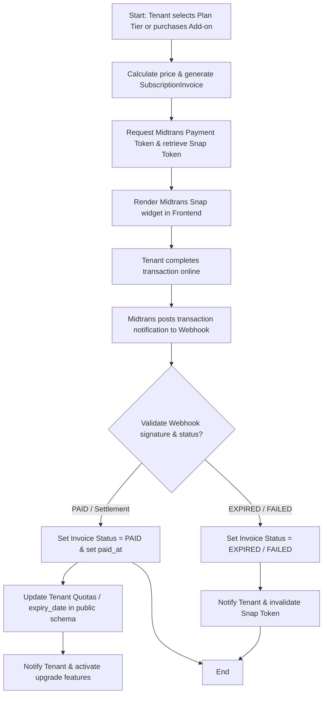

# Module Documentation: Billing & SaaS Subscriptions

## 1. General Overview
The **Billing** module manages tenant subscription invoices, online payment gateway integrations, employee/storage add-on upgrades, and storage downgrade request reviews. Operating at the global SaaS level, it maintains subscription lifecycles and enforces resources limits across tenants in real-time.

* **Target Users**: Platform Superadmins and Tenant Administrators.

---

## 2. Key Database Models
This module operates inside the `public` schema and utilizes models in the `billing` Django app:

1. **`SubscriptionInvoice`**: Holds billing documents. Stores target tenant details, amounts, plan types, payment statuses (`PENDING`, `PAID`, `FAILED`, `EXPIRED`), Midtrans order IDs (`midtrans_order_id`), snap SDK checkout tokens (`snap_token`), payment methods, subscription periods (months), add-on metadata (employee/storage counts), and payment timestamps (`paid_at`).
2. **`QuotaReductionRequest`**: Manages tenant requests to downgrade extra storage add-ons to minimize operational costs. Stores target reductions (GB), statuses (`PENDING`, `APPROVED`, `REJECTED`, `CANCELLED`), reason summaries, review comments, and approval timestamps.

---

## 3. Core Features & Capabilities
* **Automated Payments (Midtrans)**: Integrates with the Midtrans Snap SDK to process credit cards, Virtual Accounts (Bank Transfer), GoPay, ShopeePay, QRIS, or convenience store payments.
* **Employee Add-on Quotas**: Allows tenants to increase their active employee capacity limits without forcing them to upgrade to a more expensive tier.
* **Storage Add-on Quotas**: Allows tenants to purchase extra storage space (GB) to accommodate file uploads, biometrics, and receipts.
* **Controlled Storage Downgrades**: Prevents accidental data losses during downgrades by requiring tenant requests (`QuotaReductionRequest`) to be verified and completed by a Platform Superadmin.

---

## 4. Workflows & Process Flows (Mermaid Diagrams)

### A. Midtrans Payment & Subscription Upgrade Flow

---

## 5. Module Integrations
* **Integration with `tenants` Module**: Operates directly on the `Tenant` model in the public schema. Once payments are marked `PAID`, it extends `expiry_date`, adds `extra_employees` or `extra_storage_mb`, and restores status indicators from `EXPIRED` to `ACTIVE`.
* **Integration with `notifications` Module**: Sends automated billing due dates, invoice receipts, and alerts when storage usage exceeds 90%.

---

## 6. Permissions & Security Control
* **Global Administrative Access**: Managing product prices and resolving invoice overrides are locked to central roles (`BILLING` or `SUPERADMIN`). Tenants cannot bypass payments or manually resolve their own invoices.
* **Midtrans Webhook Security**: All incoming webhook requests from Midtrans are verified using server-level HMAC-SHA512 digital signatures. This prevents transaction status forgery.
