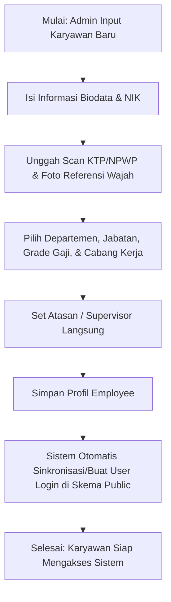
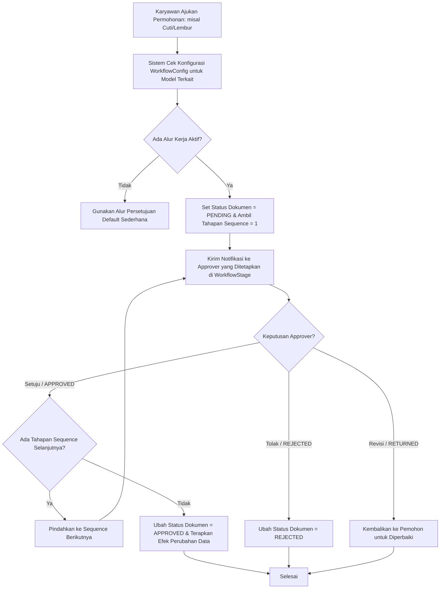

# Dokumentasi Modul: Core & Employee Management

## 1. Deskripsi Umum
Modul **Core** merupakan fondasi utama dari sistem HariKerja HRMS. Modul ini bertanggung jawab untuk memetakan struktur organisasi perusahaan, mengelola profil lengkap data karyawan, memetakan penugasan cabang fisik beserta batas koordinat wilayah kehadiran (*geofencing*), serta menyediakan mesin alur kerja persetujuan multi-level (*N-level Workflow Engine*) yang dinamis untuk digunakan oleh modul-modul operasional lainnya.

* **Target Pengguna**: Admin HR, Manajer, Direktur, dan Staf Operasional.

---

## 2. Model Basis Data Utama
Modul ini didukung oleh beberapa model Django utama di dalam Django App `core`:

1. **`Department`**: Representasi divisi atau departemen di dalam perusahaan (misalnya: IT, HR, Marketing).
2. **`Role`**: Jabatan kerja spesifik yang terikat pada departemen tertentu (misalnya: Software Engineer di Departemen IT).
3. **`Grade`**: Golongan atau jenjang kepangkatan karyawan yang menentukan besaran gaji pokok, tunjangan makan/transport harian, serta tarif dasar perhitungan jam lembur.
4. **`Branch`**: Lokasi kantor fisik atau outlet kerja, mencakup alamat, koordinat latitude & longitude, radius toleransi absensi (geofencing), serta zona waktu lokasi tersebut.
5. **`Employee`**: Profil data utama karyawan yang mencakup Nomor Induk Karyawan (NIK), nama lengkap, email unik, nomor telepon, alamat, dokumen KTP/NPWP, status PTKP (PPh 21), foto referensi pembanding presensi wajah, penugasan jabatan/cabang, serta relasi hierarki supervisor.
6. **`WorkflowConfig`**: Konfigurasi pemetaan jenis objek pengajuan (Cuti, Lembur, Koreksi Absensi, Reimbursement) ke dalam skema persetujuan tertentu.
7. **`WorkflowStage`**: Tahapan persetujuan dalam suatu konfigurasi alur kerja (mendukung penentuan approver tipe: Supervisor Langsung, Role Akses tertentu, atau Karyawan spesifik).
8. **`WorkflowAction`**: Pencatatan riwayat persetujuan, penolakan, atau revisi dokumen pengajuan oleh aktor yang berwenang di setiap tahapan.
9. **`APIKey`**: Kredensial integrasi aman dengan pihak ketiga (seperti Zapier atau ERP eksternal).
10. **`AuditLog`**: Pencatatan riwayat perubahan data (Create, Update, Delete) di tingkat model demi transparansi sistem.

---

## 3. Fitur Utama & Kegunaan
* **Manajemen Struktur Organisasi**: Pemetaan struktur departemen dan spesialisasi jabatan yang fleksibel.
* **Manajemen Profil & Legalitas Karyawan**: Penyimpanan data pribadi, perpajakan (PTKP), dokumen penting (KTP & NPWP), serta foto biometrik untuk presensi.
* **Konfigurasi Cabang & Geofencing**: Pengaturan wilayah kerja yang aman dengan koordinat GPS dan radius toleransi jarak meter untuk validasi kehadiran.
* **Mesin Alur Persetujuan Fleksibel (N-Level Workflow)**: Memungkinkan penentuan tahapan persetujuan dinamis sesuai kebijakan perusahaan untuk berbagai modul operasional.
* **Audit Trail Sistem**: Pemantauan detail log modifikasi data oleh aktor tertentu demi keamanan audit.

---

## 4. Alur Proses & Flowchart (Mermaid Diagram)

### A. Alur Pembuatan Profil Karyawan & Sinkronisasi Pengguna

### B. Evaluasi Alur Kerja Persetujuan N-Level (Workflow Engine)

---

## 5. Integrasi Antar-Modul
* **Integrasi dengan Modul `users`**: Sinkronisasi data email dan kredensial login pengguna. Hak akses dinamis karyawan diambil dari `access_role` pada profil `Employee`.
* **Integrasi dengan Modul `attendance`**: Penugasan cabang (`Branch`) menentukan geofencing tempat presensi karyawan, dan `WorkflowConfig` memproses persetujuan Cuti, Lembur, dan Koreksi Absensi.
* **Integrasi dengan Modul `payroll`**: Komponen gaji pokok, tunjangan makan/transport ditentukan oleh `Grade` karyawan, dan status keluarga (`ptkp_status`) memengaruhi perhitungan pajak PPh 21.
* **Integrasi dengan Modul `reimbursement`**: Menggunakan sistem persetujuan alur kerja multi-level untuk klaim biaya operasional.

---

## 6. Hak Akses (RBAC) & Keamanan
Akses dan konfigurasi pada modul ini diatur menggunakan beberapa permission dinamis berikut:
* **`tenant_manage_hr`**: Mengizinkan pengelolaan penuh atas Departemen, Jabatan, Cabang, dan profil Karyawan.
* **`tenant_manage_settings`**: Mengizinkan konfigurasi global alur kerja persetujuan (`WorkflowConfig` dan `WorkflowStage`).
* **`tenant_manage_access_roles`**: Mengizinkan pengaturan hak akses kustom bagi karyawan.
