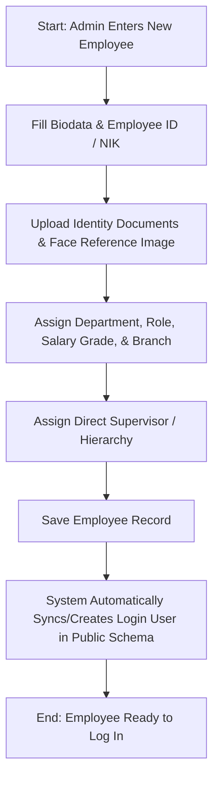
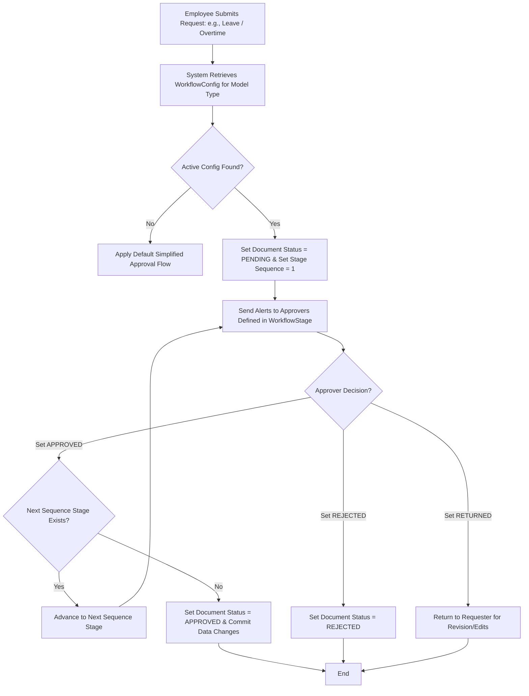

# Module Documentation: Core & Employee Management

## 1. General Overview
The **Core** module serves as the primary foundation for the HariKerja HRMS platform. It is responsible for mapping organizational structures, managing comprehensive employee profile directories, defining physical office branches with virtual boundaries (*geofencing*), and providing a dynamic, multi-stage approval workflow engine (*N-level Workflow Engine*) utilized by other operational modules.

* **Target Users**: HR Administrators, Managers, Directors, and Operational Staff.

---

## 2. Key Database Models
This module is supported by several core Django models located within the `core` application:

1. **`Department`**: Represents a structural division or department in the organization (e.g., IT, HR, Marketing).
2. **`Role`**: Specific job titles or roles bound to a particular department (e.g., Software Engineer inside the IT Department).
3. **`Grade`**: Salary tier or rank of an employee, defining their base salary, flat daily meal/transport allowances, and overtime rate multipliers.
4. **`Branch`**: Physical office location or retail outlet, containing address details, GPS coordinates (latitude/longitude), absolute geofencing radius, and timezone configurations.
5. **`Employee`**: Master profile record containing the Employee ID (NIK), full name, unique email address, phone number, address, KTP/NPWP documents, marital status for taxation (PTKP status), face reference photo for biometric validation, role/branch assignments, and direct supervisor hierarchy.
6. **`WorkflowConfig`**: Configuration binding a document model type (e.g., Leave request, Overtime, Attendance correction) to a specific approval flow.
7. **`WorkflowStage`**: A single step within an approval flow sequence, defining the actor type (Direct Supervisor, Access Role, or Specific Employee) authorized to review at this level.
8. **`WorkflowAction`**: Audit trail record tracking approvals, rejections, or revision returns made by authorized actors at each step.
9. **`APIKey`**: Credentials for secure, authenticated integrations with third-party systems (such as Zapier or ERPs).
10. **`AuditLog`**: Audit trails capturing model changes (Create, Update, Delete) to enforce security and accountability.

---

## 3. Core Features & Capabilities
* **Organizational Structure Management**: Highly flexible division and job role mapping.
* **Employee Lifecycle & Profiling**: Complete storage of employee personal details, tax parameters, identity documents (KTP/NPWP), and biometric reference photographs.
* **Office & Geofencing Configurations**: Safeguarding daily check-ins by ensuring employees clock in within specified GPS coordinates and radius zones.
* **Dynamic N-Level Workflow Engine**: Fully customizable, sequential approval stages that adapt to varying corporate hierarchies and policies.
* **System-wide Audit Trails**: Logging critical mutations across models to satisfy audit and security requirements.

---

## 4. Workflows & Process Flows (Mermaid Diagrams)

### A. Employee Onboarding & User Sync Flow

### B. N-Level Custom Approval Workflow Evaluation

---

## 5. Module Integrations
* **Integration with `users` Module**: Synchronizes unique email logins and credentials. Dynamically reads employee `access_role` to assign user permissions.
* **Integration with `attendance` Module**: Branch coordinates (`Branch`) enforce geographic check-in bounds, and `WorkflowConfig` controls the lifecycle of Leave, Overtime, and Attendance Correction approvals.
* **Integration with `payroll` Module**: Base salaries and flat allowances are mapped from `Grade` structures, and `ptkp_status` feeds PTKP tax brackets for PPh 21 calculations.
* **Integration with `reimbursement` Module**: Powers multi-stage financial expense approvals.

---

## 6. Permissions & Security Control
Access controls are enforced using granular RBAC permission strings:
* **`tenant_manage_hr`**: Grants full management over Departments, Roles, Branches, and Employee directories.
* **`tenant_manage_settings`**: Grants authorization to configure global approval settings (`WorkflowConfig` and `WorkflowStage`).
* **`tenant_manage_access_roles`**: Enforces authorization to assign custom permissions to user groups.
