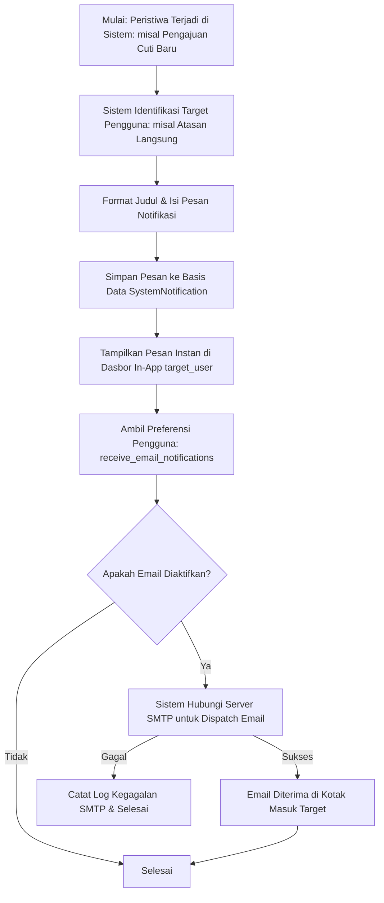

# Dokumentasi Modul: Sistem Notifikasi & Email Otomatis

## 1. Deskripsi Umum
Modul **Notifications** didesain sebagai pusat komunikasi digital real-time di dalam aplikasi HariKerja HRMS. Modul ini bertanggung jawab mengumpulkan peristiwa-peristiwa penting dari berbagai modul (seperti pengajuan cuti, perubahan periode payroll, status pembayaran tagihan, atau gangguan server), lalu menyebarkannya secara instan melalui dasbor internal (*in-app notification*) maupun surat elektronik (*email dispatch* via SMTP) sesuai preferensi pengguna.

* **Target Pengguna**: Karyawan, Manajer, Admin Tenant, dan Superadmin.

---

## 2. Model Basis Data Utama
Modul komunikasi ini bertumpu pada model Django utama di dalam Django App `notifications`:

1. **`SystemNotification`**: Menyimpan pesan pengumuman atau peringatan yang diterbitkan oleh sistem atau admin. Model ini mencatat judul pesan (`title`), rincian pesan (`message`), klasifikasi kegawatan (`INFO` informasi, `WARNING` peringatan, `CRITICAL` darurat, `SUCCESS` sukses), pengelompokan tujuan pesan (`ADMIN` sistem & tagihan, `OPERATIONAL` karyawan & alur kerja kerja), status keaktifan pesan, batas tanggal kedaluwarsa penayangan, serta relasi opsional ke target pengguna tertentu (`target_user`). Jika target user bernilai kosong (`null`), pesan tersebut dikategorikan sebagai pengumuman global tenant yang dapat dilihat oleh seluruh karyawan.

---

## 3. Fitur Utama & Kegunaan
* **Kategorisasi Pesan yang Jelas**: Memisahkan pemberitahuan administratif tingkat sistem (seperti sisa kuota penyimpanan menipis, paket langganan segera kedaluwarsa) dari pemberitahuan operasional harian (seperti permohonan lembur disetujui, nota reimbursement ditolak).
* **Prioritas Pesan Tingkat Kegawatan (Severity Levels)**: Memberikan warna visual penanda tingkat kegawatan di dasbor (hijau untuk sukses, biru untuk informasi, kuning untuk peringatan, merah untuk kritis/darurat) guna mempermudah pemindaian informasi penting oleh pengguna.
* **Notifikasi In-App Real-time**: Karyawan dapat memantau pesan langsung dari panel lonceng notifikasi di dasbor web atau aplikasi mobile tanpa perlu membuka email.
* **Integrasi Email SMTP Otomatis**: Pengiriman email dinamis menggunakan templat HTML untuk mengirimkan surat pengajuan izin ke atasan atau mengirimkan kode snap token pembayaran tagihan.
* **Preferensi Pengguna**: Menghormati privasi pengguna dengan membaca status `receive_email_notifications` pada profil akun sebelum melancarkan pengiriman email.

---

## 4. Alur Proses & Flowchart (Mermaid Diagram)

### A. Alur Pemicuan & Pengiriman Notifikasi Sistem

---

## 5. Integrasi Antar-Modul
* **Integrasi dengan Modul `users`**: Menghubungkan notifikasi ke target akun `User` di skema public, serta memvalidasi pengaturan privasi email `receive_email_notifications` pada masing-masing akun.
* **Integrasi dengan Modul `core`, `attendance`, `reimbursement`**: Menangkap peristiwa pengajuan cuti, overtime, koreksi presensi, dan klaim reimbursement baru untuk segera memberi tahu manajer/atasan langsung agar segera memproses persetujuan.
* **Integrasi dengan Modul `billing` & `tenants`**: Memantau kapasitas storage yang terpakai dan masa aktif langganan tenant secara berkala (via cron job/celery task). Jika mendekati limit, sistem akan otomatis mengirimkan `SystemNotification` tingkat `WARNING` atau `CRITICAL` ke email admin tenant bersangkutan.

---

## 6. Hak Akses (RBAC) & Keamanan
* **Pembuatan Notifikasi Global**: Hanya pengguna dengan hak administrator tenant (`tenant_manage_settings`) yang dapat memicu pembuatan pengumuman internal global bagi seluruh karyawan di perusahaannya.
* **Keamanan Hak Baca Pesan**: Model `SystemNotification` menyaring data pesan berdasarkan sub-domain skema tenant aktif dan target ID pengguna. Pengguna biasa dipastikan tidak dapat mengintip notifikasi administratif yang ditujukan khusus bagi pengguna berkategori admin tenant.
