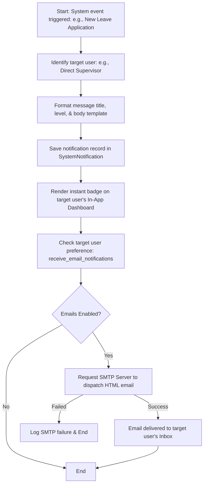

# Module Documentation: Notifications & Email System

## 1. General Overview
The **Notifications** module serves as the centralized communications engine for the HariKerja HRMS platform. It collects events triggered across different modules (such as leave applications, payroll completions, invoice updates, or server alerts) and dispatches them via in-app dashboard badges or SMTP emails based on user configurations.

* **Target Users**: General Employees, Managers, Tenant Admins, and Platform Superadmins.

---

## 2. Key Database Models
This module utilizes the following database models inside the `notifications` Django app:

1. **`SystemNotification`**: Stores system-wide or per-tenant notifications. Tracks message title, body contents, priority levels (`INFO`, `WARNING`, `CRITICAL`, `SUCCESS`), category bounds (`ADMIN` for billing/SaaS and `OPERATIONAL` for employee workflows), expiration dates, and targeted accounts (`target_user`). If `target_user` is null, the record serves as a global announcement visible to all employees in the tenant workspace.

---

## 3. Core Features & Capabilities
* **Granular Communication Channels**: Segregates critical system alerts (such as storage capacity limits and billing dues) from daily operational events (such as approved leaves and reimbursement reviews).
* **Severity Priority Matrices**: Assigns color-coded alerts (green for success, blue for info, yellow for warnings, and red for critical issues) to help users easily parse important information.
* **Real-time In-App Badging**: Renders instant notifications in the dashboard bells of web and mobile apps, keeping employees updated without forcing them to check emails.
* **Automated SMTP Emailing**: Employs clean HTML templates to dispatch leave requests to supervisors, payment confirmations, and system notifications.
* **User Delivery Preferences**: Respects user privacy constraints by checking `receive_email_notifications` on the target user's profile before sending emails.

---

## 4. Workflows & Process Flows (Mermaid Diagrams)

### A. System Notification Trigger & Dispatch Cycle

---

## 5. Module Integrations
* **Integration with `users` Module**: Matches notification targets to `User` records in the public schema, and honors user-level `receive_email_notifications` preferences.
* **Integration with Operational Modules**: Listens for operations inside `core`, `attendance`, and `reimbursement` modules to instantly notify managers when new items require their review.
* **Integration with `billing` & `tenants` Modules**: Routinely checks tenant disk space and expiration terms (via background tasks/celery cron jobs). If quotas are near limits, it dispatches `CRITICAL` or `WARNING` notifications to the tenant's admin email.

---

## 6. Permissions & Security Control
* **Global Announcements Creation**: Creating company-wide global announcements requires tenant administrator permissions (`tenant_manage_settings`).
* **Message Scoping**: The database engine queries notifications by subdomain schemas and target user IDs, ensuring general employees are strictly barred from reading administrative system logs.
