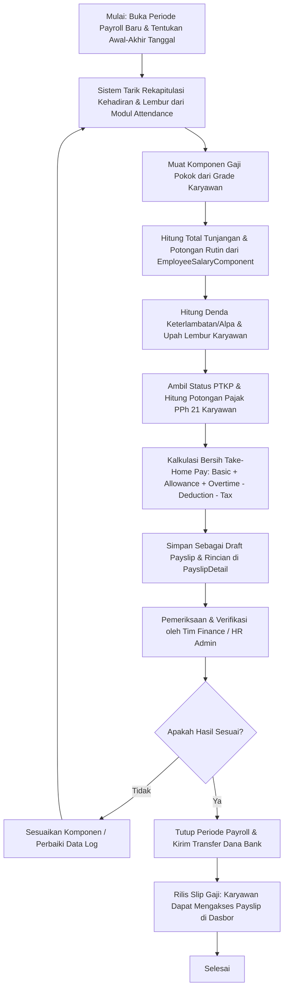

# Dokumentasi Modul: Penggajian & Perhitungan PPh 21

## 1. Deskripsi Umum
Modul **Payroll** menangani pemrosesan penggajian bulanan karyawan secara otomatis, akurat, dan patuh terhadap regulasi ketenagakerjaan di Indonesia. Modul ini menghitung komponen gaji pokok, tunjangan rutin/harian, potongan absensi, penambahan insentif lembur, serta memotong pajak penghasilan individu secara otomatis (**PPh Pasal 21**) berdasarkan status perkawinan dan jumlah tanggungan keluarga karyawan sebelum menerbitkan slip gaji digital (*Payslip*).

* **Target Pengguna**: HR Payroll Admin, Tim Keuangan (Finance), dan Karyawan (penerima Payslip).

---

## 2. Model Basis Data Utama
Modul ini didukung oleh model-model Django utama di dalam Django App `payroll`:

1. **`SalaryComponent`**: Definisi komponen pendapatan atau pengurang gaji. Menyimpan nama komponen, jenis (Tunjangan / Potongan), dan status apakah komponen ini tergolong objek yang dikenakan pajak (*is_taxable*).
2. **`PayrollPeriod`**: Menentukan batas awal dan akhir kalender siklus penggajian bulanan (misalnya: periode Mei 2026, tanggal 1 s.d. 31) beserta status penutupan pembukuan periode tersebut.
3. **`EmployeeSalaryComponent`**: Pemetaan besaran tunjangan/potongan tertentu yang ditetapkan khusus untuk setiap karyawan. Mendukung komponen berulang bulanan (*recurring*) atau komponen satu kali bayar (*one-time component*) pada periode penggajian tertentu.
4. **`Payslip`**: Rekapitulasi penggajian final bagi seorang karyawan pada periode tertentu. Menyimpan total gaji pokok, total tunjangan, total potongan, upah lembur, potongan pajak PPh 21, total bersih yang diterima (*net take-home pay*), serta tanggal pembayaran gaji.
5. **`PayslipDetail`**: Pencatatan rincian matematis per baris (*itemized details*) atas semua komponen pendapatan atau pengurang yang membentuk total akhir dari suatu Payslip.

---

## 3. Fitur Utama & Kegunaan
* **Kompilasi Penggajian Otomatis**: Menghitung gaji pokok karyawan sesuai jenjang kepangkatannya (`Grade`) dikombinasikan dengan tunjangan rutin bulanan.
* **Kalkulasi Denda Absensi & Hadir**: Otomatisasi pemotongan tunjangan transport/makan harian untuk keterlambatan, atau pemotongan gaji pokok flat harian untuk alpa berdasarkan data modul `attendance`.
* **Kalkulasi Upah Lembur Akurat**: Perhitungan nominal lembur per jam berdasarkan jam lembur yang disetujui, menggunakan tarif lembur khusus atau formula proporsional standar (Gaji Pokok / 173).
* **Pemotongan Pajak PPh 21 Otomatis**: Integrasi klasifikasi PTKP Indonesia (`ptkp_status` dari model Karyawan, seperti TK/0, K/1, K/3) untuk menghitung tarif efektif pajak bulanan demi kepatuhan perpajakan.
* **Rilis Payslip & Slip Digital**: Karyawan dapat mengunduh slip gaji resmi secara online begitu status periode payroll dinyatakan tertutup (`is_closed = True`).

---

## 4. Alur Proses & Flowchart (Mermaid Diagram)

### A. Alur Pemrosesan Bulanan & Rilis Gaji (Payroll Run)


### B. Rumus Dasar Perhitungan Bersih (Net Pay) Karyawan
```text
Net Pay = (Basic Salary + Total Allowances + Overtime Pay) - (Total Deductions + PPh 21 Tax)
Di mana:
1. Basic Salary & Tunjangan Makan/Transport Harian diperoleh dari Grade Karyawan.
2. Deductions mencakup denda keterlambatan / alpa dari tenant-level policy.
3. PPh 21 Tax dihitung secara proporsional berdasarkan ptkp_status (TK/0 s.d K/3).
```

---

## 5. Integrasi Antar-Modul
* **Integrasi dengan Modul `core`**: Membaca profil `Employee` untuk mendapatkan email (pengiriman slip), detail `Grade` gaji pokok, supervisor untuk pelaporan, serta status keluarga `ptkp_status` untuk basis pajak PPh 21.
* **Integrasi dengan Modul `attendance`**: Menarik rekap presensi harian karyawan untuk mendenda keterlambatan (`late_minutes`), kehadiran kosong (`status = ABSENT`), serta menghitung penambahan upah jam lembur (`Overtime` disetujui).
* **Integrasi dengan Modul `tenants`**: Membaca kebijakan global penggajian perusahaan seperti `overtime_rate`, pembagi lembur `payroll_overtime_divisor`, tarif asuransi iuran kerja `jkk_rate`, serta nominal pemotongan denda absensi harian.

---

## 6. Hak Akses (RBAC) & Keamanan
Seluruh tindakan operasional finansial pada modul ini diamankan oleh hak akses khusus:
* **`tenant_manage_payroll`**: Hak akses mutlak untuk membuka periode payroll, memodifikasi nominal gaji komponen karyawan, mengeksekusi kalkulasi payroll bulanan, serta menerbitkan payslip. Pengguna tanpa permission ini tidak diizinkan mengakses data slip gaji karyawan lain.
