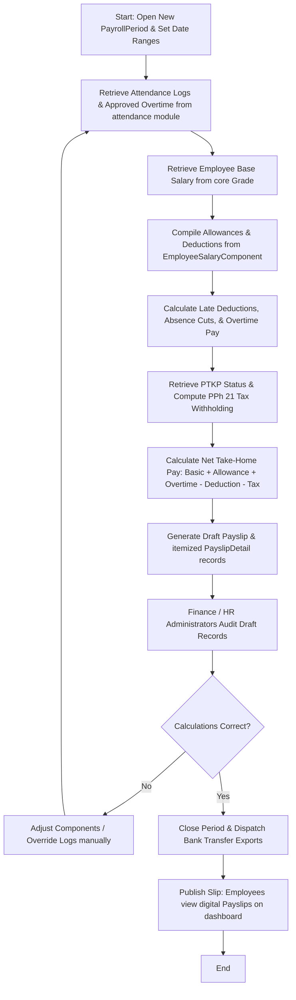

# Module Documentation: Payroll & Tax (PPh 21) Calculations

## 1. General Overview
The **Payroll** module automates the monthly salary generation process while maintaining strict compliance with Indonesian labor regulations. It calculates basic salaries, variable daily allowances, attendance penalties, and overtime bonuses, and applies automated individual income tax withholding (**PPh Pasal 21**) using the latest PTKP tax bracket guidelines.

* **Target Users**: Payroll HR Admins, Finance Teams, and General Employees.

---

## 2. Key Database Models
This module is powered by the following models inside the `payroll` Django app:

1. **`SalaryComponent`**: Defines addition or subtraction components. Stores component name, type (Allowance / Deduction), and PPh 21 tax liability status (`is_taxable`).
2. **`PayrollPeriod`**: Defines the start and end dates of a monthly payroll cycle, along with the period closure status.
3. **`EmployeeSalaryComponent`**: Links salary components to specific employees. Supports either ongoing monthly components (*recurring*) or one-time components for a specific period.
4. **`Payslip`**: Summarizes the final monthly pay for an employee. Stores base salaries, total allowances, total deductions, overtime earnings, PPh 21 tax withheld, net take-home pay, and payment dates.
5. **`PayslipDetail`**: Captures granular calculations for each component that forms the final payslip total.

---

## 3. Core Features & Capabilities
* **Automated Monthly Payroll Execution**: Computes basic salaries based on the employee's `Grade` and compiles variable allowances.
* **Attendance Deductions**: Automatically applies flat penalties to transport/meal allowances for late minutes, and basic salary cuts for unauthorized absences (alpa) using data from the `attendance` module.
* **Overtime Computation**: Calculates overtime earnings based on approved overtime logs, using either default Indonesian multipliers (Basic Salary / 173) or custom rates.
* **PPh 21 Tax Engine**: Integrates with PTKP classifications (`ptkp_status` from core Employee records, e.g., TK/0, K/1, K/3) to apply exact tax brackets and withholdings automatically.
* **Digital Payslip Generation**: Securely publishes PDF and digital payslips for employees once a payroll period is formally closed (`is_closed = True`).

---

## 4. Workflows & Process Flows (Mermaid Diagrams)

### A. Monthly Payroll Processing Cycle (Payroll Run)


### B. Core Salary Formula
```text
Net Pay = (Basic Salary + Total Allowances + Overtime Pay) - (Total Deductions + PPh 21 Tax)
Where:
1. Basic Salary, Meal, and Transport Daily Allowances are derived from Employee's Grade.
2. Deductions include late minutes and unauthorized absence penalties.
3. PPh 21 Tax is computed monthly using standard PTKP brackets.
```

---

## 5. Module Integrations
* **Integration with `core` Module**: Pulls employee profiles (`Employee`), `Grade` salary rules, supervisor hierarchies, and family `ptkp_status` parameters for tax processing.
* **Integration with `attendance` Module**: Imports daily check-in logs to identify late minutes (`late_minutes`), absences (`ABSENT`), and pulls approved `Overtime` hours to compute bonuses.
* **Integration with `tenants` Module**: Reads tenant-wide payroll variables including global `overtime_rate`, overtime divisor `payroll_overtime_divisor`, `jkk_rate` ratios, and flat late check-in penalties.

---

## 6. Permissions & Security Control
* **`tenant_manage_payroll`**: The primary administrative permission required to open/close payroll cycles, override compensation structures, process bank exports, and inspect draft employee payslips. Employees without this permission are strictly barred from accessing other employees' payslip data.
