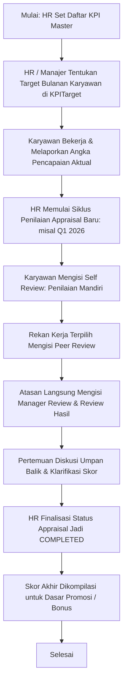

# Dokumentasi Modul: Penilaian Kinerja & Evaluasi KPI

## 1. Deskripsi Umum
Modul **Performance** didesain untuk membantu perusahaan memantau, mengevaluasi, dan meningkatkan produktivitas karyawan secara objektif dan transparan. Modul ini menyediakan kerangka kerja penetapan target kinerja utama (*Key Performance Indicators / KPI*), pencatatan pencapaian hasil kerja aktual secara berkala, serta penyelenggaraan siklus penilaian performa berkala (*Performance Appraisal*) yang mendukung sistem penilaian kolaboratif multi-pihak (*360-Degree Feedback*).

* **Target Pengguna**: Karyawan, Atasan / Manajer, Evaluator Sejawat (*Peers*), dan Admin HR.

---

## 2. Model Basis Data Utama
Pengukuran kinerja karyawan didukung oleh model-model Django berikut di dalam Django App `performance`:

1. **`KPI`**: Definisi metrik kinerja utama. Menyimpan nama KPI, deskripsi, kategori, serta satuan pengukuran yang digunakan (`PERCENTAGE`, `CURRENCY`, atau `UNIT` kuantitas).
2. **`KPITarget`**: Penugasan target angka dan pelaporan aktual pencapaian KPI bagi seorang karyawan pada periode bulan tertentu.
3. **`Appraisal`**: Siklus evaluasi kinerja utama (misalnya: "Evaluasi Tahunan Q1 2026") bagi karyawan, memuat masa aktif tanggal penilaian dan status siklus (`DRAFT`, `SUBMITTED`, `REVIEWED`, `COMPLETED`).
4. **`AppraisalReview`**: Formulir penilaian individu di dalam suatu siklus Appraisal. Model ini menampung data skor angka/rating dalam format JSON (`ratings`) dan testimoni narasi (`comments`) yang diberikan oleh aktor penilai berdasarkan perannya (`SELF` penilaian mandiri, `MANAGER` penilaian atasan, atau `PEER` penilaian rekan sejawat).

---

## 3. Fitur Utama & Kegunaan
* **Definisi KPI Dinamis**: Penyusunan metrik keberhasilan yang disesuaikan dengan jenis pekerjaan, baik menggunakan parameter persentase (%), nilai mata uang rupiah (IDR), maupun jumlah kuantitas unit barang.
* **Pencatatan Target vs Aktual**: Memberikan visualisasi perbandingan yang jelas antara target kerja bulanan karyawan dengan data pencapaian riil di lapangan.
* **Siklus Appraisal Terjadwal**: Memungkinkan HR merancang kalender evaluasi kinerja triwulan atau tahunan bagi seluruh atau sebagian departemen.
* **Penilaian 360 Derajat (360-Degree Appraisal)**: Mengurangi bias penilaian subjektif atasan dengan menyertakan penilaian mandiri dari karyawan bersangkutan serta evaluasi silang oleh rekan kerja satu divisi (*peer review*).
* **Penyimpanan Skor JSON**: Struktur data rating review disimpan dalam skema JSON dinamis, memungkinkan kuesioner penilaian memiliki kriteria penilaian yang adaptif.

---

## 4. Alur Proses & Flowchart (Mermaid Diagram)

### A. Alur Siklus Penetapan KPI & Evaluasi Kinerja (Performance Appraisal)

---

## 5. Integrasi Antar-Modul
* **Integrasi dengan Modul `core`**: Membaca data `Employee` untuk menentukan penugasan sasaran KPI, menentukan struktur hierarki atasan sebagai pengisi review `MANAGER`, serta memverifikasi rekan kerja dalam departemen yang sama untuk pengisian `PEER` review.
* **Integrasi dengan Modul `users`**: Menghubungkan akun pengguna untuk membatasi hak akses pengisian lembar penilaian agar hanya penilai yang bersangkutan yang dapat melihat dan mengisi formulir review aktif.

---

## 6. Hak Akses (RBAC) & Keamanan
* **`tenant_view_performance_report`**: Hak akses yang harus dimiliki oleh manajer atau HR untuk melihat rekapitulasi penilaian kinerja, grafik pencapaian KPI bulanan, serta kompilasi nilai akhir seluruh staf di divisi terkait.
* **Keamanan Kuesioner**: Sistem secara ketat memeriksa keterkaitan antara pengisi formulir `AppraisalReview` dengan data login pengguna. Karyawan biasa tidak dapat melihat hasil review atau komentar yang ditulis oleh manajer tentang dirinya sebelum status penilaian diumumkan secara resmi oleh HR.
