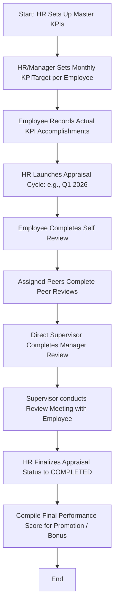

# Module Documentation: Performance Reviews & KPIs

## 1. General Overview
The **Performance** module is designed to monitor, evaluate, and improve employee productivity. It provides a robust framework to establish Key Performance Indicators (KPIs), track actual performance achievements against targets, and organize structured review cycles (*Performance Appraisals*) supporting collaborative peer-to-peer feedback (*360-Degree Feedback*).

* **Target Users**: General Employees, Managers/Supervisors, Peer Evaluators, and HR Administrators.

---

## 2. Key Database Models
This module utilizes the following database models inside the `performance` Django app:

1. **`KPI`**: Master definition of performance metrics. Stores names, categories, descriptions, and measurement units (`PERCENTAGE`, `CURRENCY`, or `UNIT` counts).
2. **`KPITarget`**: Binds specific employees to a KPI, defining targets, actual reported scores, and month-level periods.
3. **`Appraisal`**: Organizes structured evaluation timelines (e.g., "Q1 2026 Annual Evaluation"). Manages appraisal dates and lifecycle statuses (`DRAFT`, `SUBMITTED`, `REVIEWED`, `COMPLETED`).
4. **`AppraisalReview`**: Collects individual reviews. Stores numerical score matrices inside dynamic JSON structures (`ratings`) and qualitative text reviews (`comments`) compiled by pen types (`SELF` review, `MANAGER` review, or `PEER` review).

---

## 3. Core Features & Capabilities
* **Dynamic KPI Definitions**: Supports diverse KPI types, including percentage thresholds (%), financial goals (IDR), or count metrics.
* **Target vs. Actual Tracking**: Provides transparency by comparing monthly performance targets against real-world actual achievements.
* **Structured Evaluation Timelines**: Allows HR admins to easily deploy quarterly, bi-annual, or annual reviews across departments.
* **360-Degree Feedback Matrices**: Eliminates manager bias by including employee self-assessments and cross-departmental peer reviews.
* **Flexible JSON Ratings**: Stores review details inside dynamic JSON schemas, allowing HR admins to modify review questions without altering the database schema.

---

## 4. Workflows & Process Flows (Mermaid Diagrams)

### A. Performance Appraisal Lifecycle

---

## 5. Module Integrations
* **Integration with `core` Module**: Pulls employee profiles (`Employee`) for target mapping, direct supervisor chains for the `MANAGER` review, and department groupings to identify eligible `PEER` evaluators.
* **Integration with `users` Module**: Validates active logins to secure review portals, ensuring users can only edit reviews they are assigned to fill.

---

## 6. Permissions & Security Control
* **`tenant_view_performance_report`**: Required to inspect overall performance evaluations, divisional KPI achievements, and final score summaries.
* **Confidentiality Safeguards**: The system verifies the user's active session before rendering an `AppraisalReview`. Employees are barred from accessing manager reviews and peer scores until the HR department officially publishes the final results.
