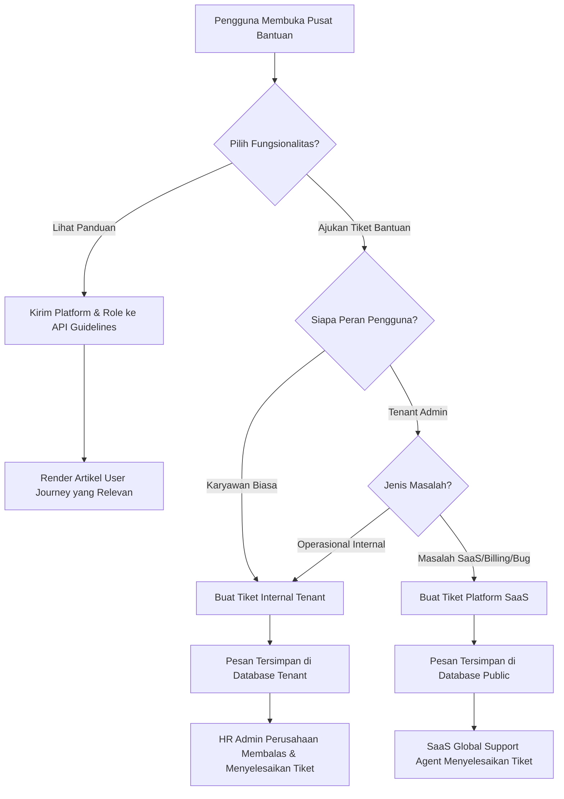

# Dokumentasi Modul: Pusat Bantuan & Sistem Tiket (Help & Support Modul)

## 1. Deskripsi Umum
Modul **Support & Help** mengelola dua fungsionalitas krusial untuk memandu pengguna platform **HariKerja HRMS** serta menyelesaikan kendala operasional dan teknis secara terstruktur:
1. **Dynamic Guidelines (User Journeys)**: Panduan dinamis berbasis role dan platform (web/mobile) untuk mengarahkan pengguna saat menjelajahi aplikasi.
2. **Ticketing System**: Saluran bantuan komunikasi interaktif dua arah yang memisahkan tiket keluhan operasional internal (karyawan ke HRD) dan tiket keluhan teknis platform SaaS (admin penyewa/tenant ke Global Support SaaS).

* **Target Pengguna**: Seluruh Karyawan, Manager HRD, Tenant Admin, dan SaaS Global Support Agent/Superadmin.

---

## 2. Model Basis Data Utama
Modul ini diimplementasikan di dua tingkat skema database untuk memastikan keamanan dan isolasi multi-tenant:

### A. Skema Tenant (Tenant Schema - `InternalTicket`)
Mengelola pengaduan internal perusahaan (Karyawan $\rightarrow$ HRD):
1. **`InternalTicket`**: Menyimpan subjek tiket, detail deskripsi aduan, kategori (`PAYROLL`, `ATTENDANCE`, `LEAVE`, `TECHNICAL`, `GENERAL`), tingkat prioritas (`LOW`, `MEDIUM`, `HIGH`, `URGENT`), status tiket (`OPEN`, `IN_PROGRESS`, `RESOLVED`, `CLOSED`), karyawan pembuat, serta HR Admin yang ditugaskan.
2. **`InternalTicketMessage`**: Utas percakapan chat di dalam tiket bantuan internal, mendukung bendera `is_internal` khusus catatan konsumsi pihak HR yang tidak dapat dilihat karyawan biasa.

### B. Skema Publik (Public Schema - `PlatformTicket`)
Mengelola pengaduan infrastruktur SaaS (Tenant Admin $\rightarrow$ Global Support):
1. **`PlatformTicket`**: Menyimpan data identitas tenant, email admin pembuat, deskripsi masalah teknis/tagihan, kategori (`BILLING`, `BUG`, `FEATURE_REQUEST`, `ONBOARDING`, `OTHER`), prioritas, status tiket, serta Global Support Agent yang ditugaskan.
2. **`PlatformTicketMessage`**: Utas percakapan obrolan resmi antara perwakilan support SaaS global dan administrator tenant.

---

## 3. Fitur Utama & Kegunaan
* **Dynamic Guideline Engine**: Memfilter dan merender panduan dinamis sesuai platform (`web` / `mobile`) dan role pengguna (`Employee`, `HR Manager`, `Tenant Admin`, atau `SaaS Support`) dari satu API Endpoint `/api/help/guidelines/`.
* **Private HR Notes**: Kemampuan bagi tim HRD untuk berdiskusi secara internal di dalam tiket bantuan karyawan tanpa memublikasikan catatan tersebut kepada karyawan bersangkutan.
* **Separation of Concerns (Isolasi Data)**: Tiket karyawan tersimpan aman di database tenant, sedangkan tiket platform terpusat di skema publik untuk aksesibilitas agen bantuan SaaS.
* **Self-Assign & Delegation**: Agen support SaaS global dapat mengklaim tiket (`assign/`) dan berkoordinasi secara efektif untuk menyelesaikan masalah tagihan atau kegagalan sistem.

---

## 4. Alur Proses & Flowchart (Mermaid Diagram)

### Alur Percabangan Sistem Bantuan dan Pengajuan Tiket

---

## 5. Integrasi Antar-Modul
* **Integrasi dengan Modul `users` & `core`**: Mengidentifikasi peran user secara real-time (`global_role` untuk admin publik, dan `Employee` role di tingkat tenant) untuk menyajikan daftar kendala yang relevan dan validasi hak akses.
* **Integrasi dengan Widget Dashboard**: Floating support widget Next.js diintegrasikan di layout dashboard utama agar selalu dapat diakses dari halaman manapun.

---

## 6. Hak Akses (RBAC) & Keamanan
* **Isolasi Tiket**: Karyawan biasa hanya diizinkan melihat dan membalas tiket buatannya sendiri (`creator = request.user.employee`).
* **HR Manager/Admin Authorization**: Membatasi fitur delegasi internal dan pengubahan status tiket karyawan hanya untuk user dengan izin HR Manager atau Admin di tingkat tenant.
* **SaaS Support Guard**: Endpoint tiket platform SaaS dilindungi dengan pengecekan `global_role__in=['SUPERADMIN', 'SUPPORT_AGENT']` sehingga user tenant tidak dapat mengintip tiket milik tenant lainnya.
* **Secure Attachments (Opsional)**: Berkas lampiran tiket internal divalidasi dan disimpan di direktori terisolasi tenant (`/media/tenant_id/tickets/`).
