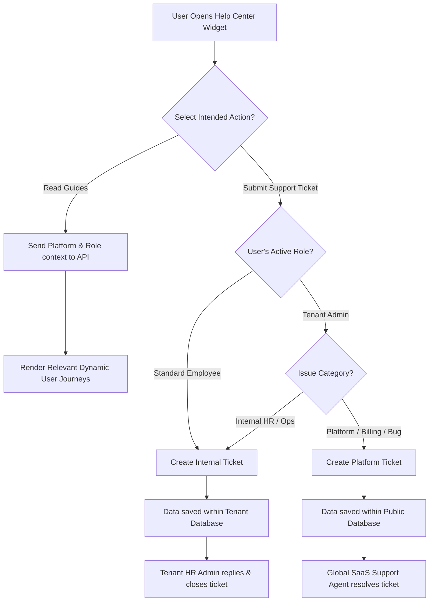

# Module Documentation: Help Center & Support Ticketing (Help & Support Module)

## 1. Overview
The **Support & Help** module manages two critical components to guide users through the **HariKerja HRMS** platform and streamline operational and technical resolution workflows:
1. **Dynamic Guidelines (User Journeys)**: Role-specific and platform-specific (web/mobile) dynamic manuals that navigate users during their journey on the app.
2. **Ticketing System**: Interactive two-way helpdesk communication channels, segregating internal tenant workspace issues (Employee $\rightarrow$ HRD) from global SaaS platform/technical bug reports (Tenant Admin $\rightarrow$ Global SaaS Support).

* **Target Audience**: All Employees, HR Managers, Tenant Admins, and SaaS Global Support Agents/Superadmins.

---

## 2. Core Database Models
This module is implemented across two database schema layers to guarantee data isolation and multi-tenant security:

### A. Tenant Schema (Internal Workspace - `InternalTicket`)
Manages internal company helpdesk issues (Employee $\rightarrow$ HRD):
1. **`InternalTicket`**: Stores ticket subject, category (`PAYROLL`, `ATTENDANCE`, `LEAVE`, `TECHNICAL`, `GENERAL`), priority (`LOW`, `MEDIUM`, `HIGH`, `URGENT`), current status (`OPEN`, `IN_PROGRESS`, `RESOLVED`, `CLOSED`), creator reference, and assigned HR Administrator.
2. **`InternalTicketMessage`**: Threaded message history inside an internal ticket, supporting an `is_internal` flag for private HR-only discussion notes invisible to standard employees.

### B. Public Schema (SaaS Platform - `PlatformTicket`)
Manages platform-wide technical and commercial infrastructure support (Tenant Admin $\rightarrow$ Global Support):
1. **`PlatformTicket`**: Stores tenant reference, creator's admin email, issue description, category (`BILLING`, `BUG`, `FEATURE_REQUEST`, `ONBOARDING`, `OTHER`), priority, status, and assigned Global Support Agent.
2. **`PlatformTicketMessage`**: Threaded conversation logs between the Global Support Team and the Tenant Admin.

---

## 3. Key Features & Utilities
* **Dynamic Guideline Engine**: Automatically filters and serves user journey articles based on the requesting platform (`web` / `mobile`) and active role (`Employee`, `HR Manager`, `Tenant Admin`, `SaaS Support`) via a single unified API endpoint `/api/help/guidelines/`.
* **Private HR Notes**: Allows HR Admins to exchange internal notes within employee tickets for backend documentation, without showing them to standard employees.
* **Multi-Tenant Separation of Concerns**: Employee workspace tickets are isolated within the tenant's database schema, whereas SaaS platform issues are aggregated on the public schema for global support accessibility.
* **Self-Assign & Delegation**: Global support agents can claim tickets (`assign/`) and coordinate effectively to resolve subscription billing errors or backend service crashes.

---

## 4. Workflows & Process Flowcharts (Mermaid Diagram)

### Help Center Routing & Ticket Creation Flow

---

## 5. Inter-Module Integration
* **User & Authentication Modules (`users` & `core`)**: Retrieves global roles (`global_role` for SaaS-wide operators) and local tenant roles (HR Manager/Employee) dynamically to target support content and validate authorization boundaries.
* **Dashboard Widgets**: Integrates the Next.js floating support widget inside the main layout so help and ticket access is globally available.

---

## 6. Access Control (RBAC) & Security
* **Ticket Isolation**: Standard employees are restricted to viewing and replying only to tickets they created (`creator = request.user.employee`).
* **HR Manager Authorization**: Restricts ticket delegation, internal notes logging, and status transitions to authorized HR Managers and Workspace Admins.
* **SaaS Support Guard**: SaaS platform ticket endpoints verify the global security group membership `global_role__in=['SUPERADMIN', 'SUPPORT_AGENT']` to block unauthorized tenant users from viewing cross-tenant requests.
* **Secure Attachment Handling (Optional)**: Support attachment uploads are validated for size and MIME types, then stored under secure tenant directories (`/media/tenant_id/tickets/`).
