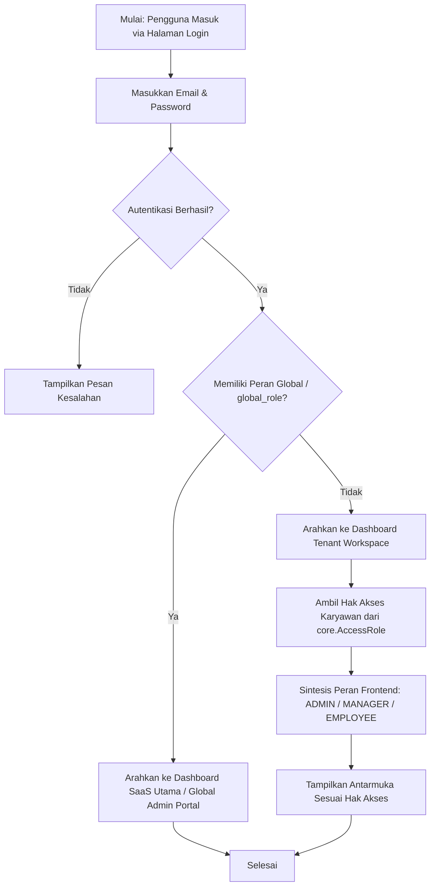
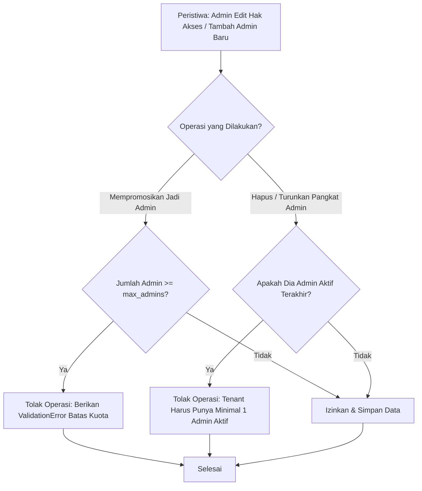

# Dokumentasi Modul: User Accounts & RBAC

## 1. Deskripsi Umum
Modul **Users** mengelola seluruh siklus autentikasi pengguna, otorisasi akses aplikasi, pemetaan akun ke satu atau beberapa tenant, pembatasan kuota administrator, serta sistem kontrol hak akses berbasis peran global (*Global RBAC*) untuk mengamankan portal SaaS utama HariKerja.

* **Target Pengguna**: Seluruh Pengguna, Admin Tenant, Tim Support/Sales SaaS, dan Superadmin.

---

## 2. Model Basis Data Utama
Modul ini bertumpu pada model Django utama di dalam Django App `users`:

1. **`User`**: Kustomisasi dari model `AbstractUser` Django. Menggunakan alamat email unik (`email`) sebagai pengenal utama masuk (bukan username). Model ini menyimpan status penerimaan notifikasi email, daftar tenant yang dapat diakses (`tenants`), status administrator global lama (`is_global_admin`), dan hak akses peran SaaS global baru (`global_role`).
2. **`GLOBAL_ROLE_CHOICES`**: Konstanta penentu peran admin SaaS di portal pusat, mencakup:
   * `SUPERADMIN`: Hak akses penuh sistem SaaS, server, dan seluruh data tenant.
   * `SUPPORT`: Akses baca-tulis terbatas untuk penyelesaian kendala teknis tenant pelanggan.
   * `SALES`: Akses pemantauan prospek pendaftaran tenant baru dan promosi paket.
   * `BILLING`: Akses pengelolaan harga, paket, dan status verifikasi invoice manual.

---

## 3. Fitur Utama & Kegunaan
* **Autentikasi Berbasis Email**: Mengganti login username standar Django dengan identifikasi email yang lebih modern dan aman.
* **Peran Hak Akses Dinamis (Dynamic RBAC)**: Integrasi dengan permissions di model `AccessRole` pada modul `core` untuk mereduksi peran pengguna di frontend menjadi:
  * `ADMIN`: Jika memiliki otorisasi pengelolaan settings/HR.
  * `MANAGER`: Jika memiliki wewenang untuk menyetujui lembur/cuti atau melihat laporan.
  * `EMPLOYEE`: Hak akses karyawan standar untuk presensi dan pengajuan permohonan.
* **Perlindungan Integritas Administrator Tenant**: Sistem pengaman berbasis Django Signals untuk mencegah:
  * Penghapusan administrator aktif terakhir di suatu tenant.
  * Deaktivasi atau penurunan pangkat (*demotion*) administrator terakhir.
  * Pelepasan relasi Many-to-Many antara administrator terakhir dengan tenant-nya.
* **Pembatasan Kuota Administrator**: Verifikasi ketat agar jumlah administrator aktif tidak melebihi kuota maksimal (`max_admins`) yang diperbolehkan pada paket langganan tenant tersebut.

---

## 4. Alur Proses & Flowchart (Mermaid Diagram)

### A. Autentikasi Pengguna & Penentuan Dashboard

### B. Validasi & Pengamanan Kuota Admin Tenant (Django Signals)

---

## 5. Integrasi Antar-Modul
* **Integrasi dengan Modul `core`**: Menghubungkan akun login `User` dengan profil bio karyawan `Employee` menggunakan pencocokan email unik. Property `permissions` pada user merujuk ke tabel `AccessRole` di modul core untuk evaluasi hak akses backend dan visualisasi navigasi frontend.
* **Integrasi dengan Modul `tenants`**: Relasi Many-to-Many antara user dengan tenant (`tenants` field) memungkinkan tim support global masuk ke dalam skema skema data tenant yang bersangkutan dengan sistem masquerade terenkripsi, serta membatasi pembuatan admin baru berdasarkan setelan `max_admins` di konfigurasi tenant.

---

## 6. Hak Akses (RBAC) & Keamanan
* Keamanan global pada modul ini dikelola oleh middleware `HasGlobalPermission` yang memastikan hanya pengguna dengan peran global pusat (`SUPERADMIN`, `SUPPORT`, `SALES`, `BILLING`) yang dapat mengakses rute SaaS API Portal.
* Keamanan level tenant diproteksi oleh middleware `TenantAccessMiddleware` untuk mengisolasi permintaan HTTP hanya pada skema database tenant milik pengguna.
