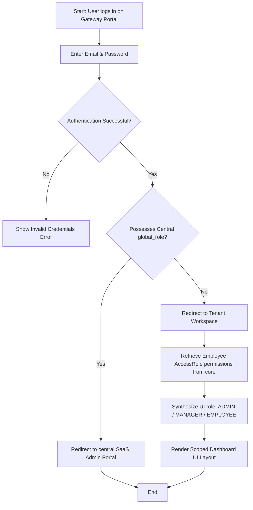
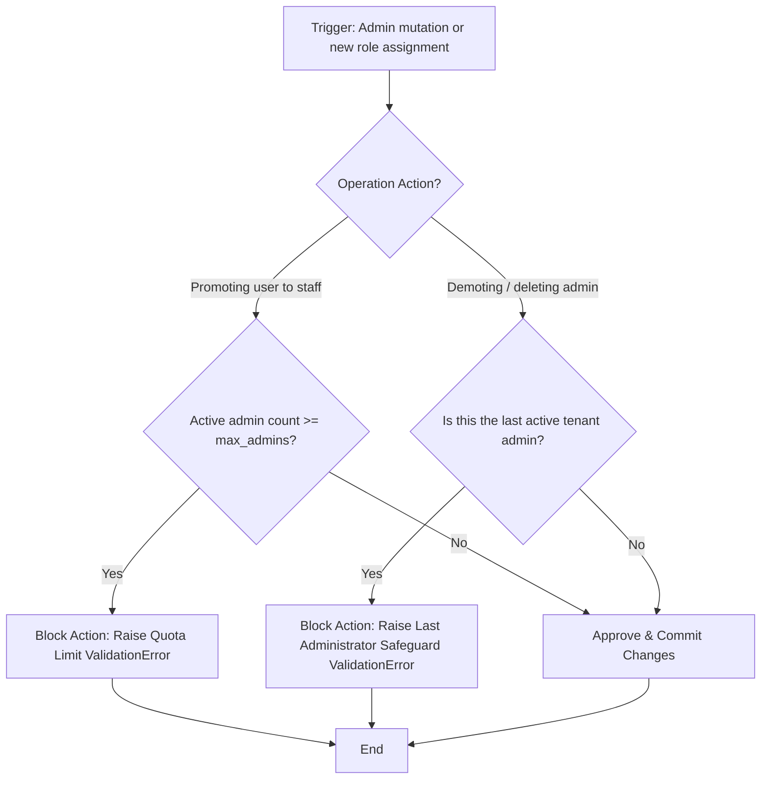

# Module Documentation: User Accounts & RBAC

## 1. General Overview
The **Users** module governs user identity, authentication lifecycles, cross-tenant user mapping, dynamic role synthesis, and global administrative operations (*Global RBAC*) for securing the HariKerja SaaS Administration Portal.

* **Target Users**: General Employees, Tenant Administrators, SaaS Support/Sales Teams, and Platform Superadmins.

---

## 2. Key Database Models
The module architecture centers around Django models inside the `users` application:

1. **`User`**: A customized `AbstractUser` class using `email` as the primary lookup field instead of username. It manages notification preferences, multi-tenant access relationships (`tenants` M2M field), legacy admin flags (`is_global_admin`), and SaaS administration roles (`global_role`).
2. **`GLOBAL_ROLE_CHOICES`**: Defines global roles that govern access levels within the centralized SaaS management portal:
   * `SUPERADMIN`: Full root authority over SaaS billing, server configurations, and tenant schemas.
   * `SUPPORT`: Read-write authorization scoped for diagnosing and solving customer issues.
   * `SALES`: Authorization for monitoring registrations and handling plan tiers.
   * `BILLING`: Scoped authority to configure pricing plans and manually process invoices.

---

## 3. Core Features & Capabilities
* **Email-centric Authentication**: Modernized Django credentials lookup relying purely on unique emails.
* **Dynamic Role Synthesis (Dynamic RBAC)**: Integrates with the employee's `AccessRole` in the `core` module to compile permissions down to three frontend layout archetypes:
  * `ADMIN`: Has permissions to control settings, access roles, and tenant metadata.
  * `MANAGER`: Has permissions to approve timesheets, leaves, and view performance records.
  * `EMPLOYEE`: Scoped workspace for personal check-ins and request submissions.
* **Tenant Admin Deletion Prevention**: Built-in Django Signals that safeguard tenant stability by blocking:
  * Deleting the last active administrator of any tenant.
  * Deactivating or demoting the last active administrator.
  * Disassociating the last active administrator from a tenant's tenant list.
* **Admin Quota Enforcement**: Active validators verifying that a tenant does not exceed its authorized administrator limit (`max_admins`) specified in their subscription plan.

---

## 4. Workflows & Process Flows (Mermaid Diagrams)

### A. Authentication & Workspace Redirection Flow

### B. Admin Quota & Safeguard Flow (Django Signals)

---

## 5. Module Integrations
* **Integration with `core` Module**: Associates authenticated logins with employee biological files (`Employee` records) via matching email strings. The `permissions` JSON property dynamically pulls from `AccessRole` to lock API endpoints.
* **Integration with `tenants` Module**: Leverages many-to-many connections to map support employees into client tenant databases via secure administrative masquerading. Reads tenant properties to validate `max_admins` thresholds.

---

## 6. Permissions & Security Control
* Centralized API security is maintained through the `HasGlobalPermission` middleware, which verifies that only verified SaaS administrators (`SUPERADMIN`, `SUPPORT`, `SALES`, `BILLING`) can communicate with system-level control panels.
* Client-level isolation is guaranteed by `TenantAccessMiddleware` to restrict employee operations within their authorized schema boundary.
