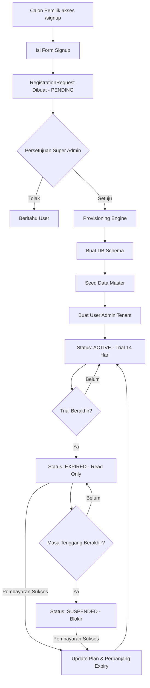

# Proses Registrasi dan Siklus Hidup Langganan

Dokumen ini memberikan tinjauan detail tentang bagaimana sebuah perusahaan baru (tenant) bergabung dengan platform HRMS, mulai dari pendaftaran awal hingga alur akhir masa percobaan.

## 1. Di mana saya bisa mendaftar?

Pendaftaran dilakukan **Hanya melalui Frontend (Web)**. 
- **URL**: `https://harikerja.web.id/signup`
- **Mengapa tidak di Mobile?** Proses registrasi melibatkan konfigurasi bisnis yang kompleks, validasi domain, dan pembuatan database (provisioning) yang paling baik dikelola melalui antarmuka web desktop. Aplikasi Mobile dirancang untuk operasional harian karyawan setelah perusahaan aktif.

## 2. Siapa yang bisa mendaftar?

- **Calon Pemilik/Administrator**: Setiap tamu atau pengunjung (Publik) yang ingin membuat instansi HRMS untuk perusahaan mereka.
- **Master Admin (Superuser)**: Pemilik sistem harikerja yang meninjau dan menyetujui atau menolak permintaan pendaftaran.
- **Karyawan Biasa**: Tidak dapat mendaftarkan perusahaan baru. Mereka harus diundang atau dibuat oleh Admin Tenant di perusahaan yang sudah terdaftar.

---

## 3. Flowchart Registrasi dan Langganan

## 4. Alur Kerja Registrasi

Proses ini mengikuti urutan yang dikelola secara ketat untuk memastikan isolasi database dan keamanan.

### Langkah 1: Signup Publik (Aksi Pengunjung)
Pengunjung mengisi formulir pendaftaran di halaman utama.
- **Data yang Dibutuhkan**: Nama Perusahaan, Subdomain yang Diinginkan (misal: `perusahaan-ku`), Email Admin, dan Password.
- **Hasil**: `RegistrationRequest` dibuat di sistem dengan status `PENDING`. Belum ada schema database yang dibuat.

### Langkah 2: Persetujuan Internal (Aksi Super Admin)
Administrator sistem harikerja meninjau permintaan yang masuk.
- **Aksi**: Setujui atau Tolak.
- **Tugas Sistem**: Jika disetujui, sistem menjalankan **Provisioning Engine**.

### Langkah 3: Provisioning & Pembuatan Tenant (Aksi Sistem)
Sistem secara otomatis melakukan hal berikut:
1. **Pembuatan Schema**: Membuat schema PostgreSQL khusus untuk tenant tersebut.
2. **Data Seeding**: Menginisialisasi data master HR (Izin dasar, peran, dll.) di dalam schema baru.
3. **Provisioning Admin**: Membuat pengguna `Tenant Admin` dan menghubungkannya dengan tenant yang baru dibuat.
4. **Pemetaan Subdomain**: Memetakan subdomain (misal: `perusahaan-ku.harikerja.web.id`) ke schema baru.

### Langkah 4: Onboarding Awal (Aksi Admin Tenant)
Pemilik baru login ke subdomain spesifik mereka untuk pertama kalinya.
- **Aksi**: Menyelesaikan wizard `/[locale]/registration` untuk mengatur detail dasar perusahaan (Alamat, Logo, jumlah Karyawan awal).
- **Paket**: Secara default, tenant baru dimulai dengan paket **FREE** dengan masa **Percobaan 14 Hari**.

---

## 4. Siklus Hidup Langganan & Alur Percobaan

Setelah tenant aktif, sistem mengelola akses mereka berdasarkan `expiry_date` (tanggal kedaluwarsa).

### Fase A: Aktif (Hari 1 - 14)
- **Status**: `ACTIVE`
- **Kapabilitas**: Akses penuh Baca & Tulis untuk semua fitur yang termasuk dalam paket.

### Fase B: Masa Tenggang (Hari 15 - 28)
- **Status**: `EXPIRED`
- **Kapabilitas**: **Mode Baca-Saja (Read-Only)**.
    - Pengguna dapat melihat data yang ada (GET).
    - Pengguna **tidak dapat** membuat atau memperbarui data (POST, PATCH, PUT, DELETE).
- **Error**: `402 Payment Required` dengan kode `SUBSCRIPTION_EXPIRED_READ_ONLY`.

### Fase C: Penangguhan (Hari 29 dst.)
- **Status**: `SUSPENDED`
- **Kapabilitas**: **Blokir Total**.
    - Semua API diblokir kecuali untuk Billing dan Logout.
- **Error**: `402 Payment Required` dengan kode `SUBSCRIPTION_SUSPENDED`.

---

## 6. Siapa yang bisa mengelola Langganan?

Tindakan terkait langganan dan penagihan (billing) **dibatasi** untuk pengguna tertentu saja:
- **Tenant Administrator**: Pengguna yang mendaftarkan perusahaan pertama kali (Owner).
- **Staf Berwenang**: Pengguna yang memiliki izin `manage_tenant_settings` atau izin khusus `manage_billing`.
- **Karyawan Biasa**: Pengguna ini **tidak dapat** melihat menu langganan atau melakukan pembayaran. Akses mereka murni operasional.

Menu penagihan terletak di `/[locale]/settings/subscription` dan disembunyikan dari pengguna non-admin.
