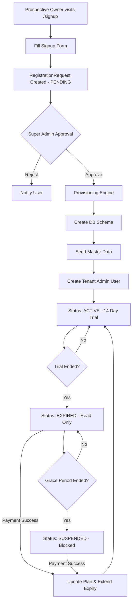

# Registration Process and Subscription Lifecycle

This document provides a detailed overview of how a new company (tenant) joins the HRMS platform, from initial registration to the end-of-trial subscription flow.

## 1. Where can I register?

Registration is **Frontend-Only (Web)**. 
- **URL**: `https://harikerja.web.id/signup`
- **Why not Mobile?** The registration process involves complex business configuration, domain validation, and database provisioning that are best handled through a desktop-class web interface. The Mobile app is designed for daily employee operations after a company is already active.

## 2. Who can register?

- **Prospective Owners/Administrators**: Any guest or visitor (Public) who wants to create an HRMS instance for their company.
- **Master Admin (Superuser)**: The system owner who approves or rejects registration requests.
- **Normal Employees**: Cannot register new companies. They must be invited/created by an existing Tenant Admin within an already registered company.

---

## 3. The Registration and Subscription Flowchart

## 4. The Registration Workflow

The process follows a strictly managed sequence to ensure database isolation and security.

### Step 1: Public Signup (Guest Action)
A visitor fills out the signup form on the main landing page.
- **Required Data**: Company Name, Desired Subdomain (e.g., `mycompany`), Admin Email, and Password.
- **Result**: A `RegistrationRequest` is created in the system with a `PENDING` status. No database schema is created yet.

### Step 2: Internal Approval (Super Admin Action)
A harikerja system administrator reviews the pending request.
- **Action**: Approve or Reject.
- **System Task**: Upon approval, the system triggers the **Provisioning Engine**.

### Step 3: Provisioning & Tenant Creation (System Action)
The system automatically performs the following:
1. **Schema Creation**: Creates a dedicated PostgreSQL schema for the tenant.
2. **Data Seeding**: Initializes HR master data (Base permissions, roles, etc.) within the new schema.
3. **Admin Provisioning**: Creates the `Tenant Admin` user and links it to the newly created tenant.
4. **Subdomain Mapping**: Maps the subdomain (e.g., `mycompany.harikerja.web.id`) to the new schema.

### Step 4: Initial Onboarding (Tenant Admin Action)
The new owner logs in to their specific subdomain for the first time.
- **Action**: Complete the `/[locale]/registration` wizard to set up basic company details (Address, Logo, Initial Employee count).
- **Plan**: By default, new tenants start on the **FREE** plan with a **14-day Trial**.

---

## 4. Subscription Lifecycle & Trial Flow

Once the tenant is active, the system manages their access based on the `expiry_date`.

### Phase A: Active (Day 1 - 14)
- **Status**: `ACTIVE`
- **Capabilities**: Full Read & Write access to all features included in the plan.

### Phase B: Grace Period (Day 15 - 28)
- **Status**: `EXPIRED`
- **Capabilities**: **Read-Only Mode**.
    - Users can view existing data (GET).
    - Users **cannot** create or update data (POST, PATCH, PUT, DELETE).
- **Error**: `402 Payment Required` with `SUBSCRIPTION_EXPIRED_READ_ONLY`.

### Phase C: Suspension (Day 29 onwards)
- **Status**: `SUSPENDED`
- **Capabilities**: **Total Block**.
    - All APIs are blocked except for Billing and Logout.
- **Error**: `402 Payment Required` with `SUBSCRIPTION_SUSPENDED`.

---

## 5. Renewal & Upgrades
Administrators can upgrade their plan at any time through the **Subscription Settings** page. Once payment is confirmed (via Midtrans), the system:
1. Updates the `plan_type` (Essential, Professional, Premium, etc.).
2. Extends the `expiry_date` (e.g., +30 days or +365 days).
3. Restores full `ACTIVE` status immediately.

## 6. Who can manage the Subscription?

Subscription and billing actions are **restricted** to specific users:
- **Tenant Administrator**: The user who originally registered the company.
- **Authorized Staff**: Users with the `manage_tenant_settings` or specialized `manage_billing` permission.
- **Normal Employees**: These users **cannot** see the subscription menu or process payments. Their access is purely operational.

The billing menu is located at `/[locale]/settings/subscription` and is hidden from non-admin users.
