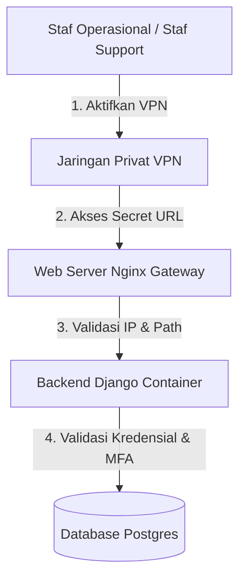

# Strategi Pengamanan Portal Admin

Dokumen ini mendokumentasikan kebijakan pengamanan (security conditions) yang diterapkan untuk melindungi Portal Admin Utama (Django Admin) pada platform HariKerja HRMS.

---

## 1. Kondisi Pengamanan yang Diimplementasikan
Untuk menjamin keamanan tingkat tinggi tanpa mengorbankan kenyamanan tim operasional, sistem menggunakan pendekatan **Pertahanan Berlapis (Defense in Depth)**.

### A. Obfuscasi URL Dinamis / Statis Rahasia (`ADMIN_URL`)
* **Kondisi:** Endpoint default `/admin/` telah dinonaktifkan sepenuhnya.
* **Mekanisme:** URL portal admin dibaca secara dinamis dari *environment variable* `ADMIN_URL` (contoh: `ADMIN_URL=django-admin-secure-39f28j/`).
* **Keuntungan:** Menghalangi pemindai otomatis (*crawlers*) dari menemukan halaman masuk administrator.

### B. Pembatasan Akses Jaringan (IP Whitelisting & VPN Gateway)
* **Kondisi:** Portal admin tidak dapat diakses dari internet publik biasa.
* **Mekanisme:** Konfigurasi web server Nginx membatasi akses ke path `ADMIN_URL` hanya untuk request yang berasal dari subnet VPN privat (misal: `10.8.0.0/24`) atau IP publik kantor yang telah terdaftar (*whitelisted*).
* **Keuntungan:** Sekalipun penyerang mengetahui URL rahasianya, koneksi mereka akan langsung ditolak (`403 Forbidden`) sebelum halaman web Django sempat dimuat.

### C. Autentikasi Dua Faktor (MFA / 2FA)
* **Kondisi:** Akses masuk ke portal admin wajib dilengkapi dengan kode OTP 6-digit.
* **Mekanisme:** Seluruh pengguna dengan hak akses Superadmin atau Customer Support wajib mengaktifkan autentikasi berbasis waktu (TOTP) melalui aplikasi seperti Google Authenticator.
* **Keuntungan:** Mencegah kebocoran akun akibat brute force atau *credential stuffing*.

---

## 2. Arsitektur Teknis
Mekanisme keamanan ini terintegrasi di tiga lapisan utama:

1. **Gateway Nginx:** Memverifikasi asal request. Jika request ke path admin tidak berasal dari IP VPN, Nginx mengembalikan kode status `403 Forbidden` atau `404 Not Found`.
2. **Routing Django (`urls.py`):** Django memetakan rute admin berdasarkan variabel `ADMIN_URL` di memori saat *startup*.
3. **Validasi Django OTP:** Setelah password benar, middleware Django mewajibkan pengisian token MFA sebelum sesi admin diberikan.
