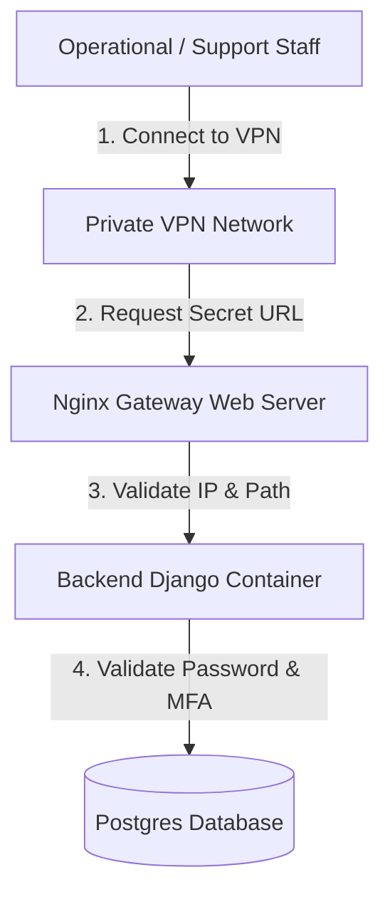

# Admin Portal Protection Strategy

This document records the security conditions implemented to protect the Main Admin Portal (Django Admin) on the HariKerja HRMS platform.

---

## 1. Implemented Security Conditions
To ensure high-grade security without compromising operational efficiency, the system utilizes a **Defense in Depth** layered approach.

### A. Custom Obfuscated URL Path (`ADMIN_URL`)
* **Condition:** The default `/admin/` endpoint is completely disabled.
* **Mechanism:** The admin portal URL is loaded dynamically from the `ADMIN_URL` environment variable (e.g., `ADMIN_URL=django-admin-secure-39f28j/`).
* **Benefit:** Blocks automated vulnerability scanners from finding the administrator login panel.

### B. Network Restriction (IP Whitelisting & VPN Gateway)
* **Condition:** The admin portal is inaccessible from the standard public internet.
* **Mechanism:** The Nginx web server configuration limits access to the `ADMIN_URL` path exclusively to requests originating from the private VPN subnet (e.g., `10.8.0.0/24`) or registered public office IPs (*whitelisted*).
* **Benefit:** Even if an attacker discovers the secret URL path, their connection is rejected immediately (`403 Forbidden`) before the Django page loads.

### C. Multi-Factor Authentication (MFA / 2FA)
* **Condition:** Logging into the admin portal strictly requires a 6-digit OTP code.
* **Mechanism:** All users with Superadmin or Customer Support privileges must activate Time-based One-Time Passwords (TOTP) via applications like Google Authenticator or Microsoft Authenticator.
* **Benefit:** Prevents administrative account compromise resulting from brute force or credential stuffing attacks.

---

## 2. Technical Architecture
The security policy is tightly integrated across three main system layers:

1. **Nginx Gateway:** Verifies the request origin. If the request to the admin path is not from the VPN IP subnet, Nginx serves `403 Forbidden` or `404 Not Found`.
2. **Django Routing (`urls.py`):** Django maps the admin route dynamically using the loaded `ADMIN_URL` variable in memory during startup.
3. **Django OTP Middleware:** Upon valid password verification, the middleware requires a physical MFA token challenge before granting the admin session.
