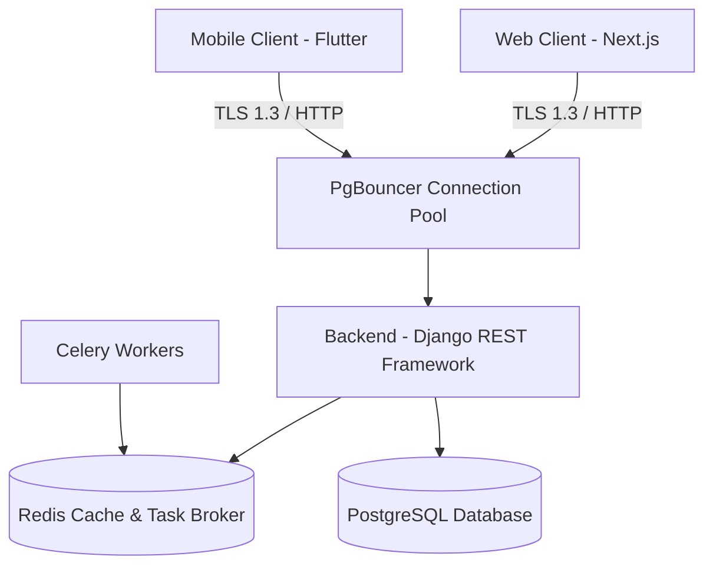

# Panduan Lengkap Pengembang Full-Stack & Arsitektur Teknis

Panduan ini berisi spesifikasi arsitektur sistem, keputusan desain, standar kualitas, serta instruksi lengkap bagi pengembang untuk membangun, menguji, dan merilis fitur di seluruh stack aplikasi platform **HariKerja HRMS** (Backend Django, Frontend Next.js, Mobile Flutter).

---

## 🛠️ 1. Lingkungan Pengembangan Lokal (Local Development Setup)

### 1.1 Persyaratan Sistem Minimal
*   **Runtime**: Node.js 20+, Python 3.12+, SDK Flutter 3.0+
*   **Database**: PostgreSQL 14+, Redis 7+
*   **Alat Bantu**: Docker & Docker Compose

### 1.2 Alat Orkestrasi Pengembang (`up.mjs`)
Kami menyediakan skrip orkestrasi `up.mjs` berbasis Node.js untuk meniadakan kompleksitas konfigurasi lokal secara manual. Skrip ini secara otomatis mendeteksi lingkungan, memeriksa dependensi, mengonfigurasi database Docker, dan memicu seeding.

```bash
# Menjalankan seluruh stack pengembangan lokal (Backend + Frontend + DB Seeding)
node up.mjs --seed

# Opsi Skrip up.mjs yang Berguna:
# --skip-docker : Menggunakan PostgreSQL lokal di OS alih-alih kontainer Docker.
# --coverage    : Mengaktifkan pelaporan cakupan kode (coverage reports) untuk pengujian.
# --workers=N   : Menentukan jumlah pekerja pengujian paralel untuk mempercepat pytest.
```

---

## 🏗️ 2. Desain Arsitektur Sistem & Prinsip API (System Architecture & API Principles)

Aplikasi dibangun menggunakan pola arsitektur **Service-Oriented Monolith** untuk backend dan aplikasi client terpisah untuk Web dan Mobile.



### 2.1 Pola Desain Multi-Tenant
*   **Isolasi Berbasis Skema**: Menggunakan arsitektur *PostgreSQL Schema-Based Multi-Tenancy* via library `django-tenants`.
    *   *Skema Bersama (`public`)*: Menyimpan data global seperti pendaftaran klien (`RegistrationRequest`), pemetaan domain, audit penagihan SaaS, dan kredensial dasar user.
    *   *Skema Terisolasi (`tenant_a`, `tenant_b`)*: Skema database khusus untuk setiap penyewa (klien). Data karyawan, lembur, absensi, cuti, dan penggajian terpisah secara fisik di tingkat PostgreSQL.
*   **Provisi Otomatis**: Pembuatan skema PostgreSQL secara real-time dan seeding database awal berjalan otomatis segera setelah peninjauan registrasi disetujui.
*   **Siklus Hidup Langganan**: Sistem membagi fase penyewa menjadi `ACTIVE`, `EXPIRED` (akses baca-saja / read-only), dan `SUSPENDED` (blokir akses / HTTP 403).

### 2.2 Prinsip Desain API RESTful
*   **Konvensi REST**: Desain API berorientasi sumber daya (*resource-oriented*) dengan kata kerja HTTP yang tepat (`GET`, `POST`, `PUT`, `DELETE`).
*   **Strategi Versi**: Versi API menggunakan URL-based versioning (`/api/v1/`, `/api/v2/`) untuk menjaga kompatibilitas ke belakang (*backward compatibility*).
*   **Pembatasan Tarif (Rate Limiting)**: Diterapkan menggunakan algoritma *Token Bucket* dengan kuota batasan permintaan spesifik berdasarkan tingkatan paket tenant.

---

## 🔐 3. Otentikasi, Keamanan & Perlindungan Data (Authentication & Data Protection)

### 3.1 Otentikasi & Otorisasi (RBAC)
*   **JWT Implementation**: Otentikasi token JWT menggunakan algoritma `HS256` dengan masa kedaluwarsa 24 jam untuk token akses, dilengkapi dengan token penyegaran (*refresh token*).
*   **Manajemen Sesi**: Aplikasi mobile Flutter menyimpan JWT secara aman pada *Encrypted Secure Storage*, sedangkan Next.js menggunakan cookie sesi aman yang terlindung dari CSRF.
*   **Penegakan Konteks Tenant**: Setiap permintaan API wajib memuat header `X-Tenant-Domain` yang divalidasi oleh middleware Django untuk mengarahkan koneksi database ke skema tenant yang benar.

### 3.2 Perlindungan Data & Kepatuhan
*   **Enkripsi Data Sensitif**: Bidang sensitif di database (seperti kata sandi, token API pihak ketiga, informasi rekening) dienkripsi saat diam menggunakan algoritma `AES-256`.
*   **Enkripsi saat Transit**: Seluruh komunikasi antara client (Web/Mobile) dengan server wajib berjalan di atas protokol aman `TLS 1.3`.
*   **Audit Logging**: Setiap aksi mutasi data (tambah, edit, hapus) otomatis mencatat riwayat lengkap aktor, waktu, dan jenis perubahan melalui model yang mewarisi `AuditModelMixin`.

---

## 🗄️ 4. Struktur Database, Pengindeksan & Migrasi Zero-Downtime (Database & Indexing)

Untuk mempertahankan responsivitas kueri di bawah 200 milidetik saat database tumbuh melewati jutaan catatan, ikuti standar berikut:

### 4.1 Strategi Pengindeksan
1.  **Indeks Kunci Asing (Foreign Keys)**: Selalu buat indeks eksplisit pada foreign key yang sering digunakan dalam klausa join (contoh: `employee_id`, `branch_id`).
2.  **GIN Indexing**: Gunakan indeks GIN untuk kolom basis data bertipe `JSONField` (seperti permission role map) untuk mempercepat pencarian data tanpa melompati index scan.
3.  **B-Tree Indexing**: Terapkan indeks B-Tree majemuk untuk kombinasi query pencarian tanggal (contoh: indeks gabungan `[employee_id, attendance_date]`).

### 4.2 Optimasi Performa Query
*   **N+1 Query Prevention**: Hindari query berulang di dalam perulangan dengan memaksimalkan penggunaan `.select_related()` (untuk relasi ForeignKey) dan `.prefetch_related()` (untuk relasi ManyToMany/Reverse).
*   **PgBouncer Connection Pooling**: Konfigurasikan PgBouncer dengan mode transaksi *Session/Transaction pooling* berkisar antara 20–100 koneksi per tenant untuk menghindari kelelahan memori PostgreSQL.
*   **Redis Key Namespacing**: Cache Redis dikonfigurasi secara modular menggunakan awalan nama skema tenant: `[nama_skema]:[kunci_cache]`.

### 4.3 Strategi Migrasi Database Zero-Downtime
*   **Penyebaran Blue-Green**: Migrasi skema database dijalankan secara bertahap menggunakan taktik rilis kompatibel ke belakang (*backward-compatible schema changes*) agar tidak merusak fungsionalitas versi aplikasi yang sedang berjalan.
*   **Migrasi Mandiri**: Migrasi skema untuk tenant dijalankan secara terisolasi menggunakan perintah `tenant_command migrate_schemas` untuk mengurangi risiko kegagalan sistem global.

---

## 🚀 5. Alur Kerja Menambahkan Fitur Baru (Feature Development Workflow)

### Langkah 1: Backend (Model, Serializer & ViewSet)
1.  Buat modul aplikasi baru di Django:
    ```bash
    python manage.py startapp <nama_modul>
    ```
2.  Daftarkan aplikasi baru pada variabel `TENANT_APPS` di `config/settings.py` (bukan `SHARED_APPS` jika data milik tenant).
3.  Warisi model dari `AuditModelMixin` untuk mengotomatiskan pencatatan riwayat audit.
4.  Gunakan middleware izin `HasTenantRBACPermission` pada ViewSet Anda dan definisikan `required_rbac_permission` yang wajib diperiksa.

### Langkah 2: Frontend Web (Next.js Halaman & API)
1.  Buat rute halaman visual baru di bawah struktur `src/app/[locale]/<nama_modul>/page.tsx`.
2.  Gunakan fungsi `apiFetch` untuk berinteraksi dengan API backend.
3.  Daftarkan label i18n baru di berkas JSON terjemahan `messages/id.json` dan `messages/en.json`.

### Langkah 3: Mobile App (Flutter View & Model)
1.  Buat antarmuka visual widget baru di folder `lib/screens/`.
2.  Daftarkan rute navigasi widget pada berkas `lib/main.dart`.
3.  Tambahkan request API spesifik pada berkas `lib/api/api_service.dart`.

---

## 🧪 6. Strategi Pengujian, CI/CD & Standar Kualitas (Testing Strategy & CI/CD)

### 6.1 Rangkaian Pengujian Mandiri per Aplikasi
Setiap kode baru wajib menyertakan unit test yang lolos pengujian 100%:
*   **Backend Pytest**:
    ```bash
    cd backend && pytest --cov=.
    ```
*   **Frontend Vitest (Unit) & Playwright (E2E)**:
    ```bash
    cd frontend && npm run test && npx playwright test
    ```
*   **Mobile Flutter Test**:
    ```bash
    cd mobile && flutter test
    ```

### 6.2 Integrasi Pipeline CI/CD (GitOps dengan ArgoCD)
*   **Metrik Kuantitas Tes**: Rangkaian pengujian minimal mencakup **403 tes** pada Backend, **340 tes** pada Frontend, dan **168 tes** pada Mobile.
*   **Keamanan Statis (Static Analysis)**: Pipeline CI/CD menjalankan alat pemindaian kerentanan `Bandit` dan `Safety` untuk Python, serta `npm audit` untuk Node.js.
*   **Docker Multi-stage Builds**: Gambar kontainer Docker dioptimalkan melalui build multi-tahap (*multi-stage builds*) untuk menghasilkan ukuran gambar produksi seminimal mungkin.
*   **Penyebaran Otomatis**: GitOps dipicu melalui webhook repositori ke **ArgoCD** untuk mensinkronisasikan manifes Kubernetes secara otomatis pada server staging dan produksi.

---

## 📈 7. Pemantauan, Observabilitas & Dokumentasi API (Monitoring & Documentation)

### 7.1 Standar Observabilitas
*   **Logging Terstruktur JSON**: Semua entri log ditulis dalam format terstruktur JSON dan menyertakan `x-correlation-id` untuk memudahkan pelacakan logs secara end-to-end lintas modul.
*   **Observabilitas Server**: Prometheus mengumpulkan data metrik CPU/memori VPS, rasio hit/miss cache Redis, dan latensi P95/P99 HTTP request untuk dirender ke dasbor Grafana.
*   **Manajemen Exception**: Kesalahan sistem yang terjadi pada lingkungan produksi secara instan ditangkap dan dikirim ke Sentry untuk peninjauan cepat.

### 7.2 Spesifikasi OpenAPI & Pembuatan SDK
*   **Dokumentasi API Otomatis**: Kami menggunakan parser library `drf-spectacular` untuk memproses dekorator API Django REST Framework menjadi spesifikasi dokumentasi OpenAPI 3.0 yang interaktif (Swagger UI & ReDoc).
*   **SDK Auto-Generation**: Pustaka klien (client library) Python SDK dan JavaScript SDK dibuat secara otomatis berbasis OpenAPI schema untuk integrasi cepat bagi client eksternal maupun internal.
