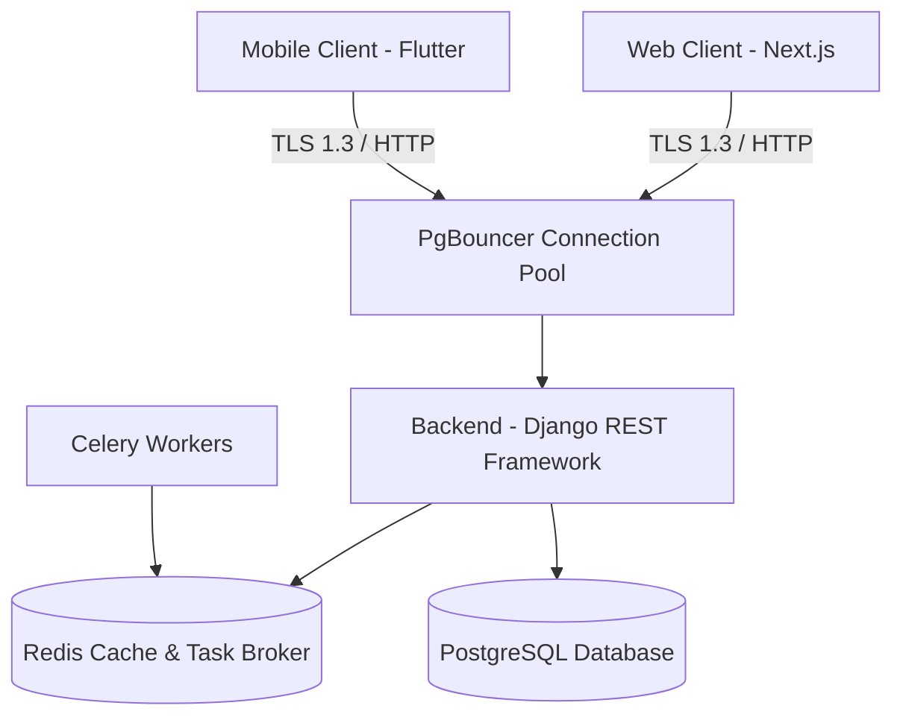

# Full-Stack Developer Guide & Technical Architecture

This guide contains the system architecture specifications, design decisions, quality standards, and step-by-step instructions for developers to build, test, and release features across the **HariKerja HRMS** platform (Django Backend, Next.js Frontend, Flutter Mobile).

---

## 🛠️ 1. Local Development Setup

### 1.1 Minimum System Requirements
*   **Runtime**: Node.js 20+, Python 3.12+, Flutter SDK 3.0+
*   **Database**: PostgreSQL 14+, Redis 7+
*   **Containers**: Docker & Docker Compose

### 1.2 Developer Orchestration Tool (`up.mjs`)
We provide a Node.js-based orchestration script `up.mjs` to eliminate manual configuration complexities. This script automatically checks dependencies, sets up local database containers, and triggers initial migrations and database seeding.

```bash
# Run the entire local development stack (Backend + Frontend + DB Seeding)
node up.mjs --seed

# Useful up.mjs script flags:
# --skip-docker : Uses local PostgreSQL running on the host OS instead of a Docker container.
# --coverage    : Enables code coverage reports for the test suite.
# --workers=N   : Specifies the number of parallel test workers to speed up pytest execution.
```

---

## 🏗️ 2. System Architecture & API Principles

The application is built using a **Service-Oriented Monolith** pattern for the backend and separate client applications for Web and Mobile.



### 2.1 Multi-Tenant Design Patterns
*   **Schema-Based Isolation**: Implements PostgreSQL Schema-Based Multi-Tenancy via the `django-tenants` library.
    *   *Shared Schema (`public`)*: Stores global tables such as client signup requests (`RegistrationRequest`), domain mapping records, billing audits, and global user credentials.
    *   *Tenant Schemas (`tenant_a`, `tenant_b`)*: Dedicated PostgreSQL schemas isolated per client. All employee records, geofenced attendance logs, leaves, and payroll are physically isolated at the database level.
*   **Automated Provisioning**: Real-time schema creation and initial database seeding are triggered automatically as soon as a registration request is approved.
*   **Subscription Lifecycle**: Automated 14-day trial for new signups. Tenant states cycle through `ACTIVE`, `EXPIRED` (read-only access), and `SUSPENDED` (blocked access / HTTP 403).

### 2.2 RESTful API Design Principles
*   **REST Conventions**: Resource-oriented API layout with appropriate HTTP verbs (`GET`, `POST`, `PUT`, `DELETE`).
*   **Versioning Strategy**: URL-based versioning (`/api/v1/`, `/api/v2/`) to ensure backward compatibility.
*   **Rate Limiting**: Implemented using the *Token Bucket* algorithm with rate limits adjusted dynamically based on the tenant's subscription tier.

---

## 🔐 3. Authentication, Security & Data Protection

### 3.1 Authentication & Authorization (RBAC)
*   **JWT Implementation**: Token authentication utilizing the `HS256` algorithm with a 24-hour expiry for access tokens and long-lived refresh tokens.
*   **Session Management**: Flutter mobile client stores JWT in *Encrypted Secure Storage*, while Next.js utilizes secure session cookies guarded against CSRF.
*   **Tenant Context Enforcement**: Every API request must supply a valid `X-Tenant-Domain` header which is validated by backend middleware to route database connections to the appropriate tenant schema.

### 3.2 Data Protection & Compliance
*   **Encryption at Rest**: Sensitive database columns (e.g., passwords, third-party API keys, bank account numbers) are encrypted at rest using `AES-256`.
*   **Encryption in Transit**: All API traffic is strictly routed over secure `TLS 1.3` protocols.
*   **Audit Trail Logs**: Data mutations (create, update, delete) automatically append audit trails (user, timestamp, diff) using Django models inheriting `AuditModelMixin`.

---

## 🗄️ 4. Database Structure, Indexing & Zero-Downtime Migrations

To maintain query latencies under 200 milliseconds as database tables exceed millions of records, enforce the following indexing guidelines:

### 4.1 Indexing Strategy
1.  **Foreign Key Indexes**: Explicitly index all foreign keys heavily used in SQL joins (e.g., `employee_id`, `branch_id`).
2.  **GIN Indexing**: Utilize GIN indexes for JSON columns (`JSONField`) such as the permissions map, avoiding sequential index scans.
3.  **Compound B-Tree Indexes**: Apply compound B-Tree indexes for combined searches (e.g., a compound index on `[employee_id, attendance_date]`).

### 4.2 Query Performance Optimization
*   **N+1 Query Prevention**: Utilize `.select_related()` (for ForeignKey relations) and `.prefetch_related()` (for ManyToMany or reverse relations) to optimize ORM SQL queries.
*   **PgBouncer Connection Pooling**: Configure PgBouncer in transaction mode allocating 20–100 connections per tenant to prevent database memory exhaustion.
*   **Redis Key Namespacing**: Cache keys are structured using schema prefixes: `[schema_name]:[cache_key]`.

### 4.3 Zero-Downtime Migration Strategy
*   **Blue-Green Deployments**: Schema alterations must be backward-compatible (e.g., add nullable fields first, populate, and then apply constraints) to prevent breaking active app servers.
*   **Independent Tenant Migrations**: Migrations are applied in isolation using `tenant_command migrate_schemas` to reduce risks of global platform downtimes.

---

## 🚀 5. Feature Development Workflow

### Step 1: Backend (Models, Serializers & ViewSets)
1.  Create a new Django app:
    ```bash
    python manage.py startapp <module_name>
    ```
2.  Register the app in `TENANT_APPS` within `config/settings.py` (do not add it to `SHARED_APPS` if the data belongs to individual tenants).
3.  Inherit models from `AuditModelMixin` to automatically track creation and modification logs.
4.  Attach `HasTenantRBACPermission` to ViewSets and specify `required_rbac_permission` strings.

### Step 2: Web Frontend (Next.js Pages & API Clients)
1.  Add routing endpoints inside `src/app/[locale]/<module_name>/page.tsx`.
2.  Utilize `apiFetch` helpers for Django API operations.
3.  Append translation keys inside `messages/id.json` and `messages/en.json`.

### Step 3: Mobile App (Flutter Screen & Models)
1.  Create layout widgets inside `lib/screens/`.
2.  Register screen routing inside `lib/main.dart`.
3.  Configure API request payloads inside `lib/api/api_service.dart`.

---

## 🧪 6. Testing Strategy, CI/CD & Quality Standards

### 6.1 Individual App Test Suites
Code changes must verify 100% pass rates on local test suites:
*   **Backend Pytest**:
    ```bash
    cd backend && pytest --cov=.
    ```
*   **Frontend Vitest (Unit) & Playwright (E2E)**:
    ```bash
    cd frontend && npm run test && npx playwright test
    ```
*   **Mobile Flutter Test**:
    ```bash
    cd mobile && flutter test
    ```

### 6.2 CI/CD Pipeline (GitOps with ArgoCD)
*   **Test Suite Quantity**: The test runner enforces a minimum of **398 unit tests** on the Backend, **339 tests** on the Frontend, and **167 tests** on the Mobile suite.
*   **Vulnerability Scanning**: Automated CI pipelines run static security checks using `Bandit` and `Safety` (for Python) and `npm audit` (for Node.js).
*   **Docker Multi-stage Builds**: Container images are packaged using multi-stage Dockerfiles to minimize production footprint.
*   **GitOps Deployment**: Manifes changes in repository trigger **ArgoCD** reconciliations, deploying services automatically into Kubernetes clusters.

---

## 📈 7. Monitoring, Observability & API Documentation

### 7.1 Observability Standards
*   **Structured JSON Logging**: App logs are outputted in JSON format containing unique `x-correlation-id` headers to ease troubleshooting.
*   **Server Observability**: Prometheus gathers host metrics, Redis hit-miss rates, and HTTP latency data to render on centralized Grafana dashboards.
*   **Exception Handling**: Production exceptions are reported in real-time to Sentry for debugging.

### 7.2 OpenAPI Specs & SDK Generation
*   **Auto-generated Docs**: We use `drf-spectacular` library to extract API metadata and generate OpenAPI 3.0 schemas, rendered dynamically on Swagger UI & ReDoc.
*   **SDK Generation**: Client packages for Python SDK and NPM JavaScript packages are generated automatically using OpenAPI schema builders for simple third-party integrations.
